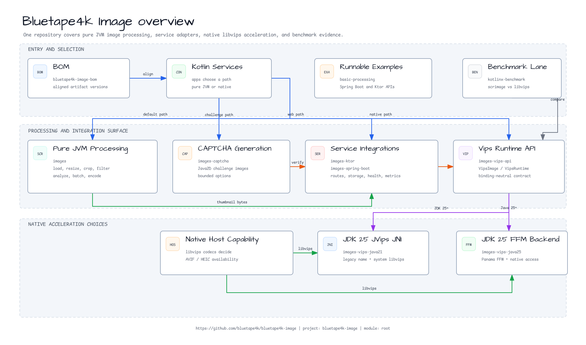
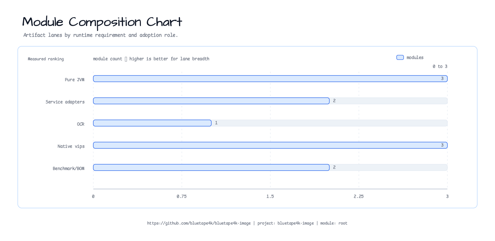
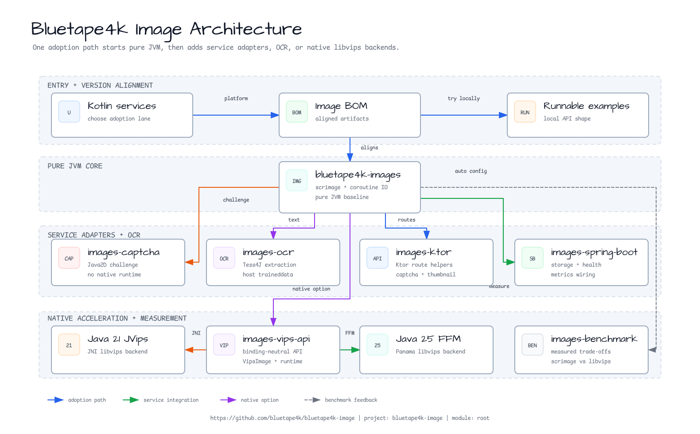
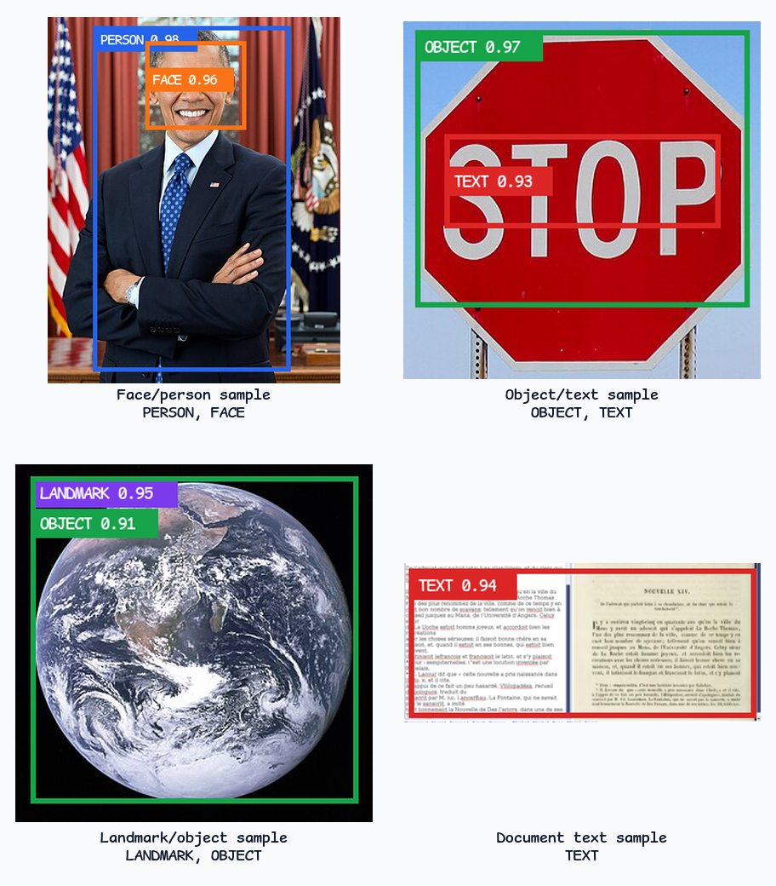

# bluetape4k-image

[](https://github.com/bluetape4k/bluetape4k-image/actions/workflows/ci.yml)
[](https://kotlinlang.org)
[](https://openjdk.org)
[](LICENSE)

English | [한국어](./README.ko.md)


Kotlin/JVM image processing library — part of the [bluetape4k](https://github.com/bluetape4k) ecosystem.
Provides two backends: a pure-JVM [scrimage](https://github.com/sksamuel/scrimage) path (Java2D) for
standard formats with coroutine async I/O, and a high-performance [libvips](https://www.libvips.org/)
path available via both the JVips JNI backend (JDK 25; legacy `java21` artifact name)
and the Panama Foreign Function & Memory API (JDK 25).

## Overview

`bluetape4k-image` gives Kotlin services one image-processing surface that can
start with pure-JVM scrimage operations and move to libvips when throughput,
memory use, or native codecs matter.

The repository is organized around several adoption lanes:

- **Pure JVM first** — use `images` when a service needs dependable resize,
  crop, filter, analysis, batch, and encode workflows without native runtime
  setup.
- **Service adapters** — add `images-captcha`, `images-ktor`, or
  `images-spring-boot` when image processing should be exposed through CAPTCHA
  challenges, Ktor routes, or Spring Boot 4 storage/health/metrics wiring.
- **OCR extraction** — add `images-ocr` when existing `ImmutableImage` values
  need Tesseract-backed text extraction with explicit language and tessdata
  configuration.
- **Barcode extraction** — add `images-barcode-api` for provider-neutral
  barcode and QR result contracts, then add `images-barcode-zxing` for the
  pure-JVM ZXing provider path.
- **Detector boundary** — use the runtime-free detector contracts in `images`
  when face, object, or sensitive-region adapters need stable result models
  before choosing OpenCV, ONNX Runtime, TensorFlow Lite, MediaPipe, or an
  external service.
- **Native acceleration** — program against `images-vips-api` and choose the
  JDK 25 JVips JNI (legacy `java21` artifact) or Java 25 FFM backend when libvips throughput, memory behavior,
  or AVIF/HEIC-capable native codec support is required.

The BOM keeps artifact versions aligned, runnable examples show local API
shape, and the benchmark module keeps scrimage/libvips trade-offs measurable
instead of implicit.

## AI/ML Backend Research Status

The production image API remains runtime-free at the detector boundary. The
current OCR baseline is Tess4J/Tesseract, and the repository does not download
or bundle third-party ML model weights.

- **OCR baseline** — use `images-ocr` with host Tesseract and explicitly selected
  traineddata; this remains the default supported OCR path.
- **Detector contract** — `images` keeps face/object/sensitive-region result
  contracts independent of ONNX Runtime, TensorFlow Lite, MediaPipe, OpenCV, or
  an external service.
- **Research state** — [#513](https://github.com/bluetape4k/bluetape4k-image/issues/513)
  is `OPEN / Backlog / BACKLOG / DEFERRED`, and its PaddleOCR child
  [#169](https://github.com/bluetape4k/bluetape4k-image/issues/169) is also
  `Backlog / DEFERRED`. The image-classification ONNX decision in
  [#3](https://github.com/bluetape4k/bluetape4k-image/issues/3) and
  [#551](https://github.com/bluetape4k/bluetape4k-image/issues/551) is `DEFER`.
- **Deferred scope** — no PaddleOCR model download, ONNX production backend, ML
  runtime dependency, benchmark adoption, or model-serving train is active.
- **Re-entry gate** — resume only after compatible license/`NOTICE`, immutable
  model digests, trusted producer provenance with SBOM/signature, offline smoke
  receipt, and an approved CI/operating-cost path are available. The shared
  policy is tracked in [#543](https://github.com/bluetape4k/bluetape4k-image/issues/543);
  the artifact and producer gates are [#544](https://github.com/bluetape4k/bluetape4k-image/issues/544),
  [#545](https://github.com/bluetape4k/bluetape4k-image/issues/545),
  [#609](https://github.com/bluetape4k/bluetape4k-image/issues/609), and
  [#611](https://github.com/bluetape4k/bluetape4k-image/issues/611). The final
  PaddleOCR adoption decision is tracked by [#547](https://github.com/bluetape4k/bluetape4k-image/issues/547);
  its current `DEFER` outcome is not an adoption grant, and any re-entry
  evidence must be supplied to a new #547 decision.

## Manual

The [Image 0.4 manual](./docs/manual/en/index.md) is the source of truth for
learning paths, module contracts, backend selection, native-resource ownership,
OCR and web integration, runnable workshops, and benchmark interpretation.
Applications select only the `bluetape4k-dependencies` version; the central BOM
keeps the individual Image artifacts aligned.

The README summarizes the current repository. The versioned manual instead
describes the exact `0.4.0` release and links every claim to that release source.

## What It Provides

- **Pure JVM processing** — load, resize, crop, filter, analyze, batch, and
  encode images through scrimage/Java2D.
- **Coroutine I/O** — suspend-friendly readers, writers, and byte encoders for
  common web image workflows.
- **CAPTCHA generation** — Java2D image challenge generation with bounded
  options, suspend-friendly entrypoint, and no native runtime dependency.
- **OCR extraction** — Tess4J/Tesseract-backed `ImmutableImage.extractText`
  and `suspendExtractText` helpers with multilingual options.
- **Barcode contracts** — provider-neutral barcode and QR models plus
  `ImmutableImage.extractBarcodes` / `suspendExtractBarcodes` entry points.
- **ZXing provider** — pure-JVM QR and 1D barcode decoding through the shared
  barcode API, without leaking ZXing types to callers.
- **Detector contracts** — backend-neutral face/object/sensitive-region result
  models, detector identity metadata, confidence filtering, and `ImmutableImage`
  sync/suspend entry points without model downloads or native ML dependencies.
- **Ktor integration** — route helpers for issuing CAPTCHA images and verifying
  one-shot answers in Ktor services.
- **libvips abstraction** — binding-neutral `VipsImage` and `VipsRuntime`
  contracts.
- **Two native backends** — JDK 25 JVips/JNI (legacy `java21` artifact) and Java 25 FFM/Panama options.
- **Benchmark lane** — `kotlinx-benchmark` comparisons for scrimage and
  libvips resize/encode paths.

## Large-File and Okio I/O

Use `bluetape4k-okio` when image bytes already cross a streaming boundary such
as upload bodies, object-storage clients, pipes, or asynchronous file channels.
The scrimage-backed `images` module accepts Okio `Source`/`Sink` and
`SuspendedSource`/`SuspendedSink` helpers for lifecycle-safe load and write
integration.

For local files on the libvips path, use `Path` entry points when the caller
already owns a local file path. This is an API and lifecycle choice, not a
throughput or memory ranking from one short benchmark snapshot. Use the vips
Okio `Source`/`Sink` helpers when the caller already owns a non-file stream or
a `bluetape4k-okio` suspended boundary. All current vips input overloads,
including `Path`, validate and buffer the compressed input within the 50 MiB
input guard; `Path` does not bypass that limit or provide streaming memory
semantics.

Benchmark evidence: [`benchmark/images-benchmark/docs/large-streaming-2026-07-10.md`](benchmark/images-benchmark/docs/large-streaming-2026-07-10.md).

<!-- README_VISUAL_OVERVIEW:START -->
## Overview Diagram



Color semantics: blue shows API selection, green shows processing output, orange
shows service verification, purple shows native backend selection, and gray
shows benchmark comparison.

## Module Composition Chart


<!-- README_VISUAL_OVERVIEW:END -->

## Modules

| Module                | Artifact ID                          | Description                                              |
|-----------------------|--------------------------------------|----------------------------------------------------------|
| `bom`                 | `bluetape4k-image-bom`               | Consumer BOM for aligned image artifacts                 |
| `images`              | `bluetape4k-images`                  | Scrimage-based processing plus runtime-free detector result contracts |
| `images-barcode-api`  | `bluetape4k-images-barcode-api`      | Provider-neutral barcode and QR extraction contracts     |
| `images-barcode-zxing` | `bluetape4k-images-barcode-zxing`   | Pure-JVM ZXing barcode provider for QR and common 1D formats |
| `images-captcha`      | `bluetape4k-images-captcha`          | Java2D CAPTCHA image challenge generation                |
| `images-ocr`          | `bluetape4k-images-ocr`              | Tess4J/Tesseract OCR text extraction for `ImmutableImage` |
| `images-ktor`         | `bluetape4k-images-ktor`             | Ktor route helpers for thumbnails and CAPTCHA verification |
| `images-spring-boot`  | `bluetape4k-images-spring-boot`      | Spring Boot 4 auto-configuration: storage, CDN, health, metrics |
| `images-vips-api`     | `bluetape4k-images-vips-api`         | Shared `VipsImage` / `VipsRuntime` interfaces (binding-neutral) |
| `images-vips-java21`  | `bluetape4k-images-vips-java21`      | JVips JNI backend — JDK 25+, system libvips (legacy artifact name) |
| `images-vips-java25`  | `bluetape4k-images-vips-java25`      | vips-ffm FFM backend — Java 25+, `--enable-native-access` |
| `benchmark/images-benchmark` | `bluetape4k-images-benchmark`        | `kotlinx-benchmark`: scrimage vs libvips                 |

## Architecture



## Requirements

| Module                | JDK    | Native package | JVM flag                        |
|-----------------------|--------|----------------|----------------------------------|
| `images`              | 25+    | —              | —                                |
| `images-barcode-api`  | 25+    | —              | —                                |
| `images-barcode-zxing` | 25+   | —              | —                                |
| `images-captcha`      | 25+    | —              | —                                |
| `images-ocr`          | 25+    | Tesseract + traineddata | —                         |
| `images-ktor`         | 25+    | —              | —                                |
| `images-vips-api`     | 25+    | —              | —                                |
| `images-vips-java21`  | 25+    | libvips        | —                                |
| `images-vips-java25`  | 25+    | libvips        | `--enable-native-access=ALL-UNNAMED` |

All library modules, including `images-vips-api` and the JVips JNI implementation
published as `images-vips-java21`, target JDK 25. The legacy artifact/module and
package names remain unchanged for compatibility; only the supported
bytecode/runtime baseline moved.

### Install Tesseract for OCR

The `images-ocr` module depends on Tess4J and requires a host Tesseract
installation plus the traineddata language packs requested in `OcrOptions`.
The module does not bundle traineddata files.

```bash
# macOS
brew install tesseract tesseract-lang

# Ubuntu / Debian
sudo apt-get install tesseract-ocr tesseract-ocr-eng tesseract-ocr-kor tesseract-ocr-jpn fonts-noto-cjk

# Verify language data
tesseract --list-langs
```

If Tesseract cannot find language data, set `TESSDATA_PREFIX` or pass
`OcrOptions(tessdataPath = "/path/to/tessdata")`.

### Install libvips

The pure JVM `images` module does not need native libraries. The `images-vips-*`
modules load libvips through JNI or FFM and require the native package to be
available on the host.

```bash
# macOS
brew install vips

# Ubuntu / Debian
sudo apt-get install libvips-tools libvips-dev

# Verify the CLI and shared libraries are visible
vips --version
```

Gradle tests for `images-vips-java25` already add
`--enable-native-access=ALL-UNNAMED` and, on Homebrew macOS, set
`DYLD_LIBRARY_PATH=/opt/homebrew/lib` when that directory exists. Consumer
applications must configure those settings themselves:

```bash
export DYLD_LIBRARY_PATH=/opt/homebrew/lib
java --enable-native-access=ALL-UNNAMED -jar my-image-app.jar
```

The native-access flag is a JVM option, so it must appear before `-jar`, the
main class, or the command that starts your application.

### AVIF / HEIC native codec support

AVIF and HEIC are visible in the shared `VipsImageFormat` API, but actual
support depends on both the selected backend and the native libvips build.

| Backend | AVIF decode | AVIF encode | HEIC decode | HEIC encode | Native dependency |
|---------|-------------|-------------|-------------|-------------|-------------------|
| `images` | N/A | N/A | N/A | N/A | Pure JVM scrimage path; use `images-vips-*` for these formats |
| `images-vips-java21` | Capability-gated | Capability-gated | Capability-gated | N/A | libvips with libheif; AVIF output also needs an AV1 encoder such as libaom |
| `images-vips-java25` | Capability-gated | Capability-gated | Capability-gated | Capability-gated | libvips with libheif plus AV1/HEVC encoders |

Capability-gated means the API accepts the AVIF/HEIC header or output format,
then the native libvips installation decides whether decode or encode can run.
Unsupported magic bytes fail as `VipsDecodeException`; missing or disabled
native HEIF-family codecs fail as sanitized `VipsDecodeException` or
`VipsEncodeException`. Verify host capability with `vips --version` plus a
small AVIF/HEIC decode or encode smoke test on the same machine that runs the
JVM.

Each vips runtime exposes a structured codec report and an opt-in smoke helper.
The AVIF/HEIC capability surface is binding-specific and is marked with
`VipsIncubatingApi`:

```kotlin
import io.bluetape4k.images.vips.VipsImageFormat
import io.bluetape4k.images.vips.VipsIncubatingApi
import io.bluetape4k.images.vips.VipsRuntime

@OptIn(VipsIncubatingApi::class)
fun verifyHeic(runtime: VipsRuntime, heicSampleBytes: ByteArray) {
val report = runtime.codecCapabilityReport()
val heic = report.codec(VipsImageFormat.HEIC)

val smoke = runtime.smokeTestCodec(
    sampleBytes = heicSampleBytes,
    outputFormat = VipsImageFormat.HEIC,
)
}
```

Both JDK 25 backends report native operation availability through
`heifload_buffer` and `heifsave_buffer`. The JVips binding reports its
limitations explicitly and uses
`UNKNOWN` where the binding cannot inspect the native libvips build.

### Troubleshooting libvips startup

- `FFM API requires --enable-native-access` or `UnsupportedOperationException`:
  start `images-vips-java25` with `--enable-native-access=ALL-UNNAMED`.
- `libvips not found`, `Cannot find vips library`, or `UnsatisfiedLinkError`:
  install libvips, run `vips --version`, and on Homebrew macOS export
  `DYLD_LIBRARY_PATH=/opt/homebrew/lib` before starting the JVM.
- Vips tests are skipped unexpectedly: pass `-Dvips.enabled=true` only when
  libvips is installed and visible. Pass `-Dvips.enabled=false` to opt out
  explicitly.
- OCR returns `Error opening data file` or missing language errors: install the
  requested traineddata package, verify `tesseract --list-langs`, then set
  `TESSDATA_PREFIX` or `OcrOptions.tessdataPath`.
- OCR native loading fails with `UnsatisfiedLinkError`: install Tesseract on
  the runtime host and confirm the same shell can run `tesseract --version`.

## Installation

Stable releases are published to Maven Central. Declare the modules you need
with the current image release version:

```kotlin
// build.gradle.kts
dependencies {
    // Select one version; the central BOM aligns every Image artifact.
    implementation(platform("io.github.bluetape4k:bluetape4k-dependencies:<version>"))

    // Scrimage-based image processing (Java 25+)
    implementation("io.github.bluetape4k.image:bluetape4k-images")

    // Provider-neutral barcode/QR extraction contracts (Java 25+, 0.4.0+)
    implementation("io.github.bluetape4k.image:bluetape4k-images-barcode-api")

    // ZXing barcode provider (Java 25+, 0.4.0+)
    implementation("io.github.bluetape4k.image:bluetape4k-images-barcode-zxing")

    // Java2D CAPTCHA generation (Java 25+)
    implementation("io.github.bluetape4k.image:bluetape4k-images-captcha")

    // Tess4J/Tesseract OCR extraction (Java 25+)
    implementation("io.github.bluetape4k.image:bluetape4k-images-ocr")

    // Ktor route helpers for CAPTCHA issue and verification (Java 25+)
    implementation("io.github.bluetape4k.image:bluetape4k-images-ktor")

    // Spring Boot 4 auto-configuration (storage, CDN, health, metrics)
    implementation("io.github.bluetape4k.image:bluetape4k-images-spring-boot")

    // libvips — shared API (required by both vips implementations)
    implementation("io.github.bluetape4k.image:bluetape4k-images-vips-api")

    // Choose ONE vips backend:
    // JVips JNI backend (JDK 25; legacy java21 artifact)
    runtimeOnly("io.github.bluetape4k.image:bluetape4k-images-vips-java21")
    // OR Java 25 FFM backend
    runtimeOnly("io.github.bluetape4k.image:bluetape4k-images-vips-java25")
}
```

## Usage

### Loading and Saving with Scrimage (`images`)

```kotlin
import io.bluetape4k.images.*
import io.bluetape4k.images.coroutines.*
import java.io.File
import java.nio.file.Paths

// Load
val image = immutableImageOf(File("photo.jpg"))

// Coroutine async load
val image = suspendImmutableImageOf(File("photo.jpg"))

// Save as WebP (async, in a coroutine)
image.suspendWrite(SuspendWebpWriter.Default, Paths.get("output.webp"))

// Encode to ByteArray
val jpegBytes = image.suspendBytes(SuspendJpegWriter(compression = 85))
```

### Applying Filters (`images`)

```kotlin
import io.bluetape4k.images.filters.dsl.*
import com.sksamuel.scrimage.ImmutableImage

val result: ImmutableImage = image.applyFilters {
    brightness(1.2f)
    saturation(1.1f)
    gaussianBlur(radius = 2)
    roundedCorners(radius = 20)
}

// Async variant inside a coroutine
val result = image.suspendApplyFilters {
    sepia()
    vignette()
}
```

### Generating CAPTCHA Challenges (`images-captcha`)

```kotlin
import io.bluetape4k.images.captcha.CaptchaDistortion
import io.bluetape4k.images.captcha.CaptchaNoise
import io.bluetape4k.images.captcha.captchaGenerator

val generator = captchaGenerator {
    length(6)
    charSet("ABCDEFGHJKLMNPQRSTUVWXYZ23456789")
    imageSize(width = 200, height = 80)
    noise(CaptchaNoise.Medium)
    distortion(CaptchaDistortion.Wave(0.2f))
}

val challenge = generator.generate()

// Store challenge.text securely on the server side.
// Encode challenge.image with a Scrimage writer when returning it to a client.
```

### Barcode Extraction with ZXing (`images-barcode-api` + `images-barcode-zxing`)

```kotlin
import com.sksamuel.scrimage.ImmutableImage
import io.bluetape4k.images.barcode.BarcodeFormat
import io.bluetape4k.images.barcode.BarcodeOptions
import io.bluetape4k.images.barcode.extractBarcodes
import io.bluetape4k.images.barcode.zxing.ZxingBarcodeReader

fun extractQrCodes(image: ImmutableImage) = image.extractBarcodes(
    reader = ZxingBarcodeReader(),
    options = BarcodeOptions(formats = setOf(BarcodeFormat.QR_CODE)),
)
```

`images-barcode-api` intentionally contains no decoder dependency. The ZXing
provider lives in `images-barcode-zxing`, maps ZXing result points and backend
format labels into `BarcodeResult`, and returns an empty list when no barcode is
found. ZXing is pure JVM and Apache-2.0, but it should be treated as the first
OSS provider path rather than the only long-term provider option.

For a runnable HTTP example, see the
[`spring-boot-barcode-api` quickstart](examples/spring-boot-barcode-api/README.md).
It provides deterministic found/no-result/malformed scenarios plus a bounded
multipart upload endpoint.

#### Barcode Provider Capability Matrix

| Provider | Module | Status | Formats and scope | Fixture/docs evidence |
|----------|--------|--------|-------------------|-----------------------|
| API contract | `images-barcode-api` | Available | No decoding; owns `BarcodeReader`, `BarcodeOptions`, `BarcodeResult`, `BarcodeRegion`, and input helpers | Shared test fixtures in `BarcodeTestFixtures` cover no-code images, rotated images, malformed bytes, and generated-source notes |
| ZXing | `images-barcode-zxing` | Available | QR Code and common 1D/2D formats through ZXing; tests cover QR Code and Code 128 | Deterministic in-memory QR/Code 128 images generated by ZXing writers |
| BoofCV | — | Deferred | Research-backed scope is QR, Micro QR, and Aztec; not a broad 1D barcode backend for 0.4.0 | See `docs/superpowers/research/2026-07-03-issue-246-boofcv-provider-research.md` |
| Commercial SDKs | — | Deferred | Optional paid or closed-source providers for industrial decoding requirements | #248 recommends no implementation issue until license, redistribution, and support policy are approved |
| Native/JNI SDKs | — | Deferred | Optional providers that require native packaging, JNI/FFM setup, or platform-specific CI | #248 recommends no implementation issue until native runtime and CI policy are approved |

Provider module tests generate QR and Code 128 fixtures at runtime from
deterministic code. The Spring Boot quickstart separately bundles fixed QR,
no-result, and malformed resources so its HTTP scenarios stay reproducible.

### Extracting OCR Text (`images-ocr`)

```kotlin
import io.bluetape4k.images.ocr.OcrOptions
import io.bluetape4k.images.ocr.extractText
import io.bluetape4k.images.ocr.suspendExtractText

val text = image.extractText(
    OcrOptions(languages = listOf("eng", "kor")),
)

val suspendText = image.suspendExtractText(
    OcrOptions(
        languages = listOf("eng"),
        tessdataPath = "/opt/homebrew/share/tessdata",
    ),
)
```

Use `pageSegmentationMode`, `engineMode`, `variables`, and `configs` when a
document needs a specific Tesseract recognition mode. The default engine creates
a fresh Tess4J instance for each OCR call, so callers do not share mutable
native OCR state.

### Defining Detector Boundaries (`images`)

The core `images` module defines detector result contracts without adding a
production ML runtime. Implement `ImageDetector` with a deterministic fake,
OpenCV/ONNX/TensorFlow Lite/MediaPipe adapter, or external service client, then
use the same result model for face, object, text, logo, or sensitive-region
outputs.

```kotlin
import io.bluetape4k.images.detection.*

val detector = ImageDetector { _, _ ->
    listOf(
        DetectionResult(
            label = "face",
            category = DetectionCategory.FACE,
            confidence = 0.96,
            detector = DetectorIdentity(name = "example-detector", version = "test"),
            region = DetectionRegion(
                geometry = DetectionRectangleRegion(
                    x = 0.1,
                    y = 0.2,
                    width = 0.4,
                    height = 0.3,
                    coordinateSpace = DetectionCoordinateSpace.NORMALIZED,
                ),
            ),
        ),
    )
}

val faces = image.detectRegions(
    detector = detector,
    options = DetectionOptions(
        minimumConfidence = 0.8,
        categories = setOf(DetectionCategory.FACE),
    ),
)
```

Detection regions reuse the sensitive-content geometry model, so rectangle,
polygon, polyline, and raster-mask metadata can flow into later moderation
policy or privacy-safe derivative pipelines. The moderation policy layer can
select `ALLOW`, `MOSAIC`, `BLUR`, `SOLID_MASK`, `DROP`, `REJECT`,
`QUARANTINE`, or `MANUAL_REVIEW` actions from detector facts without rendering
pixels. Unknown or unmatched sensitive categories are designed to fail closed
through quarantine/manual-review style policies, and applications should still
account for detector false negatives, false positives, and route-specific
thresholds.

The core module does not download models, bundle large fixtures, require GPU
support, render treatments, or select a production runtime; those adapters
belong in follow-up modules or applications.

The test suite includes a license-audited, internet-derived sample corpus under
`images/src/test/resources/detection/samples/`. It covers face/person, traffic
sign plus text, Earth/landmark-like imagery, and document text. Running
`ImageDetectionSampleCorpusTest` writes `build/reports/detection-samples.md`
with dimensions, dominant colors, blur scores, EXIF presence, and
manifest-backed detector-boundary categories.



The preview image is generated by
`docs/scripts/generate-detection-sample-overlays.py` from the same manifest, so
the rectangles shown in the README are the annotations validated by the test
suite.

### Ktor Image and CAPTCHA Routes (`images-ktor`)

```kotlin
import io.bluetape4k.images.ktor.bluetape4kCaptchaRoutes
import io.bluetape4k.images.ktor.bluetape4kImageThumbnailRoutes
import io.ktor.server.application.Application
import io.ktor.server.routing.routing

fun Application.module() {
    routing {
        bluetape4kImageThumbnailRoutes()
        bluetape4kCaptchaRoutes()
    }
}
```

`POST /images/thumbnail?maxSide=320` reads multipart field `file` and returns
PNG thumbnail bytes. `GET /captcha` returns a base64 PNG challenge payload.
`POST /captcha/{id}/verify` consumes the challenge and returns `SUCCESS`,
`WRONG_ANSWER`, `EXPIRED`, or `NOT_FOUND`. Install your preferred Ktor JSON and
error plugins in the application; the helper is compatible with the shared bluetape4k Ktor core
module from `bluetape4k-projects` once that artifact is on the selected release train.

### High-Performance Processing with libvips (`images-vips-api`)

Both `images-vips-java21` (JNI) and `images-vips-java25` (FFM) implement `VipsImage`.
Program against the interface; choose a backend at runtime.

```kotlin
import io.bluetape4k.images.vips.*
import io.bluetape4k.images.vips.coroutines.*
import java.nio.file.Path

// VipsImage is AutoCloseable — always use .use { }
vipsImageOf(Path.of("photo.jpg")).use { image ->
    // Resize
    image.resize(1280, 720).use { resized ->
        resized.writeTo(Path.of("output.jpg"), VipsImageFormat.JPEG)
    }

    // Thumbnail (maintains aspect ratio)
    image.thumbnail(800).use { thumb ->
        thumb.writeTo(Path.of("thumb.webp"), VipsImageFormat.WEBP)
    }
}

// Coroutine async — wraps blocking I/O on Dispatchers.IO
vipsImageOf(Path.of("photo.jpg")).use { image ->
    val bytes = image.suspendToBytes(
        format = VipsImageFormat.WEBP,
        options = VipsEncodeOptions(quality = 80, lossless = false),
    )
}
```

### Java 25 FFM Backend (`images-vips-java25`)

```kotlin
import io.bluetape4k.images.vips.java25.*

// Initialize once (JVM shutdown hook handles cleanup)
FfmVipsRuntime.init(concurrency = 4)

FfmVipsImageSupport.ffmVipsImageOf(Path.of("photo.jpg")).use { image ->
    image.thumbnail(800).use { thumb ->
        thumb.writeTo(Path.of("thumb.webp"), VipsImageFormat.WEBP)
    }
}
```

> **Note**: Add `--enable-native-access=ALL-UNNAMED` to your JVM startup flags when using
> `images-vips-java25`. For `java -jar`, place it before `-jar`.

### JVips JNI Backend (JDK 25, `images-vips-java21`)

```kotlin
import io.bluetape4k.images.vips.java21.*

JVipsRuntime.init(concurrency = 4)

JVipsImageSupport.jvipsImageOf(Path.of("photo.jpg")).use { image ->
    image.thumbnail(800).use { thumb ->
        thumb.writeTo(Path.of("thumb.webp"), VipsImageFormat.WEBP)
    }
}
```

## Module READMEs

Each module contains its own detailed README with API reference, architecture diagrams, and usage examples:

- [`images/README.md`](images/README.md) — Scrimage-based processing
- [`images-barcode-api/README.md`](images-barcode-api/README.md) — Provider-neutral barcode contracts
- [`images-barcode-zxing/README.md`](images-barcode-zxing/README.md) — Pure-JVM ZXing barcode provider
- [`images-captcha/README.md`](images-captcha/README.md) — Java2D CAPTCHA generation
- [`images-ocr/README.md`](images-ocr/README.md) — Tess4J/Tesseract OCR extraction
- [`images-ktor/README.md`](images-ktor/README.md) — Ktor thumbnail and CAPTCHA route helpers
- [`images-spring-boot/README.md`](images-spring-boot/README.md) — Spring Boot 4 auto-configuration
- [`images-vips-api/README.md`](images-vips-api/README.md) — VipsImage interface API
- [`images-vips-java21/README.md`](images-vips-java21/README.md) — JVips JNI backend
- [`images-vips-java25/README.md`](images-vips-java25/README.md) — vips-ffm FFM backend
- [`benchmark/images-benchmark/README.md`](benchmark/images-benchmark/README.md) — `kotlinx-benchmark` results

## Examples

Start with [`examples/basic-processing`](examples/basic-processing/README.md) for
a runnable pure JVM quickstart. It uses the bundled `cafe.jpg` and
`landscape.jpg` fixtures plus the root README representative image to generate
thumbnails, smart crops, PNG conversion, a watermarked JPEG, and a README visual
preview under `build/tmp/basic-processing`.

Use [`examples/spring-boot-image-api`](examples/spring-boot-image-api/README.md)
for a compact Spring Boot 4 local-storage API. It accepts multipart uploads,
stores the original image through `LocalImageStorage`, creates a PNG thumbnail,
and returns storage keys plus local read URLs without S3 or CDN setup.

Use [`examples/spring-boot-barcode-api`](examples/spring-boot-barcode-api/README.md)
for a compact Spring Boot 4 barcode API. It exposes deterministic found,
no-result, and malformed scenario endpoints plus a bounded multipart upload
endpoint for PNG, JPEG, and WebP images.

Use [`examples/spring-boot-ocr-api`](examples/spring-boot-ocr-api/README.md)
for a compact Spring Boot 4 OCR API. It accepts multipart image uploads, parses
Tesseract language codes, calls `images-ocr`, and documents local Tesseract plus
traineddata setup for real OCR runs.

Use
[`examples/spring-boot-image-intelligence-api`](examples/spring-boot-image-intelligence-api/README.md)
for an integrated Spring Boot 4 workflow. It qualifies and decodes one image
once, runs OCR, detection, and real ZXing barcode analysis in parallel, preserves
partial failures, and applies a replaceable visitor-pass policy.

Use [`examples/ktor-image-api`](examples/ktor-image-api/README.md) for a
compact Ktor quickstart. It wires the `images-ktor` CAPTCHA and thumbnail route
helpers into one local-only API, with curl examples for challenge issuance and
multipart thumbnail generation.

Use [`examples/ktor-ocr-api`](examples/ktor-ocr-api/README.md) for a compact
Ktor OCR API. It accepts multipart image uploads, parses Tesseract language
codes, calls `images-ocr`, and keeps host Tesseract/traineddata setup in local
application configuration.

## License

[MIT License](LICENSE)
