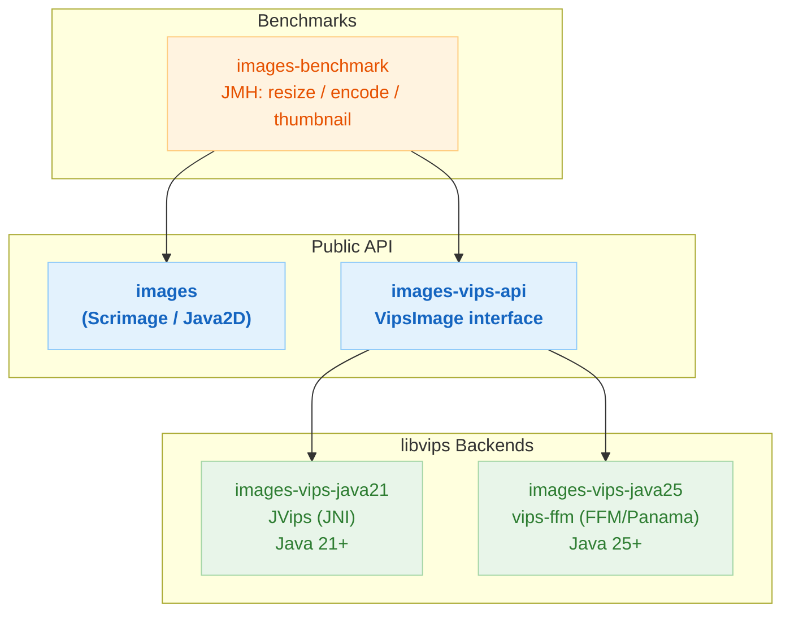

# bluetape4k-image

[](https://github.com/bluetape4k/bluetape4k-image/actions)
[](https://www.apache.org/licenses/LICENSE-2.0)

English | [한국어](./README.ko.md)

Kotlin/JVM image processing library — part of the [bluetape4k](https://github.com/bluetape4k) ecosystem.
Provides two backends: a pure-JVM [scrimage](https://github.com/sksamuel/scrimage) path (Java2D) for
standard formats with coroutine async I/O, and a high-performance [libvips](https://www.libvips.org/)
path available via both JNI (Java 21) and the Panama Foreign Function & Memory API (Java 25).

## Modules

| Module                | Artifact ID                          | Description                                              |
|-----------------------|--------------------------------------|----------------------------------------------------------|
| `images`              | `bluetape4k-images`                  | Scrimage-based processing: load, resize, filter, convert, analyze, batch |
| `images-vips-api`     | `bluetape4k-images-vips-api`         | Shared `VipsImage` / `VipsRuntime` interfaces (binding-neutral) |
| `images-vips-java21`  | `bluetape4k-images-vips-java21`      | JVips JNI backend — Java 21+, system libvips             |
| `images-vips-java25`  | `bluetape4k-images-vips-java25`      | vips-ffm FFM backend — Java 25+, `--enable-native-access` |
| `images-benchmark`    | `bluetape4k-images-benchmark`        | JMH benchmarks: scrimage vs libvips                      |

## Architecture



## Requirements

| Module                | JDK    | libvips | JVM flag                        |
|-----------------------|--------|---------|----------------------------------|
| `images`              | 21+    | —       | —                                |
| `images-vips-api`     | 21+    | —       | —                                |
| `images-vips-java21`  | 21+    | Yes     | —                                |
| `images-vips-java25`  | 25+    | Yes     | `--enable-native-access=ALL-UNNAMED` |

### Install libvips

```bash
# macOS
brew install vips

# Ubuntu / Debian
sudo apt-get install libvips-dev
```

On macOS, consumer applications using `images-vips-java25` must also set:

```bash
export DYLD_LIBRARY_PATH=/opt/homebrew/lib
```

## Installation

This library is published to Sonatype Central Portal as SNAPSHOT releases.
Add the snapshot repository and declare the modules you need:

```kotlin
// build.gradle.kts
repositories {
    maven {
        url = uri("https://central.sonatype.com/repository/maven-snapshots/")
    }
}

dependencies {
    // Scrimage-based image processing (Java 21+)
    implementation("io.github.bluetape4k.image:bluetape4k-images:0.1.0-SNAPSHOT")

    // libvips — shared API (required by both vips implementations)
    implementation("io.github.bluetape4k.image:bluetape4k-images-vips-api:0.1.0-SNAPSHOT")

    // Choose ONE vips backend:
    // Java 21 JNI backend
    runtimeOnly("io.github.bluetape4k.image:bluetape4k-images-vips-java21:0.1.0-SNAPSHOT")
    // OR Java 25 FFM backend
    runtimeOnly("io.github.bluetape4k.image:bluetape4k-images-vips-java25:0.1.0-SNAPSHOT")
}
```

## Usage

### Loading and Saving with Scrimage (`images`)

```kotlin
import io.bluetape4k.images.*
import io.bluetape4k.images.coroutines.*
import java.io.File
import java.nio.file.Paths

// Load
val image = immutableImageOf(File("photo.jpg"))

// Coroutine async load
val image = suspendImmutableImageOf(File("photo.jpg"))

// Save as WebP (async, in a coroutine)
image.suspendWrite(SuspendWebpWriter.Default, Paths.get("output.webp"))

// Encode to ByteArray
val jpegBytes = image.suspendBytes(SuspendJpegWriter(compression = 85))
```

### Applying Filters (`images`)

```kotlin
import io.bluetape4k.images.filters.dsl.*
import com.sksamuel.scrimage.ImmutableImage

val result: ImmutableImage = image.applyFilters {
    brightness(1.2f)
    saturation(1.1f)
    gaussianBlur(radius = 2)
    roundedCorners(radius = 20)
}

// Async variant inside a coroutine
val result = image.suspendApplyFilters {
    sepia()
    vignette()
}
```

### High-Performance Processing with libvips (`images-vips-api`)

Both `images-vips-java21` (JNI) and `images-vips-java25` (FFM) implement `VipsImage`.
Program against the interface; choose a backend at runtime.

```kotlin
import io.bluetape4k.images.vips.*
import io.bluetape4k.images.vips.coroutines.*
import java.nio.file.Path

// VipsImage is AutoCloseable — always use .use { }
vipsImageOf(Path.of("photo.jpg")).use { image ->
    // Resize
    image.resize(1280, 720).use { resized ->
        resized.writeTo(Path.of("output.jpg"), VipsImageFormat.JPEG)
    }

    // Thumbnail (maintains aspect ratio)
    image.thumbnail(800).use { thumb ->
        thumb.writeTo(Path.of("thumb.webp"), VipsImageFormat.WEBP)
    }
}

// Coroutine async — wraps blocking I/O on Dispatchers.IO
vipsImageOf(Path.of("photo.jpg")).use { image ->
    val bytes = image.suspendToBytes(
        format = VipsImageFormat.WEBP,
        options = VipsEncodeOptions(quality = 80, lossless = false),
    )
}
```

### Java 25 FFM Backend (`images-vips-java25`)

```kotlin
import io.bluetape4k.images.vips.java25.*

// Initialize once (JVM shutdown hook handles cleanup)
FfmVipsRuntime.init(concurrency = 4)

FfmVipsImageSupport.ffmVipsImageOf(Path.of("photo.jpg")).use { image ->
    image.thumbnail(800).use { thumb ->
        thumb.writeTo(Path.of("thumb.webp"), VipsImageFormat.WEBP)
    }
}
```

> **Note**: Add `--enable-native-access=ALL-UNNAMED` to your JVM startup flags when using
> `images-vips-java25`.

### Java 21 JNI Backend (`images-vips-java21`)

```kotlin
import io.bluetape4k.images.vips.java21.*

JVipsRuntime.init(concurrency = 4)

JVipsImageSupport.jvipsImageOf(Path.of("photo.jpg")).use { image ->
    image.thumbnail(800).use { thumb ->
        thumb.writeTo(Path.of("thumb.webp"), VipsImageFormat.WEBP)
    }
}
```

## Module READMEs

Each module contains its own detailed README with API reference, architecture diagrams, and usage examples:

- [`images/README.md`](images/README.md) — Scrimage-based processing
- [`images-vips-api/README.md`](images-vips-api/README.md) — VipsImage interface API
- [`images-vips-java21/README.md`](images-vips-java21/README.md) — JVips JNI backend
- [`images-vips-java25/README.md`](images-vips-java25/README.md) — vips-ffm FFM backend
- [`images-benchmark/README.md`](images-benchmark/README.md) — JMH benchmark results

## License

[Apache License 2.0](https://www.apache.org/licenses/LICENSE-2.0)
