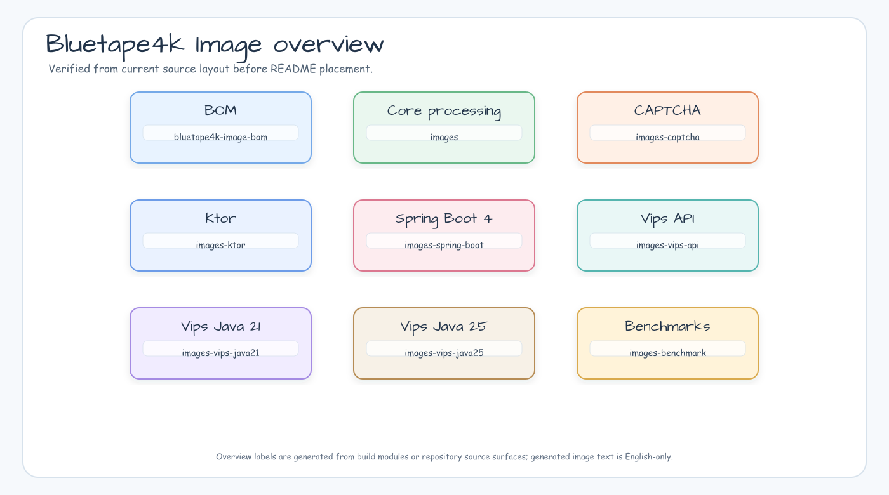
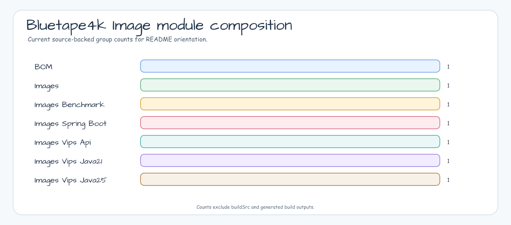
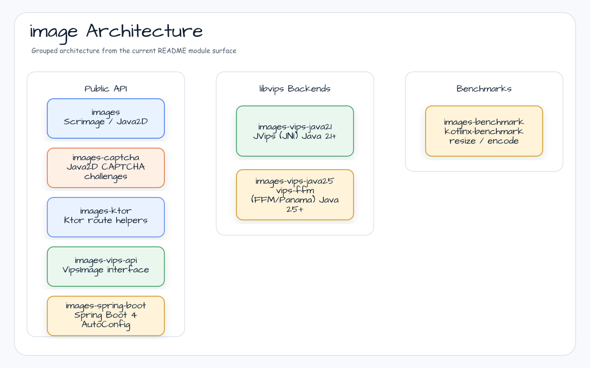

# bluetape4k-image

[](https://github.com/bluetape4k/bluetape4k-image/actions/workflows/ci.yml)
[](https://kotlinlang.org)
[](https://openjdk.org)
[](LICENSE)

English | [한국어](./README.ko.md)


Kotlin/JVM image processing library — part of the [bluetape4k](https://github.com/bluetape4k) ecosystem.
Provides two backends: a pure-JVM [scrimage](https://github.com/sksamuel/scrimage) path (Java2D) for
standard formats with coroutine async I/O, and a high-performance [libvips](https://www.libvips.org/)
path available via both JNI (Java 21) and the Panama Foreign Function & Memory API (Java 25).

## Project Purpose

`bluetape4k-image` gives Kotlin services one image-processing surface that can
start with pure-JVM scrimage operations and move to libvips when throughput,
memory use, or native codecs matter.

## What It Provides

- **Pure JVM processing** — load, resize, crop, filter, analyze, batch, and
  encode images through scrimage/Java2D.
- **Coroutine I/O** — suspend-friendly readers, writers, and byte encoders for
  common web image workflows.
- **CAPTCHA generation** — Java2D image challenge generation with bounded
  options, suspend-friendly entrypoint, and no native runtime dependency.
- **Ktor integration** — route helpers for issuing CAPTCHA images and verifying
  one-shot answers in Ktor services.
- **libvips abstraction** — binding-neutral `VipsImage` and `VipsRuntime`
  contracts.
- **Two native backends** — Java 21 JVips/JNI and Java 25 FFM/Panama options.
- **Benchmark lane** — `kotlinx-benchmark` comparisons for scrimage and
  libvips resize/encode paths.

<!-- README_VISUAL_OVERVIEW:START -->
## Overview Diagram



## Module Composition Chart


<!-- README_VISUAL_OVERVIEW:END -->

## Modules

| Module                | Artifact ID                          | Description                                              |
|-----------------------|--------------------------------------|----------------------------------------------------------|
| `bom`                 | `bluetape4k-image-bom`               | Consumer BOM for aligned image artifacts                 |
| `images`              | `bluetape4k-images`                  | Scrimage-based processing: load, resize, filter, convert, analyze, batch |
| `images-captcha`      | `bluetape4k-images-captcha`          | Java2D CAPTCHA image challenge generation                |
| `images-ktor`         | `bluetape4k-images-ktor`             | Ktor route helpers for thumbnails and CAPTCHA verification |
| `images-spring-boot`  | `bluetape4k-images-spring-boot`      | Spring Boot 4 auto-configuration: storage, CDN, health, metrics |
| `images-vips-api`     | `bluetape4k-images-vips-api`         | Shared `VipsImage` / `VipsRuntime` interfaces (binding-neutral) |
| `images-vips-java21`  | `bluetape4k-images-vips-java21`      | JVips JNI backend — Java 21+, system libvips             |
| `images-vips-java25`  | `bluetape4k-images-vips-java25`      | vips-ffm FFM backend — Java 25+, `--enable-native-access` |
| `images-benchmark`    | `bluetape4k-images-benchmark`        | `kotlinx-benchmark`: scrimage vs libvips                 |

## Architecture



## Requirements

| Module                | JDK    | libvips | JVM flag                        |
|-----------------------|--------|---------|----------------------------------|
| `images`              | 21+    | —       | —                                |
| `images-captcha`      | 21+    | —       | —                                |
| `images-ktor`         | 21+    | —       | —                                |
| `images-vips-api`     | 21+    | —       | —                                |
| `images-vips-java21`  | 21+    | Yes     | —                                |
| `images-vips-java25`  | 25+    | Yes     | `--enable-native-access=ALL-UNNAMED` |

### Install libvips

The pure JVM `images` module does not need native libraries. The `images-vips-*`
modules load libvips through JNI or FFM and require the native package to be
available on the host.

```bash
# macOS
brew install vips

# Ubuntu / Debian
sudo apt-get install libvips-tools libvips-dev

# Verify the CLI and shared libraries are visible
vips --version
```

Gradle tests for `images-vips-java25` already add
`--enable-native-access=ALL-UNNAMED` and, on Homebrew macOS, set
`DYLD_LIBRARY_PATH=/opt/homebrew/lib` when that directory exists. Consumer
applications must configure those settings themselves:

```bash
export DYLD_LIBRARY_PATH=/opt/homebrew/lib
java --enable-native-access=ALL-UNNAMED -jar my-image-app.jar
```

The native-access flag is a JVM option, so it must appear before `-jar`, the
main class, or the command that starts your application.

### AVIF / HEIC native codec support

AVIF and HEIC are visible in the shared `VipsImageFormat` API, but actual
support depends on both the selected backend and the native libvips build.

| Backend | AVIF decode | AVIF encode | HEIC decode | HEIC encode | Native dependency |
|---------|-------------|-------------|-------------|-------------|-------------------|
| `images` | N/A | N/A | N/A | N/A | Pure JVM scrimage path; use `images-vips-*` for these formats |
| `images-vips-java21` | Capability-gated | Capability-gated | Capability-gated | N/A | libvips with libheif; AVIF output also needs an AV1 encoder such as libaom |
| `images-vips-java25` | Capability-gated | Capability-gated | Capability-gated | Capability-gated | libvips with libheif plus AV1/HEVC encoders |

Capability-gated means the API accepts the AVIF/HEIC header or output format,
then the native libvips installation decides whether decode or encode can run.
Unsupported magic bytes fail as `VipsDecodeException`; missing or disabled
native HEIF-family codecs fail as sanitized `VipsDecodeException` or
`VipsEncodeException`. Verify host capability with `vips --version` plus a
small AVIF/HEIC decode or encode smoke test on the same machine that runs the
JVM.

### Troubleshooting libvips startup

- `FFM API requires --enable-native-access` or `UnsupportedOperationException`:
  start `images-vips-java25` with `--enable-native-access=ALL-UNNAMED`.
- `libvips not found`, `Cannot find vips library`, or `UnsatisfiedLinkError`:
  install libvips, run `vips --version`, and on Homebrew macOS export
  `DYLD_LIBRARY_PATH=/opt/homebrew/lib` before starting the JVM.
- Vips tests are skipped unexpectedly: pass `-Dvips.enabled=true` only when
  libvips is installed and visible. Pass `-Dvips.enabled=false` to opt out
  explicitly.

## Installation

This library is published to Sonatype Central Portal as SNAPSHOT releases.
Add the snapshot repository and declare the modules you need:

```kotlin
// build.gradle.kts
repositories {
    maven {
        url = uri("https://central.sonatype.com/repository/maven-snapshots/")
    }
}

dependencies {
    // Scrimage-based image processing (Java 21+)
    implementation("io.github.bluetape4k.image:bluetape4k-images:<version>")

    // Java2D CAPTCHA generation (Java 21+)
    implementation("io.github.bluetape4k.image:bluetape4k-images-captcha:<version>")

    // Ktor route helpers for CAPTCHA issue and verification (Java 21+)
    implementation("io.github.bluetape4k.image:bluetape4k-images-ktor:<version>")

    // Spring Boot 4 auto-configuration (storage, CDN, health, metrics)
    implementation("io.github.bluetape4k.image:bluetape4k-images-spring-boot:<version>")

    // libvips — shared API (required by both vips implementations)
    implementation("io.github.bluetape4k.image:bluetape4k-images-vips-api:<version>")

    // Choose ONE vips backend:
    // Java 21 JNI backend
    runtimeOnly("io.github.bluetape4k.image:bluetape4k-images-vips-java21:<version>")
    // OR Java 25 FFM backend
    runtimeOnly("io.github.bluetape4k.image:bluetape4k-images-vips-java25:<version>")
}
```

## Usage

### Loading and Saving with Scrimage (`images`)

```kotlin
import io.bluetape4k.images.*
import io.bluetape4k.images.coroutines.*
import java.io.File
import java.nio.file.Paths

// Load
val image = immutableImageOf(File("photo.jpg"))

// Coroutine async load
val image = suspendImmutableImageOf(File("photo.jpg"))

// Save as WebP (async, in a coroutine)
image.suspendWrite(SuspendWebpWriter.Default, Paths.get("output.webp"))

// Encode to ByteArray
val jpegBytes = image.suspendBytes(SuspendJpegWriter(compression = 85))
```

### Applying Filters (`images`)

```kotlin
import io.bluetape4k.images.filters.dsl.*
import com.sksamuel.scrimage.ImmutableImage

val result: ImmutableImage = image.applyFilters {
    brightness(1.2f)
    saturation(1.1f)
    gaussianBlur(radius = 2)
    roundedCorners(radius = 20)
}

// Async variant inside a coroutine
val result = image.suspendApplyFilters {
    sepia()
    vignette()
}
```

### Generating CAPTCHA Challenges (`images-captcha`)

```kotlin
import io.bluetape4k.images.captcha.CaptchaDistortion
import io.bluetape4k.images.captcha.CaptchaNoise
import io.bluetape4k.images.captcha.captchaGenerator

val generator = captchaGenerator {
    length(6)
    charSet("ABCDEFGHJKLMNPQRSTUVWXYZ23456789")
    imageSize(width = 200, height = 80)
    noise(CaptchaNoise.Medium)
    distortion(CaptchaDistortion.Wave(0.2f))
}

val challenge = generator.generate()

// Store challenge.text securely on the server side.
// Encode challenge.image with a Scrimage writer when returning it to a client.
```

### Ktor Image and CAPTCHA Routes (`images-ktor`)

```kotlin
import io.bluetape4k.images.ktor.bluetape4kCaptchaRoutes
import io.bluetape4k.images.ktor.bluetape4kImageThumbnailRoutes
import io.ktor.server.application.Application
import io.ktor.server.routing.routing

fun Application.module() {
    routing {
        bluetape4kImageThumbnailRoutes()
        bluetape4kCaptchaRoutes()
    }
}
```

`POST /images/thumbnail?maxSide=320` reads multipart field `file` and returns
PNG thumbnail bytes. `GET /captcha` returns a base64 PNG challenge payload.
`POST /captcha/{id}/verify` consumes the challenge and returns `SUCCESS`,
`WRONG_ANSWER`, `EXPIRED`, or `NOT_FOUND`. Install your preferred Ktor JSON and
error plugins in the application; the helper is compatible with the shared bluetape4k Ktor core
module from `bluetape4k-projects` once that artifact is on the selected release train.

### High-Performance Processing with libvips (`images-vips-api`)

Both `images-vips-java21` (JNI) and `images-vips-java25` (FFM) implement `VipsImage`.
Program against the interface; choose a backend at runtime.

```kotlin
import io.bluetape4k.images.vips.*
import io.bluetape4k.images.vips.coroutines.*
import java.nio.file.Path

// VipsImage is AutoCloseable — always use .use { }
vipsImageOf(Path.of("photo.jpg")).use { image ->
    // Resize
    image.resize(1280, 720).use { resized ->
        resized.writeTo(Path.of("output.jpg"), VipsImageFormat.JPEG)
    }

    // Thumbnail (maintains aspect ratio)
    image.thumbnail(800).use { thumb ->
        thumb.writeTo(Path.of("thumb.webp"), VipsImageFormat.WEBP)
    }
}

// Coroutine async — wraps blocking I/O on Dispatchers.IO
vipsImageOf(Path.of("photo.jpg")).use { image ->
    val bytes = image.suspendToBytes(
        format = VipsImageFormat.WEBP,
        options = VipsEncodeOptions(quality = 80, lossless = false),
    )
}
```

### Java 25 FFM Backend (`images-vips-java25`)

```kotlin
import io.bluetape4k.images.vips.java25.*

// Initialize once (JVM shutdown hook handles cleanup)
FfmVipsRuntime.init(concurrency = 4)

FfmVipsImageSupport.ffmVipsImageOf(Path.of("photo.jpg")).use { image ->
    image.thumbnail(800).use { thumb ->
        thumb.writeTo(Path.of("thumb.webp"), VipsImageFormat.WEBP)
    }
}
```

> **Note**: Add `--enable-native-access=ALL-UNNAMED` to your JVM startup flags when using
> `images-vips-java25`. For `java -jar`, place it before `-jar`.

### Java 21 JNI Backend (`images-vips-java21`)

```kotlin
import io.bluetape4k.images.vips.java21.*

JVipsRuntime.init(concurrency = 4)

JVipsImageSupport.jvipsImageOf(Path.of("photo.jpg")).use { image ->
    image.thumbnail(800).use { thumb ->
        thumb.writeTo(Path.of("thumb.webp"), VipsImageFormat.WEBP)
    }
}
```

## Module READMEs

Each module contains its own detailed README with API reference, architecture diagrams, and usage examples:

- [`images/README.md`](images/README.md) — Scrimage-based processing
- [`images-captcha/README.md`](images-captcha/README.md) — Java2D CAPTCHA generation
- [`images-ktor/README.md`](images-ktor/README.md) — Ktor thumbnail and CAPTCHA route helpers
- [`images-spring-boot/README.md`](images-spring-boot/README.md) — Spring Boot 4 auto-configuration
- [`images-vips-api/README.md`](images-vips-api/README.md) — VipsImage interface API
- [`images-vips-java21/README.md`](images-vips-java21/README.md) — JVips JNI backend
- [`images-vips-java25/README.md`](images-vips-java25/README.md) — vips-ffm FFM backend
- [`images-benchmark/README.md`](images-benchmark/README.md) — `kotlinx-benchmark` results

## Examples

Start with [`examples/basic-processing`](examples/basic-processing/README.md) for
a runnable pure JVM quickstart. It uses the bundled `cafe.jpg` and
`landscape.jpg` fixtures plus the root README representative image to generate
thumbnails, smart crops, PNG conversion, a watermarked JPEG, and a README visual
preview under `build/tmp/basic-processing`.

## License

[MIT License](LICENSE)
