[한국어](./README.ko.md) | English

# Module bluetape4k-images-benchmark

`kotlinx-benchmark` benchmarks comparing [scrimage](https://sksamuel.github.io/scrimage/) and [libvips](https://www.libvips.org/) image processing performance on the JVM JMH backend.

## Architecture


## Benchmark Results

> AverageTime ms/op; lower is better. Current comparable macOS Java 25 FFM evidence uses committed natural-photo fixtures: [`docs/benchmark-results-2026-05-28-natural-photos.md`](docs/benchmark-results-2026-05-28-natural-photos.md) and its [raw JSON](docs/raw/benchmark-results-2026-05-28-macos-java25-natural-photos.json). Historical CI Linux rows are intentionally excluded because they do not use the same fixture set.

### Resize (natural 4K photo → 1920×1080)


| Natural photo | scrimage (ms/op) | vips Java 25 FFM (ms/op) | Speedup |
|---------------|-----------------|---------------------------|---------|
| `cafe` | 114.885 ± 3.207 | 0.257 ± 0.083 | **446×** |
| `landscape` | 115.641 ± 2.242 | 0.244 ± 0.028 | **473×** |

### Encode (natural 4K photo)


| Format | Natural photo | scrimage (ms/op) | vips Java 25 FFM (ms/op) | Speedup |
|--------|---------------|-----------------|---------------------------|---------|
| JPEG | `cafe` | 137.947 ± 2.417 | 58.351 ± 23.828 | **2.4×** |
| JPEG | `landscape` | 144.961 ± 5.511 | 46.749 ± 6.066 | **3.1×** |
| PNG | `cafe` | 884.105 ± 156.993 | 585.288 ± 186.247 | **1.5×** |
| PNG | `landscape` | 989.370 ± 346.605 | 546.388 ± 25.444 | **1.8×** |

> These are natural-photo snapshots on one macOS Java 25 FFM host. They are not a cross-host or Java 21 JNI ranking.

### Vips Backend Comparison

`VipsBackendBenchmark` and `VipsBackendEncodeBenchmark` compare the Java 21
JVips JNI backend and the Java 25 FFM backend with stable benchmark names
across both runs.

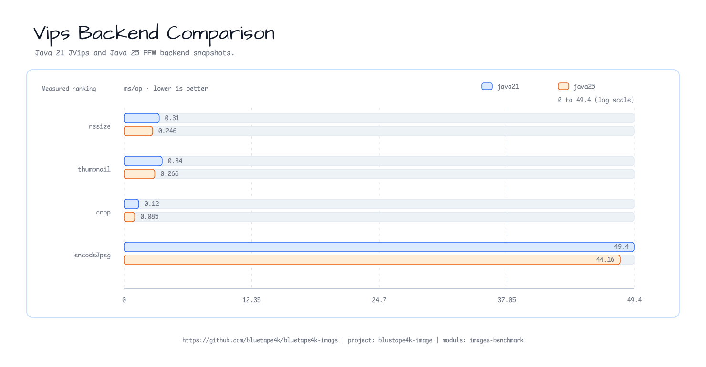

| Benchmark | Workload |
|-----------|----------|
| `vips_resize` | 4K JPEG resize to `1920x1080` and `1280x720` |
| `vips_thumbnail` | 4K JPEG thumbnail at matching max dimensions |
| `vips_crop` | 4K JPEG top-left crop to matching dimensions |
| `vips_encodeJpeg` | 4K JPEG decode and JPEG encode |

See [`docs/vips-backend-comparison.md`](docs/vips-backend-comparison.md) for
the side-by-side run commands, raw JSON reporting shape, and local validation
notes.

### Codec Runtime Matrix (PNG, WebP, AVIF, HEIC)

The 2026-07-13 codec run uses `cafe.jpg` as a `1920x1080` web-photo fixture
and `homer.jpg` as a `512x512` profile fixture. Java 25 FFM/libvips 8.18.4
measured all 16 direction cells. Java 21 JNI is `N/A` on this macOS arm64 host
because the JNI binary architecture could not be established; it is not ranked
against Java 25.

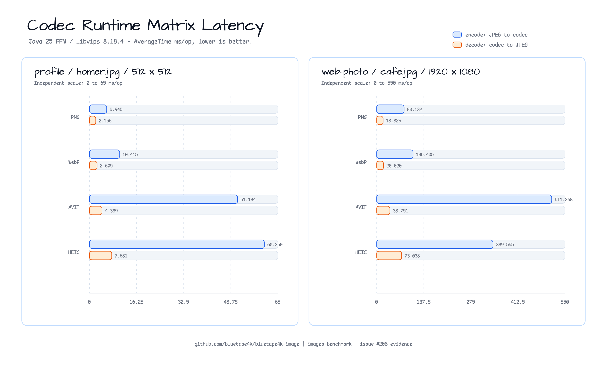

| Scenario | PNG encode / decode | WebP encode / decode | AVIF encode / decode | HEIC encode / decode |
|----------|---------------------|-----------------------|-----------------------|-----------------------|
| profile | 5.945 / 2.156 ms | 10.415 / 2.605 ms | 51.134 / 4.339 ms | 60.350 / 7.681 ms |
| web-photo | 80.132 / 18.825 ms | 106.405 / 20.020 ms | 511.268 / 38.751 ms | 339.555 / 73.038 ms |

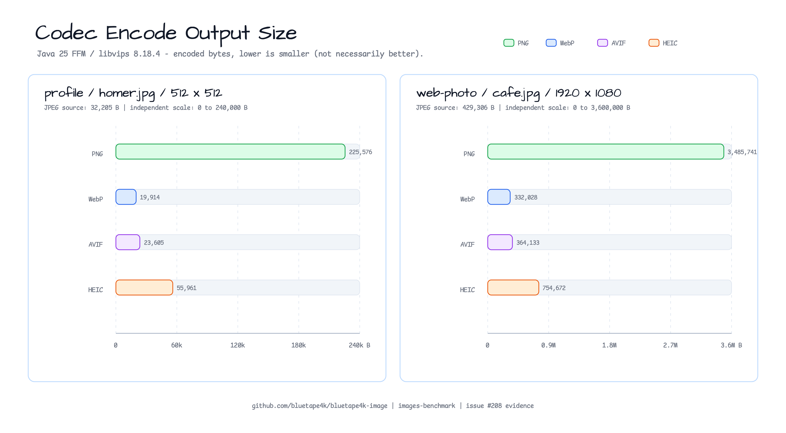

Status legend: `MEASURED` means accepted latency and allocation evidence;
`N/A` means the runtime could not be evaluated on this host; `UNSUPPORTED`
means an available runtime lacks a codec/direction; `SKIPPED` means an eligible
cell was intentionally not run. Encode is JPEG to the named codec; decode is
the named codec to JPEG. Managed-heap allocation excludes native libvips
memory, and output size is not a visual-quality ranking. See the
[`codec runtime matrix report`](docs/codec-runtime-matrix-2026-07-13.md) and
the [immutable raw evidence](docs/raw/issue-208-20260713-macos-arm64-09/).

### ZXing Barcode Extraction

This Java 25 snapshot measures ZXing extraction from immutable images that were
loaded and decoded during JMH trial setup. Latency is `AverageTime ms/op`
(lower is better); throughput is a separate observed `ops/s` run (higher is
better), not a reciprocal conversion.

| Scenario | Latency (ms/op) | Throughput (ops/s) | Expected result |
|----------|-----------------|--------------------|-----------------|
| QR | 0.174126 ± 0.001086 | 5702.142 ± 37.446 | One QR result |
| Code 128 | 0.112914 ± 0.000715 | 8839.015 ± 135.003 | One Code 128 result |
| No result | 0.271397 ± 0.009099 | 3690.012 ± 32.832 | Empty list |

These values are a local Apple M5 snapshot for one provider and three pinned
PNG fixtures, not a provider or cross-host ranking. See the
[`detailed report`](docs/barcode-extraction-2026-07-14.md) and
[`immutable raw evidence`](docs/raw/issue-272-20260714-macos-arm64-01/).

### 0.4.0 Benchmark Additions

The remaining `0.4.0` benchmark lanes are independently filterable:

| Issue | Configuration | Scope |
|------:|---------------|-------|
| #204 | `storageLocal`, `storageS3` | `ImageStorage` upload/download/list and max-size guards |
| #206 | `batchPipeline` | thumbnail fan-out, sequential versus bounded coroutine batches |
| #207 | `algorithmicHotPaths` | crop, tiling, dominant colors, SVG rasterization, similarity |

Run the local storage, batch, and algorithmic lanes with:

```bash
./gradlew :bluetape4k-images-benchmark:benchmarkStorageLocalBenchmark
./gradlew :bluetape4k-images-benchmark:benchmarkBatchPipelineBenchmark
./gradlew :bluetape4k-images-benchmark:benchmarkAlgorithmicHotPathsBenchmark
```

The S3 lane is an opt-in in-memory adapter benchmark and requires
`-Pstorage.s3.enabled=true`; it does not claim live network performance. See
[`storage backend`](docs/storage-backend-benchmark.md),
[`batch and thumbnail`](docs/batch-thumbnail-benchmark.md), and
[`algorithmic hot paths`](docs/algorithmic-hot-paths-2026-07.md) for fixture,
object-count, cleanup, and interpretation details.

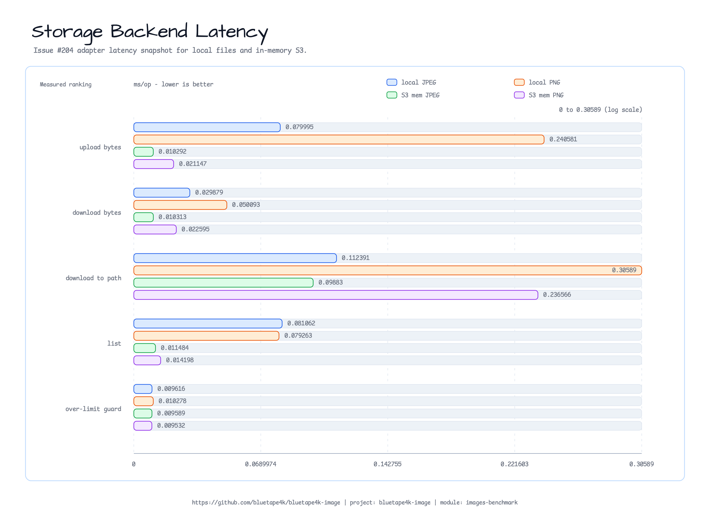

The storage chart uses a log scale because the adapter rows span sub-millisecond
to multi-format filesystem costs. The in-memory S3 adapter is faster for byte
and list operations because it removes network and durable-filesystem effects;
the chart must not be read as a production S3 throughput claim. The over-limit
guard is intentionally near-zero for both backends because rejection happens
before payload persistence.

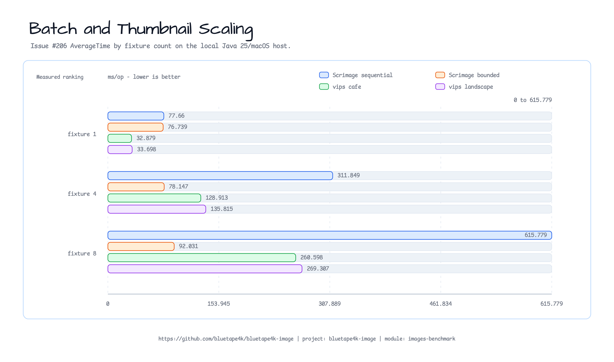

The batch chart shows the main scaling decision: Scrimage sequential work grows
from about `78` to `616 ms/op` between one and eight inputs, while bounded
concurrency stays near `92 ms/op` at eight. The libvips thumbnail-only rows
scale roughly linearly from `33` to `261-269 ms/op`; they are a different
pipeline boundary from Scrimage's resize-plus-JPEG rows and should not be
treated as a direct backend ranking.

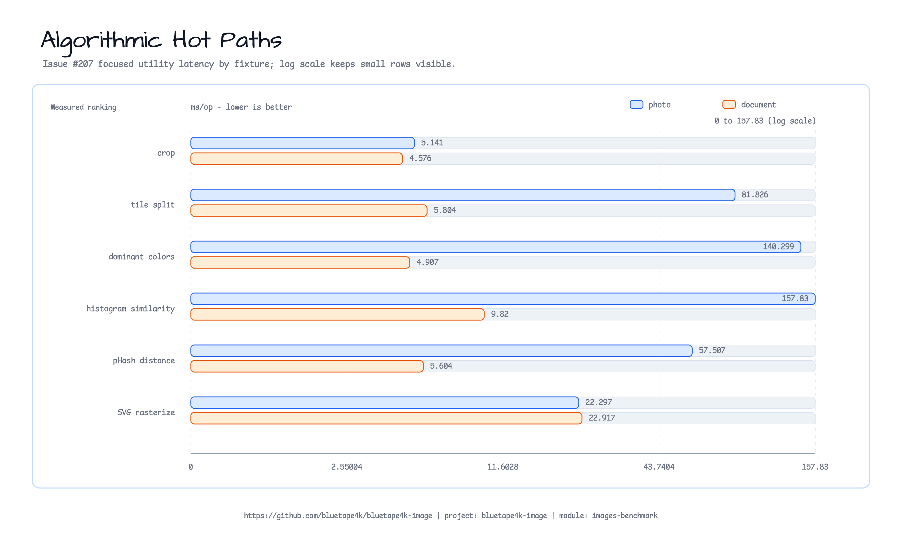

The algorithmic chart uses a log scale to keep document and photo fixtures
visible together. Photo `dominantColors` and `histogramSimilarity` are the
largest measured hot paths at roughly `140` and `158 ms/op`, while document
fixtures stay below `10 ms/op` for those operations. This is fixture-sensitive
evidence for prioritizing photo analysis work, not a cross-host guarantee.

### Filter (scrimage only, 1240×1754 document image)


| Filter    | macOS (ms/op) | CI Linux java25 (ms/op) | CI Linux java21 (ms/op) |
|-----------|--------------|------------------------|------------------------|
| Sepia     | 14.51 ± 8.45 | 60.83 ± 0.42 | 60.70 ± 0.59 |
| Grayscale | 6.26 ± 0.12  | 99.72 ± 23.9 | 97.05 ± 12.6 |
| Blur      | 27.76 ± 0.15 | 73.64 ± 1.28 | 84.81 ± 6.31 |

### Pipeline Allocation (scrimage chained operations)

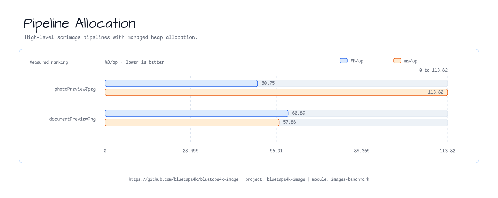

| Benchmark | Pipeline | AverageTime | Allocation |
|-----------|----------|-------------|------------|
| `scrimage_photoPreviewJpeg` | resize `landscape.jpg` to `1280x720`, grayscale, JPEG encode | 113.82 ms/op | 50.75 MB/op |
| `scrimage_documentPreviewPng` | resize `homer.png` to `640x905`, blur, sepia, PNG encode | 57.86 ms/op | 60.89 MB/op |

See [`docs/pipeline-allocation-2026-05-29.md`](docs/pipeline-allocation-2026-05-29.md)
and the raw `kotlinx-benchmark` JSON
[`docs/raw/benchmark-pipeline-allocation-2026-05-29-macos-java25.json`](docs/raw/benchmark-pipeline-allocation-2026-05-29-macos-java25.json).

### IO Boundary Baseline (Path, Okio, Suspended File Channel)

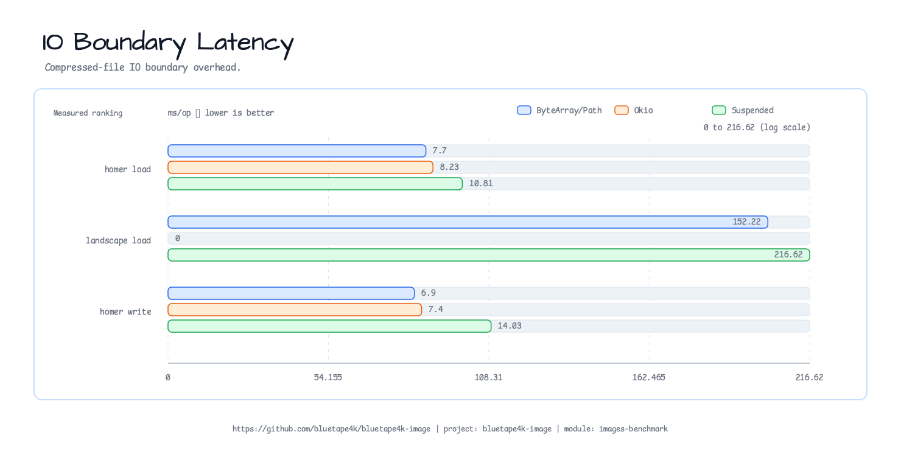

| Workload | Fastest baseline | Okio boundary | Suspended file channel |
|----------|------------------|---------------|------------------------|
| `homer.jpg` load | `ByteArray` 7.70 ms/op | `Source` 8.23 ms/op | `SuspendedSource` 10.81 ms/op |
| `landscape.jpg` load | `Path` 152.22 ms/op | N/A | `SuspendedSource` 216.62 ms/op |
| `homer.jpg` JPEG write | `ByteArray` 6.90 ms/op | `Sink` 7.40 ms/op | `SuspendedSink` 14.03 ms/op |

The suspended file-channel overloads are useful coroutine IO boundaries, but
they are not a latency win for Scrimage load/write because Scrimage still
bridges through blocking streams. See
[`docs/io-boundary-baseline-2026-05-29.md`](docs/io-boundary-baseline-2026-05-29.md)
and the raw `kotlinx-benchmark` JSON
[`docs/raw/benchmark-io-boundary-2026-05-29-macos-java25.json`](docs/raw/benchmark-io-boundary-2026-05-29-macos-java25.json).

### Concurrent File IO Throughput

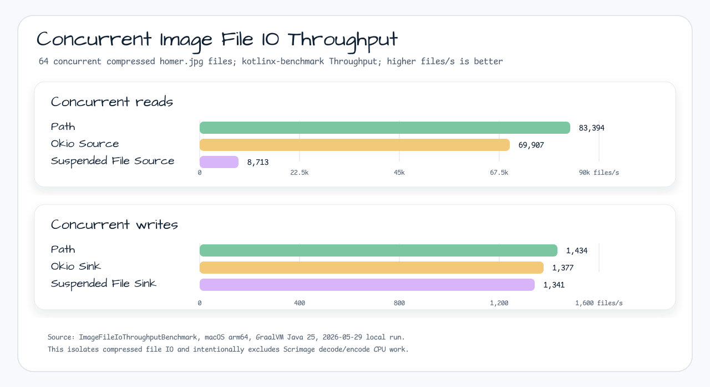

| Workload | Path | Okio | Suspended file channel |
|----------|------|------|------------------------|
| `cafe.jpg` 6,400-path concurrent read | 16,904 files/s | 2,513 files/s | 74 files/s |
| `landscape.jpg` 6,400-path concurrent read | 15,981 files/s | 2,072 files/s | 70 files/s |
| `cafe.jpg` 256-file concurrent write | 1,507 files/s | 767 files/s | 147 files/s |
| `landscape.jpg` 256-file concurrent write | 1,280 files/s | 778 files/s | 154 files/s |

This compressed-file IO benchmark intentionally excludes Scrimage decode/encode.
It uses `cafe.jpg` and `landscape.jpg`, streams bytes through a fixed buffer,
and creates 6,400 read paths with hard links to avoid huge setup copies. The
local Java 25 result does not support treating suspended file channels as a
throughput optimization. See
[`docs/file-io-throughput-2026-05-29.md`](docs/file-io-throughput-2026-05-29.md)
and the raw `kotlinx-benchmark` JSON
[`docs/raw/benchmark-file-io-throughput-2026-05-29-macos-java25.json`](docs/raw/benchmark-file-io-throughput-2026-05-29-macos-java25.json).

### Large Streaming Pipeline

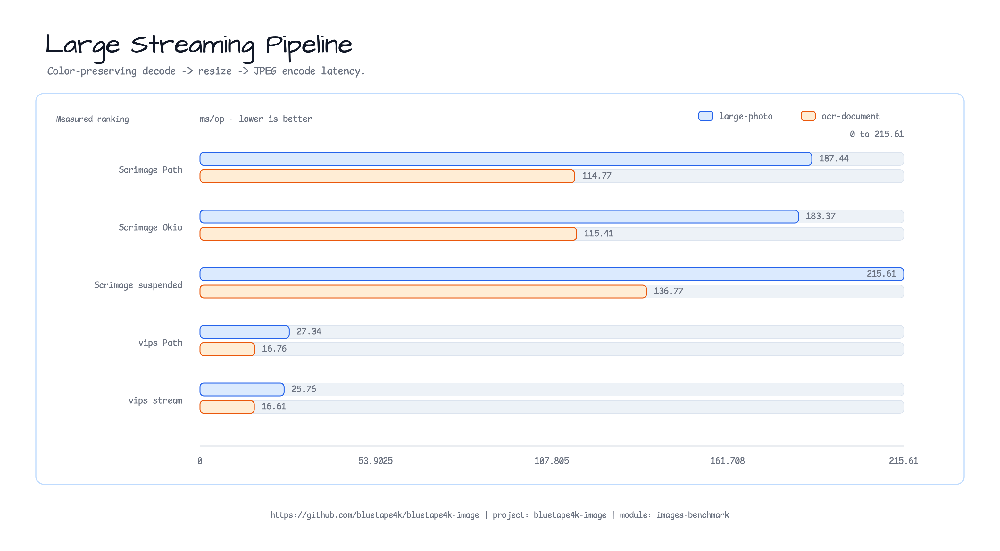

| Boundary | `large-photo` | `ocr-document` | Recommendation |
|----------|---------------|----------------|----------------|
| Scrimage `Path` | 187.44 ms/op | 114.77 ms/op | Color-preserving blocking path |
| Scrimage Okio `Source`/`Sink` | 183.37 ms/op | 115.41 ms/op | Lifecycle/integration boundary, not a latency promise |
| Scrimage suspended source/sink | 215.61 ms/op | 136.77 ms/op | Coroutine boundary with bridge overhead |
| vips `Path` | 27.34 ms/op | 16.76 ms/op | Local-file API boundary; still buffers within the 50 MiB guard |
| vips `InputStream`/`OutputStream` | 25.76 ms/op | 16.61 ms/op | Caller-owned stream boundary; also buffers within the 50 MiB guard |

`ImageLargeStreamingBenchmark` generates deterministic large fixtures during
JMH setup instead of committing huge binary assets. The local Java 25 row
supports positioning Okio/suspended APIs as memory/lifecycle boundaries rather
than latency or throughput optimizations for Scrimage. For large-file
performance, choose the vips input boundary from the caller's existing
resource and lifecycle rather than treating this short snapshot as a universal
ranking. Every current vips input overload, including `Path`, validates and
buffers the compressed input within the 50 MiB guard; neither boundary is a
streaming-memory or guard-bypass choice. See
[`docs/large-streaming-2026-07-10.md`](docs/large-streaming-2026-07-10.md)
and the raw `kotlinx-benchmark` JSON
[`docs/raw/benchmark-large-streaming-2026-07-10-macos-java25.json`](docs/raw/benchmark-large-streaming-2026-07-10-macos-java25.json).
The JMH GC-profiler addendum
[`docs/raw/benchmark-large-streaming-jmh-gc-2026-07-10-macos-java25.json`](docs/raw/benchmark-large-streaming-jmh-gc-2026-07-10-macos-java25.json)
reports managed-heap allocation for the same 16 rows; native libvips memory is
not inferred from those Java allocation numbers.

### Memory Profile (kotlinx-benchmark + GC addendum)

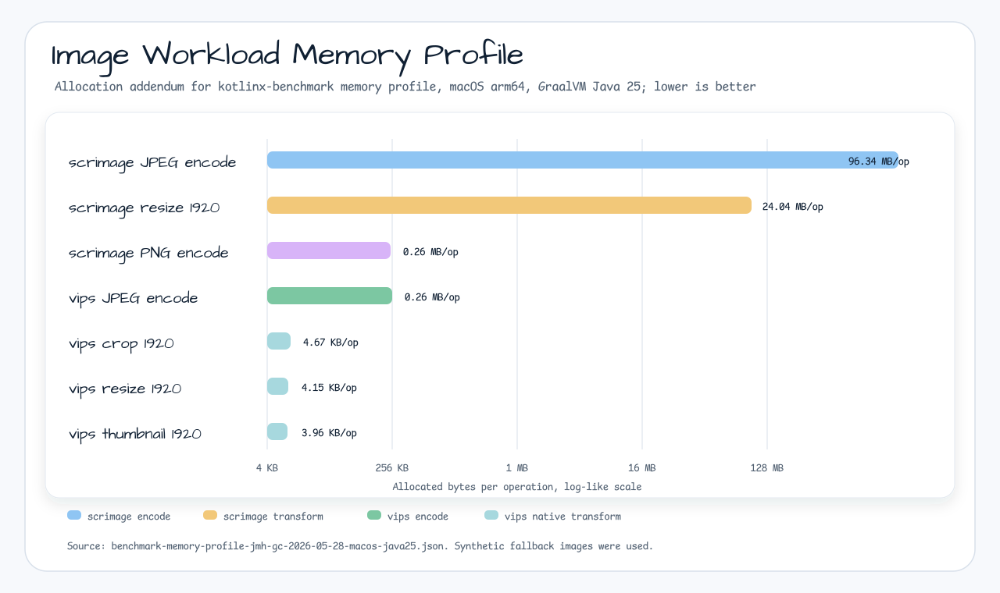

| Workload | AverageTime | Allocation |
|----------|-------------|------------|
| `scrimage_encodeJpeg` | 146.09 ms/op | 96.34 MB/op |
| `scrimage_scaleTo` 1920x1080 | 115.34 ms/op | 24.04 MB/op |
| `vips_encodeJpeg` | 44.16 ms/op | 0.26 MB/op |
| `vips_resize` 1920x1080 | 0.246 ms/op | 4.14 KB/op |
| `vips_crop` 1920x1080 | 0.085 ms/op | 4.63 KB/op |
| `vips_thumbnail` 1920x1080 | 0.266 ms/op | 3.95 KB/op |

See [`docs/memory-profile-2026-05-29.md`](docs/memory-profile-2026-05-29.md)
and the raw `kotlinx-benchmark` JSON
[`docs/raw/benchmark-memory-profile-2026-05-29-macos-java25.json`](docs/raw/benchmark-memory-profile-2026-05-29-macos-java25.json).

---

## Running Benchmarks

```bash
# Java 25 - full benchmark set, including FFM-only large streaming (macOS/Linux)
RUN_ID="local-$(date +%Y%m%d-%H%M%S)"
./gradlew :bluetape4k-images-benchmark:benchmarkBenchmark \
  -Pcodec.matrix.runId="$RUN_ID" -Pvips.impl=java25

# Java 21 - selected JVips JNI-compatible benchmarks (Linux only; excludes FFM-only large streaming)
./gradlew :bluetape4k-images-benchmark:benchmarkPipelineAllocationBenchmark :bluetape4k-images-benchmark:benchmarkMemoryProfileBenchmark :bluetape4k-images-benchmark:benchmarkIoBoundaryBenchmark :bluetape4k-images-benchmark:benchmarkIoThroughputBenchmark -Pvips.impl=java21

# Focused evidence used by the 2026-05-29 reports
JAVA_HOME=$(/usr/libexec/java_home -v 25) ./gradlew :bluetape4k-images-benchmark:benchmarkPipelineAllocationBenchmark --console=plain
JAVA_HOME=$(/usr/libexec/java_home -v 25) ./gradlew :bluetape4k-images-benchmark:benchmarkIoBoundaryBenchmark --console=plain
JAVA_HOME=$(/usr/libexec/java_home -v 25) ./gradlew :bluetape4k-images-benchmark:benchmarkIoThroughputBenchmark --console=plain
JAVA_HOME=$(/usr/libexec/java_home -v 25) ./gradlew :bluetape4k-images-benchmark:benchmarkMemoryProfileBenchmark --console=plain
JAVA_HOME=$(/usr/libexec/java_home -v 25) ./gradlew :bluetape4k-images-benchmark:benchmarkLargeStreamingBenchmark -Pvips.impl=java25 --console=plain

# Managed heap allocation addendum for large streaming rows
./gradlew :bluetape4k-images-benchmark:benchmarkBenchmarkJar --console=plain

# 0.4.0 focused lanes
./gradlew :bluetape4k-images-benchmark:benchmarkStorageLocalBenchmark --console=plain
./gradlew :bluetape4k-images-benchmark:benchmarkBatchPipelineBenchmark --console=plain
./gradlew :bluetape4k-images-benchmark:benchmarkAlgorithmicHotPathsBenchmark --console=plain
# S3 adapter-only lane (no credentials; explicitly opt in)
./gradlew :bluetape4k-images-benchmark:benchmarkStorageS3Benchmark \
  -Pstorage.s3.enabled=true --console=plain

JAVA25=$(/usr/libexec/java_home -v 25)
"$JAVA25/bin/java" --enable-native-access=ALL-UNNAMED \
  -jar benchmark/images-benchmark/build/benchmarks/benchmark/jars/bluetape4k-images-benchmark-benchmark-jmh-0.3.0-JMH.jar \
  '.*ImageLargeStreamingBenchmark.*' -wi 1 -i 3 -f 1 -bm avgt -tu ms \
  -prof gc -rf json \
  -rff benchmark/images-benchmark/docs/raw/benchmark-large-streaming-jmh-gc-2026-07-10-macos-java25.json
```

**macOS prerequisites**: `brew install vips`

`VipsBenchmarkState` auto-detects macOS and sets Homebrew library paths
(`vipsffm.libpath.*.override`) so libvips is found even with SIP stripping `DYLD_LIBRARY_PATH`.

### Regenerating Reports and Charts

Use the Gradle `kotlinx-benchmark` tasks as the primary execution surface. The
benchmark target is named `benchmark`, so Gradle exposes these tasks:

| Task | Purpose |
|------|---------|
| `benchmarkBenchmark` | Run the full benchmark target and write JMH reports |
| `benchmarkBenchmarkJar` | Build the JMH jar for focused/debug runs |
| `benchmarkBenchmarkGenerate` | Generate JMH sources |
| `benchmarkBenchmarkCompile` | Compile generated JMH sources |

Fresh report workflow:

1. Install native prerequisites for vips rows.
   - macOS: `brew install vips`
   - Linux: install `libvips-tools` and `libvips-dev`
2. Run one backend at a time. Do not run Java 21 and Java 25 benchmark
   processes in parallel on the same host.
3. Copy the generated JMH JSON from
   `benchmark/images-benchmark/build/reports/benchmarks/<target>/<timestamp>/benchmark.json`
   to `benchmark/images-benchmark/docs/raw/` with an environment-specific filename such
   as `benchmark-results-YYYY-MM-DD-macos-java25.json`.
4. Update the matching Markdown report under `benchmark/images-benchmark/docs/` with the
   measured command, host/JVM/libvips conditions, raw JSON link, and result
   tables. Every latency table uses `AverageTime ms/op`; lower is better.
5. Update the benchmark chart SVG sources under `docs/images/readme-charts/`,
   then render the matching PNG files. README files embed PNGs only; keep SVG
   sources beside them for review and regeneration.

Chart assets currently referenced by this module:

| Chart | SVG source | README PNG |
|-------|------------|------------|
| Resize latency | `../../docs/images/readme-charts/images-benchmark-resize-latency-chart-01.svg` | `../../docs/images/readme-charts/images-benchmark-resize-latency-chart-01.png` |
| Encode latency | `../../docs/images/readme-charts/images-benchmark-encode-latency-chart-01.svg` | `../../docs/images/readme-charts/images-benchmark-encode-latency-chart-01.png` |
| Filter latency | `../../docs/images/readme-charts/images-benchmark-filter-latency-chart-01.svg` | `../../docs/images/readme-charts/images-benchmark-filter-latency-chart-01.png` |
| Vips backend comparison | `../../docs/images/readme-charts/images-benchmark-vips-backend-comparison-chart-01.svg` | `../../docs/images/readme-charts/images-benchmark-vips-backend-comparison-chart-01.png` |
| Large streaming pipeline | `../../docs/images/readme-charts/images-benchmark-large-streaming-chart-01.svg` | `../../docs/images/readme-charts/images-benchmark-large-streaming-chart-01.png` |
| Storage backend | `../../docs/images/readme-charts/images-benchmark-storage-backend-chart-01.svg` | `../../docs/images/readme-charts/images-benchmark-storage-backend-chart-01.png` |
| Batch and thumbnail scaling | `../../docs/images/readme-charts/images-benchmark-batch-pipeline-chart-01.svg` | `../../docs/images/readme-charts/images-benchmark-batch-pipeline-chart-01.png` |
| Algorithmic hot paths | `../../docs/images/readme-charts/images-benchmark-algorithmic-hot-paths-chart-01.svg` | `../../docs/images/readme-charts/images-benchmark-algorithmic-hot-paths-chart-01.png` |

Render and validate chart updates:

```bash
# Render touched chart SVG files to PNG
rsvg-convert docs/images/readme-charts/images-benchmark-resize-latency-chart-01.svg \
  -o docs/images/readme-charts/images-benchmark-resize-latency-chart-01.png

# Validate SVG syntax and PNG readability
xmllint --noout docs/images/readme-charts/*.svg
identify docs/images/readme-charts/*.png

# Validate the documented benchmark task path without running a full benchmark
./gradlew :bluetape4k-images-benchmark:benchmarkBenchmark \
  -Pcodec.matrix.runId=local-dry-run-01 \
  -Pvips.impl=java25 --dry-run --console=plain
```

When only one environment row was rerun, label the refreshed row explicitly and
preserve older CI rows as historical data. Do not imply Linux CI or Java 21 JNI
numbers are current unless those rows were rerun on a compatible host.

---

## Benchmark Classes

### `ImageResizeBenchmark`

Resizes the natural `landscape.jpg` fixture (4032×3024) to multiple target resolutions.

| Parameter    | Values |
|--------------|--------|
| `resolution` | `1920x1080`, `1280x720` |

```kotlin
@Benchmark
fun scrimage_scaleTo(bh: Blackhole) {
    val resized = BenchmarkImageSets.photo4k.scaleTo(targetWidth, targetHeight)
    bh.consume(resized)
}

@Benchmark
fun vips_resize(state: VipsBenchmarkState, bh: Blackhole) {
    if (!state.vipsAvailable) { bh.consume(null); return }
    state.createVipsImage(state.photo4kJpegBytes).use { img ->
        bh.consume(img.resize(targetWidth, targetHeight))
    }
}
```

### `ImageEncodeBenchmark`

Encodes the natural `landscape.jpg` fixture to JPEG and PNG.

```kotlin
@Benchmark
fun scrimage_encodeJpeg(bh: Blackhole) {
    bh.consume(BenchmarkImageSets.document.bytes(JpegWriter(85, false)))
}

@Benchmark
fun vips_encodeJpeg(state: VipsBenchmarkState, bh: Blackhole) {
    if (!state.vipsAvailable) { bh.consume(null); return }
    state.createVipsImage(state.photo4kJpegBytes).use { img ->
        bh.consume(img.toJpegBytes(85))
    }
}
```

### `ImageFilterBenchmark`

Applies scrimage filters to a 1240×1754 document image.

| Benchmark          | Filter          |
|--------------------|-----------------|
| `scrimage_blur`    | `BlurFilter`    |
| `scrimage_grayscale` | `GrayscaleFilter` |
| `scrimage_sepia`   | `SepiaFilter`   |

### `ImagePipelineBenchmark`

Measures chained high-level scrimage operation paths through `kotlinx-benchmark`.
Allocation rows in the report use a separate JVM GC-profiler addendum because
the `kotlinx-benchmark` Gradle DSL does not expose profiler arguments.

| Benchmark | Workload |
|-----------|----------|
| `scrimage_photoPreviewJpeg` | 4K photo resize -> grayscale -> JPEG encode |
| `scrimage_documentPreviewPng` | document resize -> blur -> sepia -> PNG encode |

### `ImageIoBoundaryBenchmark`

Compares baseline load/write entry points with Okio and
`bluetape4k-okio` suspended file-channel boundaries.

| Benchmark group | Boundaries |
|-----------------|------------|
| `load_homer_*` | `ByteArray`, `InputStream`, `Path`, Okio `Source`, `SuspendedSource` |
| `load_landscape_*` | `Path`, `SuspendedSource` |
| `write_homer_*` | `ByteArray`, `OutputStream`, `Path`, Okio `Sink`, `SuspendedSink` |

### `ImageFileIoThroughputBenchmark`

Measures compressed image file IO throughput with `cafe.jpg` and
`landscape.jpg`. Reads use 6,400 hard-linked paths per scenario. Writes use 256
real output files per scenario. It excludes Scrimage decode/encode to isolate
the file boundary.

| Benchmark group | Boundaries |
|-----------------|------------|
| `read_*_concurrent` | `Path`, Okio `Source`, `SuspendedSource` |
| `write_*_concurrent` | `Path`, Okio `Sink`, `SuspendedSink` |

### `ImageLargeStreamingBenchmark`

Measures complete large-image load-transform-write pipelines. Fixtures are
generated during JMH setup to avoid committing large binary files.

| Scenario | Generated dimensions | Transform |
|----------|----------------------|-----------|
| `large-photo` | 4032x3024 | resize to 1920x1440, JPEG encode |
| `ocr-document` | 2480x3508 | resize to 1240x1754, JPEG encode |

| Benchmark group | Boundaries |
|-----------------|------------|
| `scrimage_*_pipeline` | `ByteArray`, `Path`, `InputStream`/`OutputStream`, Okio `Source`/`Sink`, suspended file source/sink |
| `vips_*_pipeline` | `ByteArray`, `Path`, `InputStream`/`OutputStream` with the required Java 25 FFM backend |

### `VipsBenchmarkState`

JMH `@State(Scope.Thread)` — initializes the vips runtime once per trial via reflection
(supports both `FfmVipsRuntime` Java 25 and `JVipsRuntime` Java 21).

```kotlin
@Setup(Level.Trial)
fun setup() {
    photo4kJpegBytes = BenchmarkImageSets.photo4k.bytes(JpegWriter(80, false))
    applyMacOsVipsLibraryPaths()   // sets vipsffm.libpath.*.override on macOS
    vipsAvailable = tryInitVipsRuntime()
}
```
