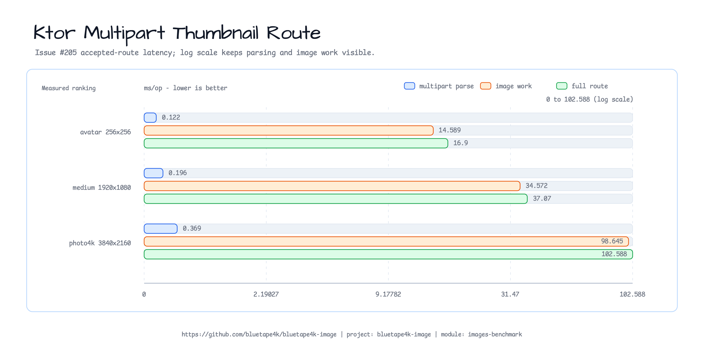
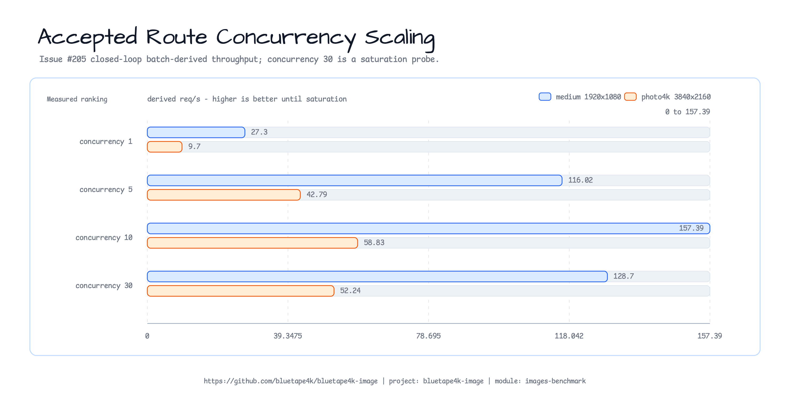

# Ktor multipart 썸네일 경로 벤치마크 (Issue #205)

`KtorThumbnailRouteBenchmark`는 Ktor의 프로세스 내부 test host에서 multipart 파싱,
직접 이미지 처리, 전체 운영 썸네일 경로를 측정한다. 테스트 애플리케이션은 JMH
trial마다 한 번 시작되며 네트워크 포트를 바인딩하지 않는다.

## 명령

```bash
./gradlew :bluetape4k-images-benchmark:benchmarkKtorRouteBenchmark
./gradlew :bluetape4k-images-benchmark:benchmarkKtorRouteConcurrencyBenchmark
```

동시성 작업은 새 JSON 보고서 하나가 `sample` 모드의 예상 parameter 행 15개와
p50, p95, p99 데이터를 모두 담을 때만 성공한다. 이렇게 해서 JMH 워크로드 예외가
일부 행만 채운 Gradle 성공 보고서로 숨겨지지 않게 한다.

## 실행 환경

| 항목 | 값 |
|------|-------|
| Host | Apple M4 Pro, 48 GiB |
| OS | macOS 26.5.2 (25F84) |
| JVM | Oracle GraalVM 25.0.3, Java 25 |
| Ktor | 3.5.1 test host |
| JMH, single request | 1 fork, 1 x 1 s warmup, 3 x 1 s measurement |
| JMH, concurrency | 1 fork, 3 x 3 s warmup, 5 x 3 s measurement |
| 메트릭 | single request: `AverageTime ms/op`; concurrency: `SampleTime ms/batch` |
| 원본 픽스처 | `landscape.jpg`, SHA-256 `bd674fb8518311c3d9add76b54d4a05baef3328991a0214360c2a8cf62716f05` |

## 픽스처와 제한

허용되는 각 JPEG는 trial 설정 중 체크인된 자연 사진 픽스처에서 JPEG quality 82로
한 번 생성된다.

| 픽스처 | 크기 | 인코딩된 페이로드 |
|---------|------------|----------------:|
| `avatar` | `256x256` | 15,656 bytes |
| `medium` | `1920x1080` | 419,392 bytes |
| `photo4k` | `3840x2160` | 1,434,914 bytes |
| 거부되는 초과 크기 | streamed bytes | 1,048,577 bytes |
| 혼합 트래픽 초과 크기 | streamed bytes | 2,097,153 bytes |

허용 경로는 16 MiB, 디코딩 픽셀 16,777,216개, 한 변 8,192픽셀을 허용한다.
응답은 `PngWriter.MaxCompression`으로 최대 `320x320` PNG를 반환한다. 거부 경로는
`maxInputBytes`를 1 MiB로 낮추고 1바이트를 추가로 보낸다. 혼합 lane은 허용
픽스처 두 개가 모두 유효하도록 2 MiB 제한을 사용한 뒤, 각 배치의 정확히 10%에
1바이트를 추가로 보낸다.

## 결과

| 픽스처 | Multipart 파싱만 | 디코딩 + 썸네일 + PNG | 전체 운영 경로 |
|---------|---------------------:|------------------------:|----------------------:|
| `avatar` | 0.122 +/- 0.648 ms | 14.589 +/- 4.781 ms | 16.900 +/- 6.966 ms |
| `medium` | 0.196 +/- 0.468 ms | 34.572 +/- 5.693 ms | 37.070 +/- 9.441 ms |
| `photo4k` | 0.369 +/- 0.691 ms | 98.645 +/- 38.459 ms | 102.588 +/- 13.227 ms |
| 거부되는 초과 크기 | N/A | N/A | 0.351 +/- 1.505 ms |



직접 이미지 작업 대비 전체 경로의 추가 비용은 avatar 약 `2.3 ms`, medium 사진 약
`2.5 ms`, 4K 사진 약 `3.9 ms`였다. 이 호스트에서는 디코딩, 크기 조정, PNG 인코딩이
허용 요청 지연 시간의 대부분을 차지하며, multipart 파싱 자체는 `0.4 ms/op` 아래에
머문다.

초과 크기 요청은 이미지 디코딩 전에 약 `0.35 ms/op`에 거부된다. 이는 byte-limit
검증을 dimension probing과 썸네일 생성보다 앞에 두는 설계를 뒷받침한다. 전체
경로의 추가 비용에는 프로세스 내부 Ktor 요청 처리, multipart 검증, 코루틴 dispatch,
응답 직렬화가 포함된다. 소켓, TLS, reverse proxy, 실제 네트워크 IO는 제외된다.

오차 구간이 넓은 이유는 짧은 로컬 근거 실행이기 때문이다. 비교에는 원시 sample을
사용하고 배포 하드웨어에서 다시 실행해야 하며, 이 값을 운영 capacity 보장으로
취급하면 안 된다.

원시 출력:
[`ktor-route.json`](raw/issue-205-20260726-macos-java25/ktor-route.json)
(SHA-256 `4cb260b1967785f7e6e3ddef3e2e87f240ee8715dd799d9a0abec313babef134`).

## 동시 허용 요청

각 JMH sample은 공유 coroutine gate에서 closed-loop 배치 하나를 풀고 모든 응답
body를 소비한 뒤에만 완료된다. 보고된 percentile은 개별 요청 지연 시간이 아니라
**배치 완료 지연 시간**이다. 파생 초당 요청 수는
`concurrency * 1000 / mean ms/batch`이며, 이 정규화는 test host의 포화 지점을 찾는
데 유용하지만 open-loop 서버 처리량은 아니다.

| 픽스처 | 동시성 | 평균 ms/batch | p50 | p95 | p99 | 파생 req/s |
|---------|------------:|--------------:|----:|----:|----:|--------------:|
| `medium` | 1 | 36.630 | 36.176 | 38.558 | 52.203 | 27.30 |
| `medium` | 5 | 43.097 | 41.157 | 50.070 | 94.110 | 116.02 |
| `medium` | 10 | 63.537 | 61.833 | 74.200 | 88.993 | 157.39 |
| `medium` | 30 | 233.102 | 229.638 | 290.770 | 470.286 | 128.70 |
| `photo4k` | 1 | 103.119 | 101.515 | 113.725 | 134.159 | 9.70 |
| `photo4k` | 5 | 116.847 | 113.836 | 136.643 | 154.062 | 42.79 |
| `photo4k` | 10 | 169.973 | 166.199 | 191.365 | 289.931 | 58.83 |
| `photo4k` | 30 | 574.240 | 555.745 | 687.866 | 696.254 | 52.24 |



두 픽스처 모두 동시성 10에서 가장 높은 파생 처리량을 보였다. 동시성을 10에서
30으로 올리면 `medium` 처리량은 약 18.2%, `photo4k` 처리량은 약 11.2% 감소하고,
p95 배치 완료 시간은 각각 74.2에서 290.8 ms, 191.4에서 687.9 ms로 증가한다.
따라서 동시성 30은 이 12코어 호스트에서 포화 probe로는 유용하지만, 기본 capacity
목표로 삼기에는 적절하지 않다.

## 거부 요청과 혼합 트래픽

예상된 `400 Bad Request` 응답은 성공한 벤치마크 작업으로 센다. 예상하지 못한
status는 sample을 실패시킨다.

| 워크로드 | 픽스처 | 동시성 | 평균 ms/batch | p95 | p99 | 파생 req/s |
|----------|---------|------------:|--------------:|----:|----:|--------------:|
| 거부만 | N/A | 1 | 0.210 | 0.258 | 0.304 | 4,760.78 |
| 거부만 | N/A | 10 | 1.209 | 1.780 | 4.260 | 8,272.79 |
| 거부만 | N/A | 30 | 7.528 | 29.213 | 59.549 | 3,985.29 |
| 허용 90% / 거부 10% | `medium` | 10 | 57.411 | 64.766 | 74.187 | 174.18 |
| 허용 90% / 거부 10% | `medium` | 30 | 176.290 | 204.787 | 218.104 | 170.17 |
| 허용 90% / 거부 10% | `photo4k` | 10 | 156.511 | 179.988 | 241.435 | 63.89 |
| 허용 90% / 거부 10% | `photo4k` | 30 | 511.312 | 611.372 | 640.680 | 58.67 |

거부 전용 경로도 동시성 10에서 정점을 찍고, 30에서는 긴 꼬리가 생긴다(`p95 29.213 ms`
대 `1.780 ms`). 혼합 트래픽은 여전히 허용된 이미지 작업이 지배하지만, 동시성
10에서 30 사이의 파생 처리량은 `medium`에서 2.3%, `photo4k`에서 8.2% 낮아진다.
이 결과는 운영 한도를 정하기 전에 제한된 admission/concurrency 정책과 배포 환경별
부하 테스트가 필요하다는 점을 뒷받침한다.

## 운영 throttling 권장 사항

허용된 썸네일 요청은 CPU와 메모리를 많이 쓰는 디코딩, 크기 조정, PNG 인코딩을
수행한다. 동시성 30 행은 허용 경로 처리량을 개선하지 못한 채 queueing과 tail
latency만 늘리므로, 운영 서비스에서는 이 경로에 제한된 admission이 필요하다.

초기 배포 정책은 다음처럼 시작한다.

| 제어 항목 | 초기 정책 | 이 실행의 근거 |
|---------|----------------|-------------------------|
| 인스턴스별 허용 경로 동시성 | 활성 썸네일 요청 `10`개를 구성 가능한 상한으로 시작한다. | 허용 픽스처 두 개가 모두 동시성 10에서 정점을 찍었고, 동시성 30은 파생 처리량을 낮추고 p95 배치 지연 시간을 늘렸다. |
| 대기 요청 | 제한된 큐를 사용하고, 무제한 코루틴 또는 요청 누적을 허용하지 않는다. | 30에서의 포화는 4K p95 배치 완료 시간을 191.4에서 687.9 ms로 높였다. |
| Capacity 초과 | 서비스 전체 큐가 가득 차면 `Retry-After`와 함께 `503 Service Unavailable`을 반환한다. | 즉시 받아들일 수 없는 작업으로부터 CPU와 힙을 보호한다. |
| 클라이언트 또는 tenant quota | 별도 rate limit을 적용하고 quota를 넘으면 `429 Too Many Requests`를 반환한다. | 한 호출자가 공유 썸네일 예산을 소진하지 못하게 한다. |
| 큰 입력 | 디코딩 전 byte/pixel/side guard를 유지하고, 큰 업로드에는 더 낮은 quota 또는 비동기 작업 경로를 검토한다. | `photo4k`는 `medium`보다 처리량이 뚜렷하게 낮고 tail latency가 더 크다. |
| 관측성 | 활성 작업 수, 큐 깊이, admission 거부, p95/p99 완료 시간, 입력 크기를 기록한다. | 고정된 로컬 스냅숏이 아니라 실측 근거로 배포별 상한을 조정할 수 있다. |

상한 `10`은 한 인스턴스의 출발점이지 보편적인 capacity 숫자가 아니다. 릴리스 전에는
배포 CPU/메모리 제한, 스토리지와 네트워크 경계, 레플리카 수, 예상 arrival pattern을
반영해 허용, 거부, 혼합 워크로드를 다시 실행해야 한다. 최종 상한은 그 환경에서
관찰한 latency SLO와 overload 동작으로 정한다.

test host는 소켓, TLS, reverse proxy, client think time, open-loop arrival rate를
제외한다. 또한 다중 인스턴스 배포를 모델링하지 않고 현재 운영 경로 dispatcher를
통해 이미지 처리를 실행한다.

동시성 원시 출력:
[`ktor-route-concurrency.json`](raw/issue-205-20260726-macos-java25/ktor-route-concurrency.json)
(SHA-256 `345e9eb08940856daf364970358bcc3681a3136b4c4e5fc62713e3ac56cd04f2`).
