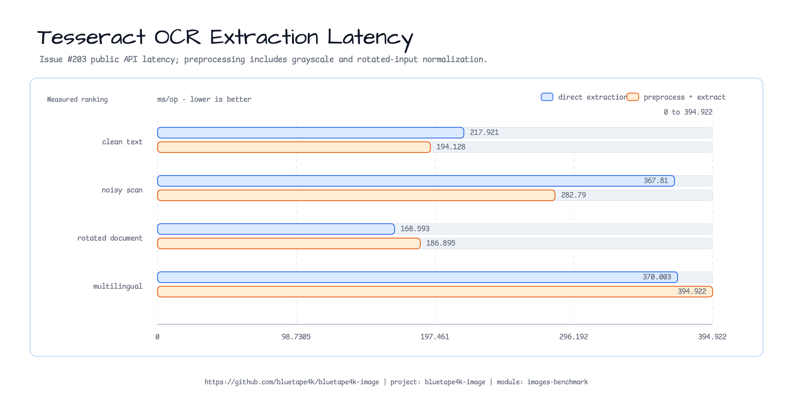

# Tesseract OCR 추출 벤치마크 (2026-07-26)

이 보고서는 해시로 고정한 문서 픽스처 4개에 대해 로컬 Tess4J/Tesseract 추출
스냅숏을 기록한다. 매 호출마다 새 Tesseract 엔진을 만들고 구성하는 공개
`ImmutableImage.extractText` 경로와, 회전된 픽스처에 회색조 변환과 안전한 90도
정규화를 적용하는 별도 전처리 경로를 함께 측정한다.

## 실행 환경

| 항목 | 값 |
|------|-------|
| Host | Apple M4 Pro, 12 logical processors |
| OS | macOS 26.5.2 (25F84), arm64 |
| JVM | Oracle GraalVM Java 25.0.3 LTS |
| OCR 엔진 | Tesseract 5.5.3 through Tess4J |
| tessdata | `/opt/homebrew/share/tessdata` |
| 사용한 설치 언어 | `eng`, `kor`, `jpn` |
| 지연 시간 명령 | `./gradlew :bluetape4k-images-benchmark:benchmarkOcrLatencyBenchmark --console=plain` |
| 처리량 명령 | `./gradlew :bluetape4k-images-benchmark:benchmarkOcrThroughputBenchmark --console=plain` |
| 실행 형태 | 1 thread, 1 fork, 3 x 1 s warmups, 5 x 1 s measurements |

벤치마크는 실제 조치 가능한 호스트 사전 검사를 수행한다. `tesseract --list-langs`가
각 픽스처의 언어를 노출해야 하며, tessdata 디렉터리는 `TESSDATA_PREFIX` 또는
문서화된 로컬 경로 중 하나에서 확인되어야 한다. 이렇게 해서 누락된 언어 패키지를
조용히 건너뛰지 않고 네이티브 사전 조건을 명시한다.

## 픽스처

픽스처 PNG 로드, SHA-256 검사, 디코딩, 예상 토큰 OCR 검사 하나는 JMH trial 설정
단계에서 실행된다. 이 작업들은 측정 대상 메서드에서 제외된다.

| 시나리오 | 크기 | 언어 | 측정 전처리 | 매니페스트 SHA-256 |
|----------|------------|-----------|---------------------|-----------------|
| `clean-text` | 1600x1000 | `eng` | grayscale | `eeae6d9dc34fa8281befad9b288196a4fac955ca0b25bda77102b5b1b6079bb0` |
| `noisy-scan` | 1600x1000 | `eng` | grayscale | same manifest |
| `rotated-document` | 1000x1600 | `eng` | right rotation to `TYPE_INT_RGB`, then grayscale | same manifest |
| `multilingual-text` | 1600x1000 | `eng+kor+jpn` | grayscale | same manifest |

픽스처 매니페스트는 개별 PNG 해시와 ImageMagick/폰트 출처를 기록한다. 다국어
검증은 안정적인 공통 토큰을 요구하지만, 한국어/일본어 글리프 전체 인식은 여전히
엔진과 모델에 따른 관찰값으로 남긴다.

## 결과

`AverageTime`은 낮을수록 좋다. 처리량은 별도의 JMH 관찰값이며 높을수록 좋고,
지연 시간 값에서 역산하지 않는다.

| 시나리오 | 직접 지연 시간 (ms/op) | 전처리 + 추출 (ms/op) | 직접 처리량 (ops/s) | 전처리 + 추출 처리량 (ops/s) |
|----------|------------------------|------------------------------|---------------------------|--------------------------------|
| `clean-text` | 217.921 +/- 11.427 | 194.128 +/- 2.548 | 4.607 +/- 0.180 | 5.111 +/- 0.116 |
| `noisy-scan` | 367.810 +/- 16.800 | 282.790 +/- 7.498 | 2.727 +/- 0.054 | 3.418 +/- 0.285 |
| `rotated-document` | 168.593 +/- 3.040 | 186.895 +/- 2.912 | 5.875 +/- 0.151 | 5.189 +/- 0.406 |
| `multilingual-text` | 370.003 +/- 2.103 | 394.922 +/- 3.548 | 2.704 +/- 0.043 | 2.518 +/- 0.045 |



### 관리 힙 할당 부록

GC-profiler 부록은 직접 `clean-text` 추출에 대해서만 생성된 JMH jar를 실행한다. 이
로컬 실행에서는 `214.555 ms/op`, `gc.alloc.rate.norm` 기준 `1,417,421 B/op`,
GC count 1회를 기록했다. 이는 관리 힙 근거일 뿐이며, Tesseract 네이티브 메모리와
traineddata 메모리는 이 숫자에 포함되지 않는다.

```bash
"$(/usr/libexec/java_home -v 25)/bin/java" \
  -jar benchmark/images-benchmark/build/benchmarks/benchmark/jars/bluetape4k-images-benchmark-benchmark-jmh-0.4.0-JMH.jar \
  '.*TesseractOcrExtractionBenchmark.extractText' -p scenario=clean-text \
  -wi 3 -i 5 -f 1 -bm avgt -tu ms -prof gc -rf json \
  -rff benchmark/images-benchmark/docs/raw/issue-203-20260726-macos-java25/ocr-gc-clean-text.json
```

## 원시 근거

위의 모든 값은 다음 불변 원시 JSON 디렉터리에서 가져왔다.
[`raw/issue-203-20260726-macos-java25/`](raw/issue-203-20260726-macos-java25/):

| File | SHA-256 |
|------|---------|
| `ocr-latency.json` | `9b1a9bcbe0a6543b979eda577d74281ef4ada6e4bcc84d9e4db769c248e01151` |
| `ocr-throughput.json` | `fe3f93b8c53f20d5bd7dff6f43995c3c953901e21cb459da4fe951ba62c44137` |
| `ocr-gc-clean-text.json` | `0c644e551d569d29ad4e8df7e0e2c4385caabc15ef0999b6bf6be1f4bd1d3e52` |

## 해석과 한계

이 호스트에서는 노이즈가 있는 입력과 다국어 입력의 직접 지연 시간이 회전된 영어
문서의 약 두 배였다. 이 스냅숏에서는 회색조 전처리가 깨끗한 문서와 노이즈 문서
행을 개선했지만, 회전 정규화는 회전 문서에 비용을 더했고 전처리는 다국어 행을 더
느리게 만들었다. 따라서 전처리는 보편적인 OCR 최적화가 아니라 워크로드별 선택이다.

이 결과에는 프로세스 내부 Tess4J/Tesseract 초기화와 추출이 포함되지만, 업로드,
이미지 디코딩, 소켓, 큐, 스토리지, 다중 인스턴스 경합은 제외된다. 이는 로컬
네이티브 엔진 관찰값이지 운영 처리량 보장이 아니다. 서비스는 비용이 큰 문서,
노이즈 문서, 다국어 문서에 대해 제한된 OCR admission 또는 백그라운드 작업을
사용하고, 실제 배포 하드웨어에서 한도를 보정해야 한다.

[issue #203](https://github.com/bluetape4k/bluetape4k-image/issues/203)에서 추적한다.
