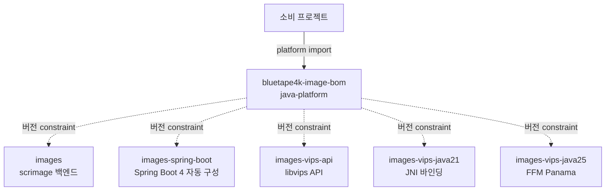

# bluetape4k-image-bom

한국어 | [English](./README.md)

**bluetape4k-image** 생태계용 Maven BOM (Bill of Materials). 모든 `io.github.bluetape4k.image:*`
모듈의 버전을 중앙 관리한다.

## Architecture



BOM은 Gradle `java-platform` 으로 `<dependencyManagement>` constraint 만 게시한다.

## 핵심 기능

- 모든 `bluetape4k-image` 모듈 버전 중앙 관리
- 이중 백엔드 (scrimage + libvips) 버전 일관성 보장
- `bluetape4k-dependencies` 가 상위에서 통합

## 관리 모듈

| 모듈 | 설명 |
|------|------|
| `images` | 이미지 처리 코어 (scrimage / Java2D 백엔드) |
| `images-spring-boot` | Spring Boot 4 자동 구성: 스토리지, CDN, 헬스, 메트릭 |
| `images-vips-api` | libvips API 표면 (백엔드 중립) |
| `images-vips-java21` | libvips JNI 바인딩 (Java 21) |
| `images-vips-java25` | libvips FFM (Project Panama) 바인딩 (Java 25) |

## 사용 예제

### Gradle Kotlin DSL

```kotlin
plugins {
    id("io.spring.dependency-management") version "1.1.x"
}

dependencyManagement {
    imports {
        mavenBom("io.github.bluetape4k.image:bluetape4k-image-bom:<version>")
    }
}

dependencies {
    implementation("io.github.bluetape4k.image:images")
    implementation("io.github.bluetape4k.image:images-spring-boot")
    implementation("io.github.bluetape4k.image:images-vips-java25")
}
```

### 순수 Gradle

```kotlin
dependencies {
    implementation(platform("io.github.bluetape4k.image:bluetape4k-image-bom:<version>"))
    implementation("io.github.bluetape4k.image:images")
}
```

### Maven

```xml
<dependencyManagement>
    <dependencies>
        <dependency>
            <groupId>io.github.bluetape4k.image</groupId>
            <artifactId>bluetape4k-image-bom</artifactId>
            <version>${bluetape4k-image.version}</version>
            <type>pom</type>
            <scope>import</scope>
        </dependency>
    </dependencies>
</dependencyManagement>
```

## 설정 옵션

BOM 자체는 별도 설정이 없다. SNAPSHOT 사용 시 Sonatype Central Snapshots 저장소 추가:

```kotlin
repositories {
    mavenCentral()
    maven {
        name = "central-snapshots"
        url = uri("https://central.sonatype.com/repository/maven-snapshots/")
    }
}
```

## 의존성

이 BOM은 `bluetape4k-dependencies` 에서 자동 통합된다. 여러 bluetape4k 생태계를 함께 사용한다면
`io.github.bluetape4k:bluetape4k-dependencies` import 권장.
