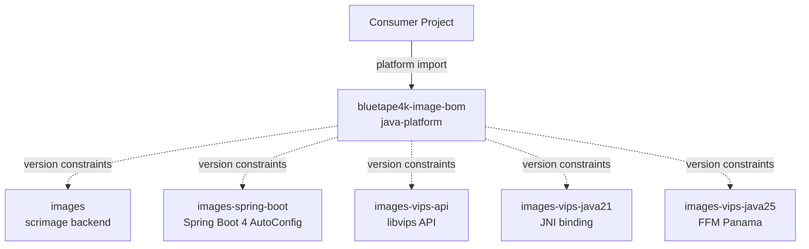

# bluetape4k-image-bom

[한국어](./README.ko.md) | English

Maven BOM (Bill of Materials) for the **bluetape4k-image** ecosystem. Manages versions of all
`io.github.bluetape4k.image:*` modules so consumers can declare dependencies without specifying
individual versions.

## Architecture



The BOM is a Gradle `java-platform` that publishes only `<dependencyManagement>` constraints — no runtime classes.

## Core Features

- Centralized version management for all `bluetape4k-image` modules
- Single source of truth for the dual-backend image stack (scrimage + libvips)
- Aggregated by `bluetape4k-dependencies` for cross-ecosystem version coordination

## Modules Managed

| Module | Description |
|--------|-------------|
| `images` | Image processing core with scrimage (Java2D) backend |
| `images-spring-boot` | Spring Boot 4 auto-configuration: storage, CDN, health, metrics |
| `images-vips-api` | libvips API surface (backend-neutral) |
| `images-vips-java21` | libvips JNI binding for Java 21 |
| `images-vips-java25` | libvips FFM (Project Panama) binding for Java 25 |

## Usage Examples

### Gradle Kotlin DSL

```kotlin
plugins {
    id("io.spring.dependency-management") version "1.1.x"
}

dependencyManagement {
    imports {
        mavenBom("io.github.bluetape4k.image:bluetape4k-image-bom:<version>")
    }
}

dependencies {
    implementation("io.github.bluetape4k.image:images")
    implementation("io.github.bluetape4k.image:images-spring-boot")
    implementation("io.github.bluetape4k.image:images-vips-java25")
}
```

### Plain Gradle

```kotlin
dependencies {
    implementation(platform("io.github.bluetape4k.image:bluetape4k-image-bom:<version>"))
    implementation("io.github.bluetape4k.image:images")
}
```

### Maven

```xml
<dependencyManagement>
    <dependencies>
        <dependency>
            <groupId>io.github.bluetape4k.image</groupId>
            <artifactId>bluetape4k-image-bom</artifactId>
            <version>${bluetape4k-image.version}</version>
            <type>pom</type>
            <scope>import</scope>
        </dependency>
    </dependencies>
</dependencyManagement>
```

## Configuration Options

The BOM itself has no configuration. For SNAPSHOT builds, add the Sonatype Central Snapshots repository:

```kotlin
repositories {
    mavenCentral()
    maven {
        name = "central-snapshots"
        url = uri("https://central.sonatype.com/repository/maven-snapshots/")
    }
}
```

## Dependency

This BOM is automatically aggregated by `bluetape4k-dependencies`. Prefer importing
`io.github.bluetape4k:bluetape4k-dependencies` when consuming multiple bluetape4k ecosystems.
