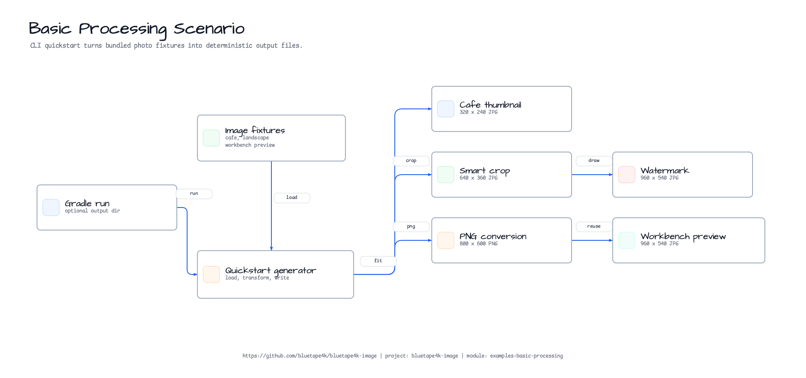
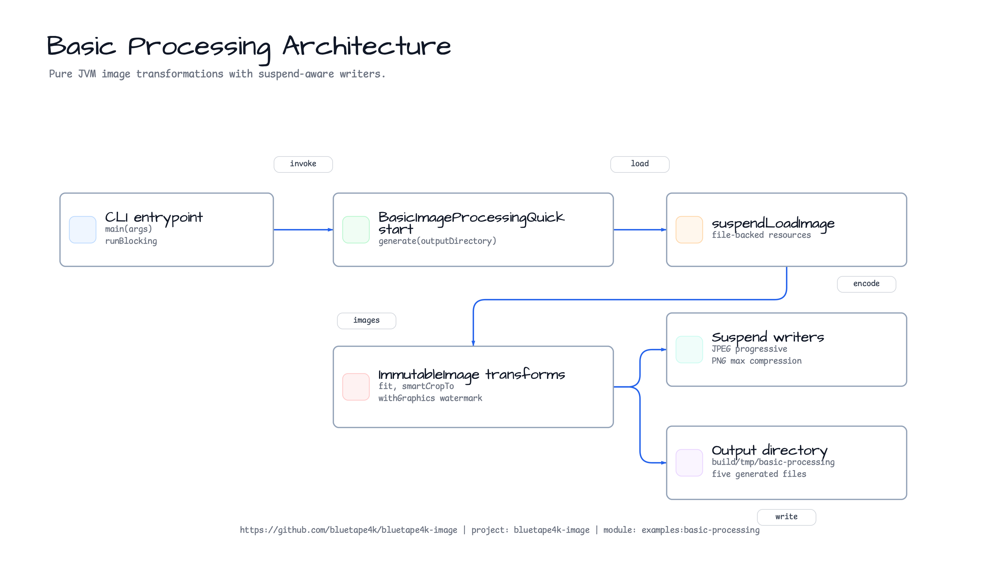
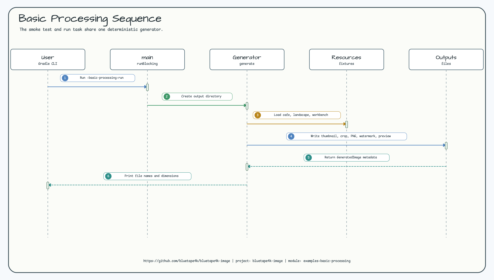

# Basic Image Processing Quickstart

English | [한국어](./README.ko.md)

Small runnable example for pure JVM image processing with `bluetape4k-images`.
It uses the natural photo fixtures `cafe.jpg` and `landscape.jpg`, plus the root
README representative image `docs/images/image-workbench.png`, and writes all
generated files under `build/tmp/basic-processing` by default.

## What It Shows

- Load images from file-backed resources without copying the whole compressed file into your own `ByteArray`
- Create a bounded thumbnail
- Smart-crop a landscape photo to an exact 16:9 output
- Convert JPEG input to PNG output
- Add a simple text watermark
- Reuse the root README representative image as a 16:9 preview output
- Write encoded images through suspend-aware `bluetape4k-images` writers
- Run a deterministic sensitive-content moderation workflow without bundling an
  ML runtime or model weights

## Diagrams

### Example Scenario



### Architecture



### Sequence



## Run

```bash
./gradlew :basic-processing:run
```

Use a custom output directory:

```bash
./gradlew :basic-processing:run --args="/tmp/bluetape4k-basic-processing"
```

Expected outputs:

| File | Source | Operation | Size |
| --- | --- | --- | --- |
| `01-cafe-thumbnail.jpg` | `cafe.jpg` | fit thumbnail | `320x240` |
| `02-landscape-smart-crop.jpg` | `landscape.jpg` | saliency smart crop | `640x360` |
| `03-cafe-converted.png` | `cafe.jpg` | JPEG to PNG conversion | `800x600` |
| `04-landscape-watermarked.jpg` | `landscape.jpg` | fit and text watermark | `960x540` |
| `05-readme-workbench-preview.jpg` | `image-workbench.png` | root README visual preview | `960x540` |

## Smoke Test

```bash
./gradlew :basic-processing:test
```

The test calls the same generator used by the `run` task and verifies that every
output file exists, is decodable, and has the expected dimensions.

## Sensitive Moderation Workflow

The `runSensitiveWorkflow` task demonstrates a detector-result to policy to
action pipeline with deterministic fake detector output. It is intentionally not
a production moderator. The example is useful for wiring, audit reports, and
safe derivative behavior, but real deployments still need model validation,
false-positive and false-negative monitoring, threshold review, and human
escalation rules.

```bash
./gradlew :basic-processing:runSensitiveWorkflow
```

Use a custom output directory:

```bash
./gradlew :basic-processing:runSensitiveWorkflow --args="/tmp/bluetape4k-sensitive-workflow"
```

Expected outputs:

| File | Purpose |
| --- | --- |
| `06-sensitive-moderation-preview.jpg` | Public-safe derivative generated from the sample policy's rectangle actions |
| `06-sensitive-moderation-report.txt` | Text audit summary of detections, policy decisions, action intensity, and renderer coverage |

The example covers these geometry and action cases:

| Detector fixture | Geometry | Policy action | Action parameters |
| --- | --- | --- | --- |
| `suggestive-low` | rectangle | `ALLOW` | no treatment |
| `explicit-medium` | rectangle | `MOSAIC` | `mosaicBlockSize=18` |
| `pii-text-line` | polyline | `BLUR` | `blurRadius=6.0`, `blurSigma=2.0` |
| `minor-face` | rectangle | `SOLID_MASK` | `maskOpacity=0.95` |
| `violence-contour` | polygon | `MANUAL_REVIEW` | `reviewPriority=70` |
| `weapon-silhouette` | rectangle | `DROP` | `rejectReason=weapon policy` |
| `hate-symbol-mask` | raster mask metadata | `REJECT` | `rejectReason=hate-symbol policy` |
| `unknown-sensitive-region` | polygon | `QUARANTINE` | fail-closed fallback |

Only rectangle actions are rendered by the core privacy derivative pipeline in
this example. Polygon, polyline, and raster-mask cases are included in the
policy/audit contract so a future renderer or detector adapter can plug into the
same `SensitiveContentDetection` and `SensitiveModerationPolicy` models without
moving model runtime dependencies into `bluetape4k-images`.

Blog seed: see
[`docs/blog/sensitive-content-moderation-workflow-outline.md`](../../docs/blog/sensitive-content-moderation-workflow-outline.md).
