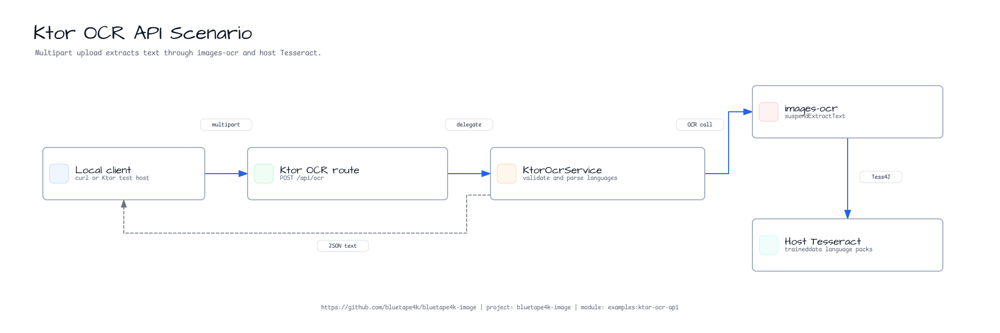
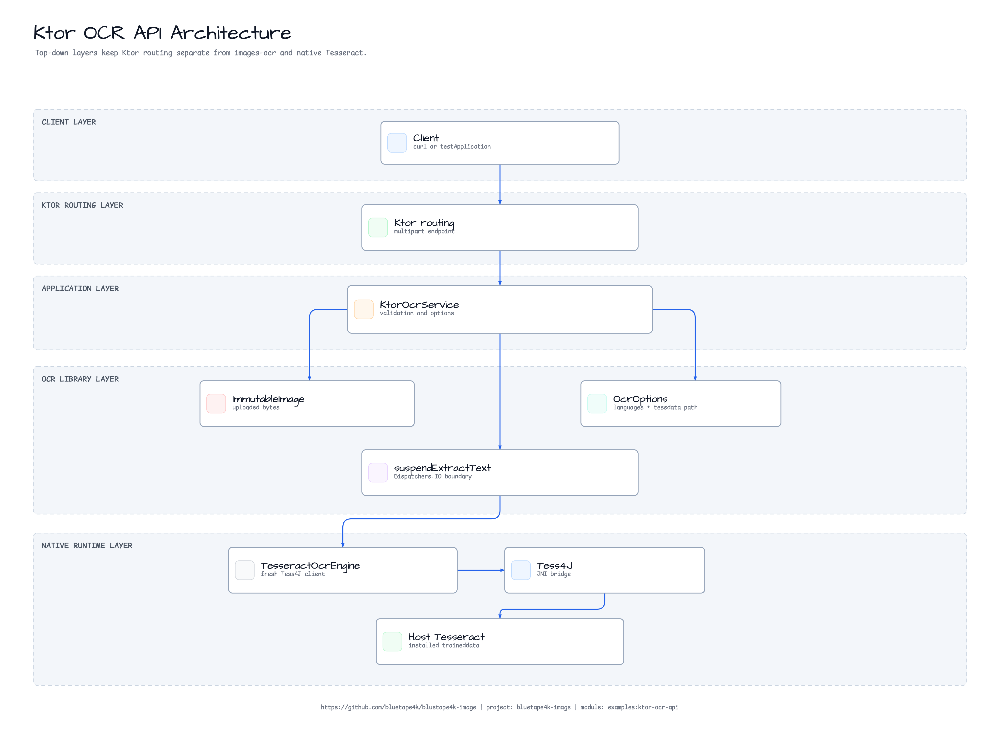
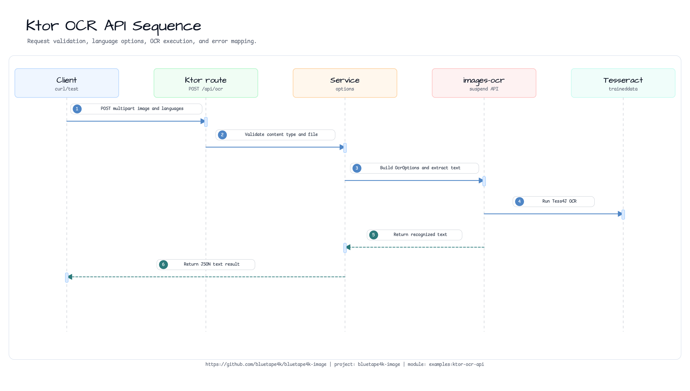

# Ktor OCR API Quickstart

[English](./README.md) | 한국어

`bluetape4k-images-ocr`로 multipart image upload에서 OCR text를 추출하는
작은 Ktor 3 예제입니다.

## 보여주는 것

- `POST /api/ocr` multipart upload endpoint
- `languages=eng`, `eng+kor`, `eng,kor` 형식의 Tesseract language parsing
- 주입 가능한 `OcrEngine`을 통한 `ImmutableImage.suspendExtractText` 연결
- host traineddata 위치를 위한 선택적 `EXAMPLE_OCR_TESSDATA_PATH` 환경 설정
- OCR 작업 전 압축 byte 크기와 decoded pixel 수를 분리해서 제한
- request validation과 native OCR runtime unavailable 상황의 error mapping
- normal CI가 Tesseract를 요구하지 않도록 fake `OcrEngine`을 쓰는 route test

이 예제는 repo-owned quickstart입니다. 인증, rate limiting, request queue,
file persistence, batch OCR 같은 production concern은 더 큰 애플리케이션이나
follow-up issue에서 다룹니다.

## Diagrams

### Example Scenario



### Architecture



### Sequence



## Native OCR 요구사항

이 예제는 `bluetape4k-images-ocr`를 통해 Tess4J를 사용합니다. 실제 OCR 실행에는
host Tesseract와 요청한 language code에 맞는 traineddata package가 필요합니다.

```bash
# macOS
brew install tesseract tesseract-lang

# Ubuntu / Debian
sudo apt-get install tesseract-ocr tesseract-ocr-eng tesseract-ocr-kor tesseract-ocr-jpn fonts-noto-cjk

tesseract --list-langs
```

Tesseract가 traineddata를 찾지 못한다면 애플리케이션을 시작하는 shell에서
`TESSDATA_PREFIX`를 설정하거나 다음 환경 변수를 지정하세요.

```bash
export EXAMPLE_OCR_TESSDATA_PATH=/opt/homebrew/share/tessdata
```

Endpoint는 request-level tessdata path를 받지 않도록 의도적으로 제한되어 있습니다.

이 quickstart는 10 MiB를 넘는 upload를 거부하고, `ImmutableImage` 생성이나 OCR
호출 전에 image header 기준 16,777,216 pixel 또는 한 변 8,192 pixel을 넘는
decoded image를 거부합니다.

## 실행

```bash
./gradlew :ktor-ocr-api:run
```

기본 port는 `8080`입니다. `PORT`로 변경할 수 있습니다.

```bash
PORT=9090 ./gradlew :ktor-ocr-api:run
```

Upload image에서 text를 추출합니다.

```bash
curl -F "file=@images/src/test/resources/images/cafe.jpg;type=image/jpeg" \
  "http://localhost:8080/api/ocr?languages=eng"
```

응답 예:

```json
{
  "text": "recognized text",
  "languages": ["eng"],
  "characterCount": 15
}
```

여러 language pack이 설치되어 있다면 다음처럼 요청합니다.

```bash
curl -F "file=@sample-ko.png;type=image/png" \
  "http://localhost:8080/api/ocr?languages=eng+kor"
```

## 테스트

```bash
./gradlew :ktor-ocr-api:test
```

테스트는 Ktor `testApplication`과 fake `OcrEngine`을 사용합니다. Host Tesseract 없이
multipart OCR success, language parsing, missing multipart field rejection,
unsupported content type rejection, decoded-pixel rejection, native OCR failure
mapping을 검증합니다.
