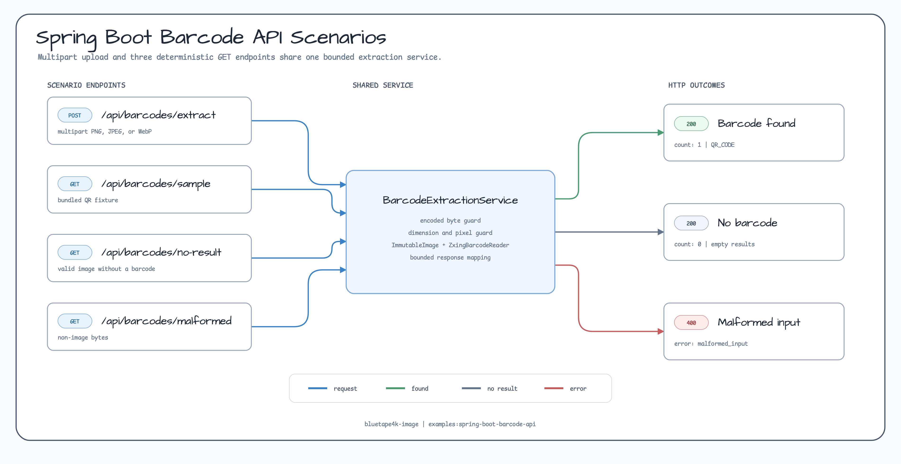
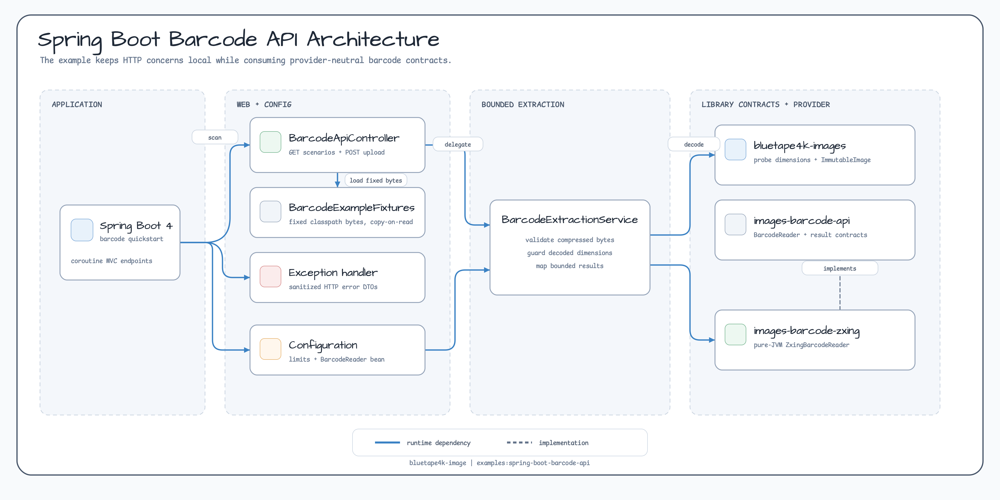
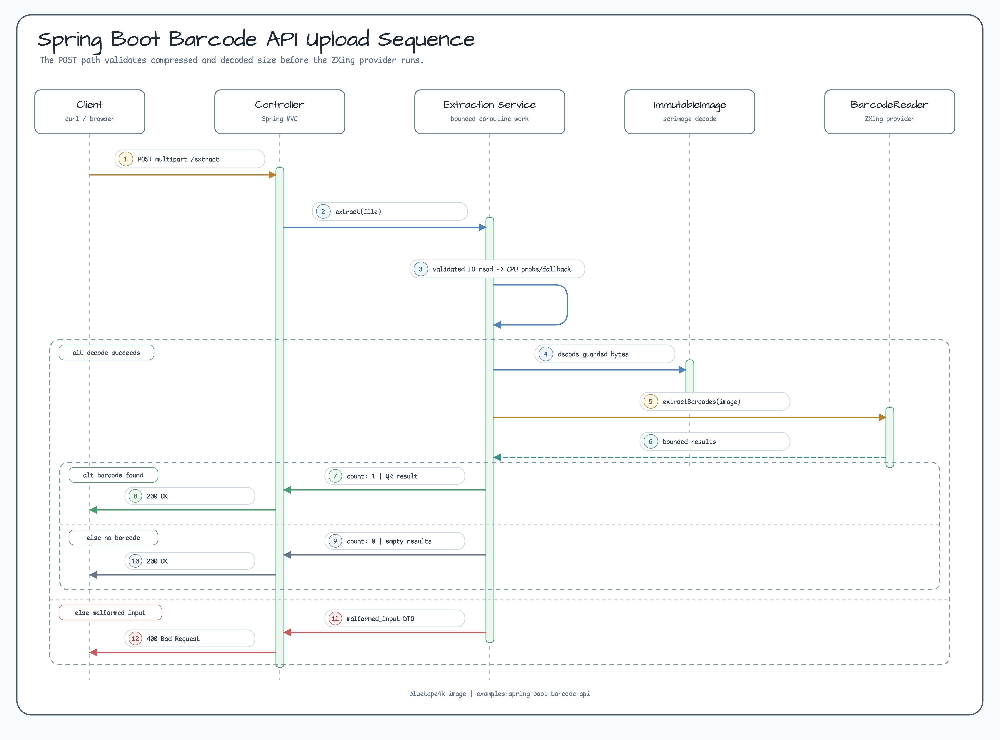

# Spring Boot Barcode API Quickstart

[English](./README.md) | 한국어

`bluetape4k-images-barcode-zxing`으로 번들 시나리오와 multipart image upload에서
QR 및 barcode 정보를 추출하는 작은 Spring Boot 4 예제입니다.

## 보여주는 내용

- barcode 발견, no-result, malformed input을 재현하는 deterministic `GET` endpoint
- 사용자가 PNG, JPEG, WebP 이미지를 올릴 수 있는 `POST /api/barcodes/extract`
- 순수 JVM `ZxingBarcodeReader`를 사용하되 provider-neutral DTO만 반환
- barcode 추출 전에 compressed bytes, decoded side, decoded pixel을 각각 제한
- blocking multipart read와 CPU-bound decoding을 분리한 coroutine dispatcher 사용
- filename, raw bytes, provider metadata, region, stack trace를 노출하지 않는 안정적인
  HTTP error 응답
- Docker, native library, 외부 서비스 없이 실행되는 MockMvc test

이 코드는 local quickstart이며 production upload service는 아닙니다. 실제 서비스에서는
authentication, rate limiting, request concurrency 제한, request-log 정책, malware
scanning, observability를 추가해야 합니다.

## 다이어그램

### Deterministic 시나리오



### Architecture



### Upload Sequence



## 실행

Repository root에서 예제를 시작합니다.

```bash
./gradlew :spring-boot-barcode-api:bootRun
```

Application은 `http://localhost:8080`에서 요청을 받습니다.

## Deterministic 시나리오 endpoint

번들 resource를 사용하므로 별도 upload 준비 없이 세 가지 주요 결과를 같은 방식으로
재현할 수 있습니다.

| Endpoint | Status | 결과 |
|---|---:|---|
| `GET /api/barcodes/sample` | `200` | `bluetape4k-barcode-quickstart` text를 가진 QR 결과 1개 |
| `GET /api/barcodes/no-result` | `200` | 정상 이미지, `count: 0`, 빈 `results` |
| `GET /api/barcodes/malformed` | `400` | Sanitized `MALFORMED_INPUT` 응답 |

```bash
curl http://localhost:8080/api/barcodes/sample
curl http://localhost:8080/api/barcodes/no-result
curl http://localhost:8080/api/barcodes/malformed
```

Sample 응답:

```json
{
  "count": 1,
  "results": [
    {
      "text": "bluetape4k-barcode-quickstart",
      "format": "QR_CODE",
      "provider": "ZXing"
    }
  ]
}
```

Barcode가 없는 경우도 정상 추출이며 빈 결과를 반환합니다.

```json
{
  "count": 0,
  "results": []
}
```

## 이미지 업로드

Multipart `file` part를 extraction endpoint로 보냅니다. 선언한 content type은
`image/png`, `image/jpeg`, `image/webp` 중 하나여야 합니다.

```bash
curl -F \
  "file=@examples/spring-boot-barcode-api/src/main/resources/barcodes/qr.png;type=image/png" \
  "http://localhost:8080/api/barcodes/extract"
```

웹에서 사용하는 자신의 이미지도 같은 방식으로 확인할 수 있습니다.

```bash
curl -F 'file=@/path/to/image.webp;type=image/webp' \
  http://localhost:8080/api/barcodes/extract
```

응답에는 `text`, provider-neutral `format`, provider name만 포함합니다. Raw provider
bytes, backend format label, result point, region, 임의 metadata, source filename,
stack trace는 반환하지 않습니다.

## 제한과 오류 contract

작게 잡은 기본 제한은 `application.yml`에 있습니다.

```yaml
spring:
  servlet:
    multipart:
      max-file-size: 5MB
      max-request-size: 6MB

example:
  barcode:
    max-input-bytes: 5242880
    max-input-pixels: 16777216
    max-input-side: 8192
```

`spring.servlet.multipart`가 web boundary에서 큰 multipart request를 먼저 거부합니다.
그다음 example service가 실제 byte array 크기를 다시 확인하고, `ImmutableImage`를
만들거나 provider를 호출하기 전에 이미지 dimension을 probe합니다.

| Status | Error | 의미 |
|---:|---|---|
| `400` | `empty_input` | Multipart file이 없거나 비어 있음 |
| `400` | `malformed_input` | Byte를 이미지로 decode할 수 없음 |
| `400` | `unsupported_format` | 지원하지 않는 barcode format |
| `413` | `payload_too_large` | Compressed bytes, side length, pixel count 중 하나가 제한 초과 |
| `415` | `unsupported_media_type` | 선언한 content type이 없거나 allowlist에 없음 |
| `503` | `provider_unavailable` | Barcode provider를 사용할 수 없음 |
| `500` | provider failure reason | Provider 상세 정보를 숨긴 extraction 실패 |

Malformed 응답 예:

```json
{
  "error": "malformed_input",
  "reason": "MALFORMED_INPUT",
  "message": "The uploaded file is not a decodable image."
}
```

Content-type allowlist는 초기 request guard일 뿐입니다. Service는 실제 byte를 다시
probe하고 decode합니다. Production service에서는 request timeout과 concurrency 제한,
caller authentication, upload rate limit를 설정하고, raw input을 제외하는 request-log
정책과 malware scanning을 적용하며, rejection rate와 provider latency를 모니터링해야
합니다.

## 의존성

이 예제는 provider 구현을 제공하는 `bluetape4k-images-barcode-zxing`에 의존하면서
`bluetape4k-images-barcode-api`의 provider-neutral 결과 contract를 사용합니다.
Spring Web이 multipart MVC request를 받고, coroutine support가 blocking read와
CPU-bound extraction을 request coroutine에서 분리합니다.

번들 HTTP success fixture는 QR Code extraction을 검증합니다. ZXing provider 모듈은
QR Code와 Code 128을 별도로 검증하며, provider-neutral API 덕분에 이 예제의 response
contract에는 decoder 전용 type이 노출되지 않습니다.

## 테스트

```bash
./gradlew :spring-boot-barcode-api:test
```

테스트는 세 deterministic endpoint, PNG/JPEG/WebP upload, bounded success JSON,
empty result, malformed byte, missing part, unsupported media type, encoded size,
decoded side length, decoded pixel count, cancellation propagation, sanitized exception
mapping을 검증합니다.
