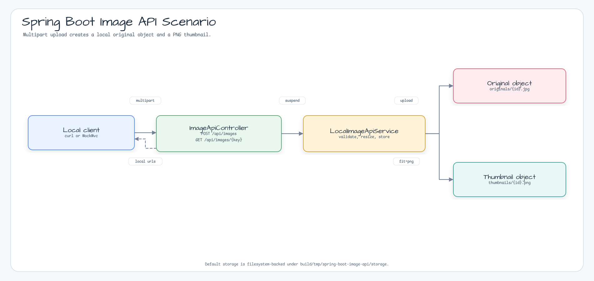
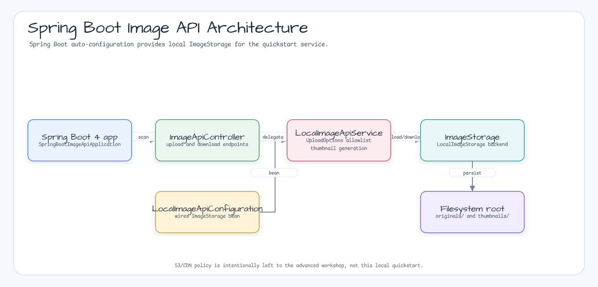
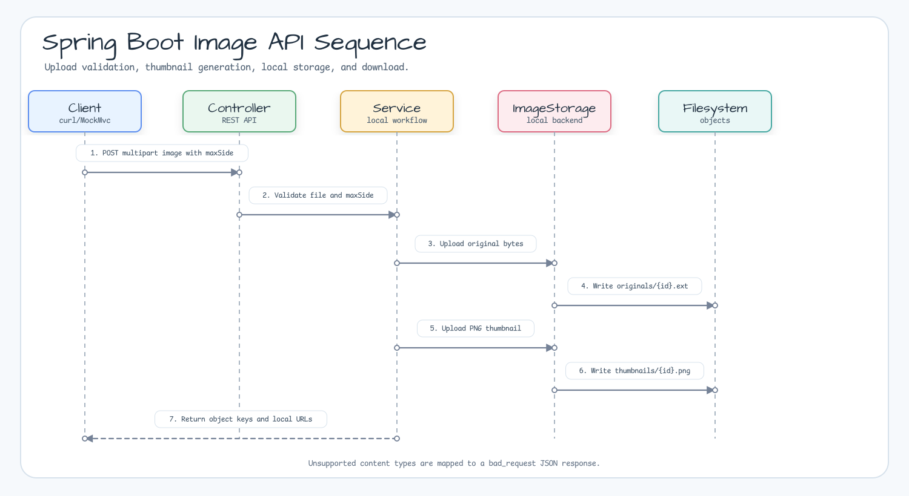

# Spring Boot Image API Quickstart

[English](./README.md) | 한국어

`bluetape4k-images-spring-boot`로 local image upload, thumbnail 생성,
filesystem-backed storage를 실행해 보는 작은 Spring Boot 4 예제입니다.

## 보여주는 내용

- `bluetape4k-images-spring-boot`의 `LocalImageStorage` auto-configuration
- shared `UploadOptions` content-type allowlist 기반 multipart upload validation
- thumbnail 작업 전 압축 byte 크기와 decoded pixel 수를 분리해서 제한
- 원본 이미지를 `originals/` 아래에 저장
- `bluetape4k-images`로 PNG thumbnail 생성
- 저장된 원본과 thumbnail에 대한 local read URL 반환
- S3, CDN, Docker, 외부 인프라 없는 controller test

이 예제는 저장소 안에 포함된 작은 quickstart입니다. Public URL, S3/CDN,
운영 정책까지 포함한 큰 서비스 흐름은
`bluetape4k-workshop/image-processing/advanced-workflow`를 사용하세요.

## 다이어그램

### 예제 시나리오



### Architecture



### Sequence



## 실행

```bash
./gradlew :spring-boot-image-api:bootRun
```

이미지 업로드:

```bash
curl -F "file=@images/src/test/resources/images/cafe.jpg;type=image/jpeg" \
  "http://localhost:8080/api/images?maxSide=320"
```

응답 예:

```json
{
  "original": {
    "key": "originals/AbCdEf123456.jpg",
    "url": "/api/images/originals/AbCdEf123456.jpg"
  },
  "thumbnail": {
    "key": "thumbnails/AbCdEf123456.png",
    "url": "/api/images/thumbnails/AbCdEf123456.png"
  },
  "originalBytes": 73543,
  "thumbnailBytes": 18412
}
```

thumbnail 다운로드:

```bash
curl -o thumbnail.png "http://localhost:8080/api/images/thumbnails/AbCdEf123456.png"
```

## 설정

기본 예제는 아래 경로에 파일을 저장합니다.

```yaml
example:
  image:
    max-input-bytes: 10485760
    max-input-pixels: 16777216
    max-input-side: 8192

bluetape4k:
  images:
    storage:
      backend: local
      max-size-bytes: 10485760
      local:
        root-dir: build/tmp/spring-boot-image-api/storage
```

`example.image.max-input-bytes`는 storage 전 압축 request bytes를 제한합니다.
`example.image.max-input-pixels`와 `example.image.max-input-side`는 thumbnail
생성을 시작하기 전에 header 기준 decoded image 면적과 width/height를 제한합니다.

이 quickstart는 S3와 CDN 설정을 기본 흐름에서 제외합니다. S3 전환은 bucket,
credential, public URL, 운영 정책 결정이 필요하므로 advanced workshop 범위가 더
적합합니다.

## 테스트

```bash
./gradlew :spring-boot-image-api:test
```

테스트는 in-memory JPEG를 업로드하고, 원본과 thumbnail storage key, local URL
다운로드, PNG thumbnail bytes, unsupported content type rejection, decoded-pixel
overflow rejection을 검증합니다.
