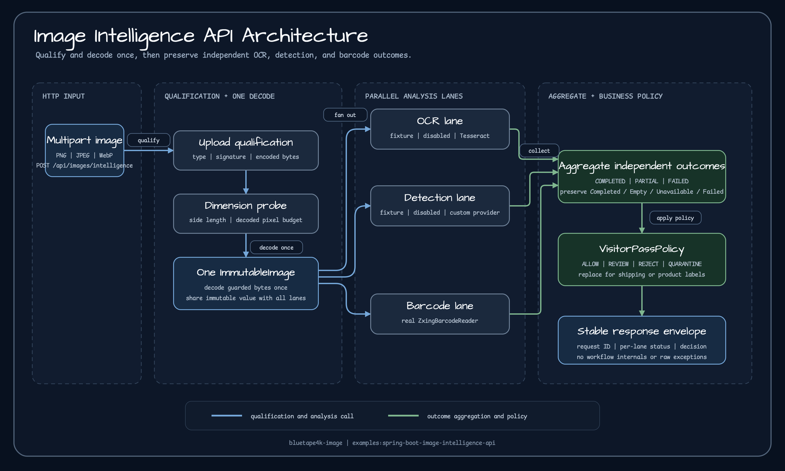
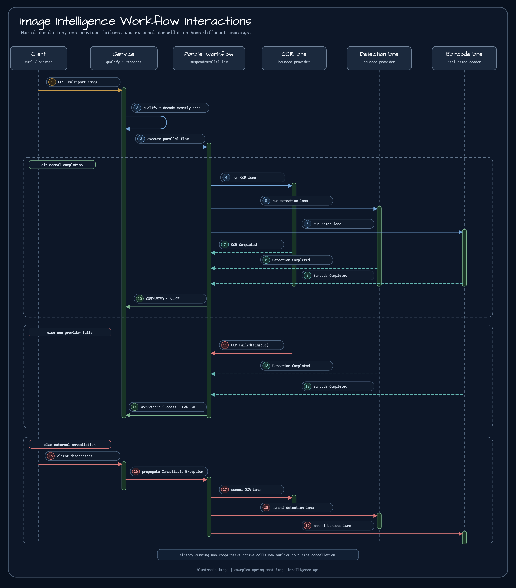

# Spring Boot 이미지 인텔리전스 API

[English](./README.md) | 한국어

한 이미지에 다양한 정보가 함께 있을 때, 입력을 한 번 검증하고 한 번만 디코딩한 뒤
OCR, 객체 검출, 바코드·QR 판독을 병렬로 실행하는 Spring Boot 4 통합 예제입니다.

예제의 핵심은 특정 인식 모델이 아니라 다음 네 가지 경계입니다.

- 분석 가능한 이미지인지 먼저 판정하는 공통 입력 검증
- 서로 다른 분석 작업을 격리해 병렬 실행하는 워크플로
- 일부 공급자가 실패해도 성공한 결과를 보존하는 부분 결과 계약
- 분석 사실과 업무 결정을 분리하는 교체 가능한 정책

## 실전 시나리오

행사장 방문증 이미지에는 방문자 이름과 소속, 얼굴 사진, 출입용 QR 코드가 함께
있다고 가정합니다.

| 분석 경로 | 이미지에서 얻는 사실 | 방문증 정책이 확인하는 내용 |
| --- | --- | --- |
| OCR | 방문증의 텍스트와 페이지 정보 | 읽을 수 있는 텍스트가 있는가 |
| 객체 검출 | 얼굴과 민감 영역 | 얼굴이 정확히 하나이며 금지 영역이 없는가 |
| 바코드·QR | `visitor:`로 시작하는 QR 값 | 유효한 방문자 QR이 정확히 하나인가 |

`demo` 프로필은 OCR과 객체 검출에 결과가 고정된 테스트 구현을 사용하고, QR은 실제
`ZxingBarcodeReader`로 판독합니다. 그래서 네이티브 OCR이나 외부 ML 모델 없이도
통합 흐름을 재현하면서 바코드 경로는 실제 구현을 검증할 수 있습니다.

이 구조는 방문증 전용 만능 서비스가 아닙니다. 배송 라벨이나 상품 라벨처럼
OCR·검출·바코드 결과를 함께 사용하는 업무에서 **검증·병렬 처리·부분 실패·정책
분리의 재사용 가능한 기본 구조**를 보여줍니다.

## 전체 구조

[SVG 크게 보기](./docs/images/readme-diagrams/image-intelligence-architecture.svg)



처리 순서는 다음과 같습니다.

1. multipart에 선언된 미디어 타입, 압축 바이트 크기, 실제 파일 시그니처를 확인합니다.
2. 이미지 헤더에서 가로·세로와 전체 픽셀 수를 제한합니다.
3. 제한을 통과한 바이트를 `ImmutableImage`로 **한 번만** 디코딩합니다.
4. 같은 불변 이미지로 OCR, 객체 검출, ZXing 경로를 병렬 실행합니다.
5. 각 경로의 `Completed`, `Empty`, `Unavailable`, `Failed`를 그대로 보존합니다.
6. 집계 상태를 계산하고 방문증 정책을 적용해 응답을 만듭니다.

## 상호 작용과 실패 의미

[SVG 크게 보기](./docs/images/readme-diagrams/image-intelligence-interactions.svg)



`bluetape4k-workflow`의 `suspendParallelFlow`는 세 작업을 동시에 실행하고 각 결과를
서로 다른 `WorkContext` 키에 기록합니다. 여기서 두 종류의 “성공”을 구분해야 합니다.

| 표현 | 의미 |
| --- | --- |
| `WorkReport.Success` | 워크플로의 모든 작업이 계약대로 끝났고 결과 키가 모였음 |
| `AnalysisResult.Completed` | 해당 공급자가 실제 분석 값을 만들었음 |
| `AnalysisResult.Empty` | 공급자는 정상 실행됐지만 결과가 없음 |
| `AnalysisResult.Unavailable` | 공급자가 구성되지 않았거나 사용할 수 없음 |
| `AnalysisResult.Failed` | 공급자가 실행됐지만 제한 시간 초과 등으로 실패함 |

공급자 실패는 예상 가능한 업무 결과이므로 `WorkContext`에 `Failed`로 기록한 뒤
해당 작업은 `WorkReport.Success`를 반환합니다. 그래야 OCR이 실패해도 객체 검출과
QR 결과를 버리지 않습니다. 반대로 결과 키 누락이나 예상하지 못한 프로그래밍
오류는 워크플로 자체의 실패입니다.

집계 상태는 다음 규칙으로 정합니다.

| 결과 조합 | 응답 상태 |
| --- | --- |
| 세 경로가 모두 `Completed` 또는 `Empty` | `COMPLETED` |
| 사용할 수 있는 결과와 `Unavailable`/`Failed`가 함께 있음 | `PARTIAL` |
| 사용할 수 있는 결과가 하나도 없음 | `FAILED` |

외부 요청이 취소되면 `CancellationException`을 업무 실패로 바꾸지 않고 세 하위
작업에 전달합니다. Semaphore permit은 취소·실패·시간 초과 뒤에도 반환되므로 다음
요청이 실행될 수 있습니다.

> Coroutine 취소는 이미 실행 중인 네이티브 함수를 강제로 중단시키지 못할 수 있습니다.
> `withContext`는 취소 후 새 네이티브 작업이 시작되는 것을 막지만, Tesseract처럼
> 비협조적인 호출은 자체적으로 끝날 때까지 스레드를 점유할 수 있습니다. 운영에서는
> 별도 프로세스 격리와 프로세스 수준 제한 시간도 검토해야 합니다.

## 실행

### 기본 프로필

기본 프로필은 외부 의존성 없이 시작합니다. OCR과 객체 검출은
`UNAVAILABLE(provider_not_configured)`이고 ZXing만 실제로 실행되므로, 정상 이미지
응답은 대개 `PARTIAL`입니다.

```bash
./gradlew :spring-boot-image-intelligence-api:bootRun
```

### Demo 프로필

정상 통합 경로를 확인하려면 `demo`를 사용합니다.

```bash
./gradlew :spring-boot-image-intelligence-api:bootRun \
  --args='--spring.profiles.active=demo'
```

### Native OCR 프로필

호스트에 Tesseract와 필요한 traineddata를 설치한 뒤 선택적으로 실행합니다.
객체 검출은 계속 비활성화되고, OCR은 실제 Tesseract, 바코드는 ZXing을 사용합니다.

```bash
./gradlew :spring-boot-image-intelligence-api:bootRun \
  --args='--spring.profiles.active=native-ocr \
  --example.image-intelligence.tessdata-path=/usr/local/share/tessdata'
```

`demo`와 `native-ocr`를 동시에 활성화하면 공급자 소유권이 모호해지므로 애플리케이션이
안정된 설정 오류로 시작을 거부합니다.

## 요청

```bash
curl -X POST \
  -F "file=@visitor-pass.png;type=image/png" \
  http://localhost:8080/api/images/intelligence
```

PNG, JPEG, WebP만 허용합니다. 기본 제한은 압축 크기 5 MiB, 한 변 8,192픽셀,
전체 16,777,216픽셀입니다. 선언된 콘텐츠 타입과 실제 시그니처가 다르거나
디코딩할 수 없으면 `400`, 크기 제한을 넘으면 `413`과 정제된 `reasonCode`를
반환합니다.

## 응답 예

아래 값은 응답 형태와 상태 의미를 설명하기 위한 축약 예입니다. `requestId`와
`elapsedMillis`는 실행마다 달라집니다.

### `COMPLETED`

`demo` 프로필에서 방문자 QR을 포함한 이미지를 보내면 세 경로가 모두 완료되고
방문증 정책이 `ALLOW`를 선택합니다.

```json
{
  "requestId": "2d7eebfa-2d3b-4d95-b07a-94bb82d6df38",
  "status": "COMPLETED",
  "decision": "ALLOW",
  "reasons": [],
  "image": { "mediaType": "image/png", "width": 240, "height": 240 },
  "ocr": {
    "status": "COMPLETED",
    "provider": "fixture-ocr",
    "elapsedMillis": 4,
    "result": { "text": "VISITOR PASS-001", "pageCount": 1 }
  },
  "detection": {
    "status": "COMPLETED",
    "provider": "fixture-detector",
    "elapsedMillis": 2,
    "regions": [
      { "label": "face", "category": "FACE", "confidence": 0.99, "detector": "fixture-detector" }
    ]
  },
  "barcodes": {
    "status": "COMPLETED",
    "provider": "zxing",
    "elapsedMillis": 18,
    "items": [
      { "text": "visitor:PASS-001", "format": "QR_CODE", "provider": "ZXING" }
    ]
  }
}
```

### `PARTIAL`

OCR만 제한 시간을 넘기고 나머지 경로가 완료되면 성공한 결과는 유지되며 정책은
자동 승인 대신 수동 검토를 선택합니다.

```json
{
  "status": "PARTIAL",
  "decision": "MANUAL_REVIEW",
  "reasons": ["OCR_FAILED"],
  "ocr": {
    "status": "FAILED",
    "provider": "tesseract",
    "elapsedMillis": 3001,
    "reasonCode": "timeout"
  },
  "detection": {
    "status": "COMPLETED",
    "provider": "local-detector",
    "elapsedMillis": 32,
    "regions": [
      { "label": "face", "category": "FACE", "confidence": 0.97, "detector": "local-detector" }
    ]
  },
  "barcodes": {
    "status": "COMPLETED",
    "provider": "zxing",
    "elapsedMillis": 19,
    "items": [
      { "text": "visitor:PASS-001", "format": "QR_CODE", "provider": "ZXING" }
    ]
  }
}
```

### `FAILED`

사용할 수 있는 분석 결과가 하나도 없으면 요청 자체를 `500`으로 바꾸지 않고
도메인 응답 `FAILED`를 반환합니다.

```json
{
  "status": "FAILED",
  "decision": "MANUAL_REVIEW",
  "reasons": ["OCR_UNAVAILABLE", "DETECTION_UNAVAILABLE", "BARCODE_FAILED"],
  "ocr": {
    "status": "UNAVAILABLE",
    "provider": "disabled-ocr",
    "elapsedMillis": 0,
    "reasonCode": "provider_not_configured"
  },
  "detection": {
    "status": "UNAVAILABLE",
    "provider": "disabled-detector",
    "elapsedMillis": 0,
    "reasonCode": "provider_not_configured"
  },
  "barcodes": {
    "status": "FAILED",
    "provider": "zxing",
    "elapsedMillis": 2001,
    "reasonCode": "timeout"
  }
}
```

## 설정

```yaml
example:
  image-intelligence:
    max-input-bytes: 5242880
    max-input-pixels: 16777216
    max-input-side: 8192
    ocr-timeout: 3s
    detection-timeout: 2s
    barcode-timeout: 2s
    ocr-concurrency: 1
    detection-concurrency: 2
    barcode-concurrency: 4
    tessdata-path: null
```

제한 시간은 한 공급자의 지연이 전체 응답을 무기한 붙잡지 않게 하고, 공급자별
Semaphore는 네이티브 자원과 CPU를 보호합니다. 업무 특성과 공급자 비용에 맞춰 서로
독립적으로 조정하세요.

## 다른 업무에 적용하기

OCR, 객체 검출, 바코드 결과는 특정 업무에 종속되지 않은 사실입니다.
`VisitorPassPolicy`만 교체하면 조정 구조를 유지한 채 다른 결정을 만들 수 있습니다.

- 배송 라벨: 송장 번호 OCR, 라벨 영역 검출, 운송장 바코드의 일치 여부
- 상품 라벨: 상품명 OCR, 경고 표식 검출, SKU 바코드의 일치 여부
- 입고 문서: 문서 번호 OCR, 도장 영역 검출, 자산 QR의 중복 여부

새 정책은 `AnalysisResult.Empty`와 `Failed`를 같은 의미로 취급하지 않아야 합니다.
“정상 실행했지만 없음”과 “확인하지 못함”은 자동 승인 여부가 달라지기 때문입니다.

## 운영에 추가할 것

이 예제에는 다음 운영 기능이 의도적으로 포함되지 않습니다.

- 인증·인가, 테넌트별 할당량과 요청 속도 제한
- 바이러스·악성 파일 검사와 `content disarm`
- 원본·파생 데이터 저장, 보존 기간, 삭제와 감사 이력
- 얼굴·OCR 텍스트·QR 값의 암호화, 마스킹과 개인정보 접근 통제
- 외부 공급자 재시도, `circuit breaker`, `bulkhead`와 프로세스 격리
- 실제 검출 모델 선택, 품질 측정과 드리프트 감시

## 테스트

```bash
./gradlew :spring-boot-image-intelligence-api:test
```

테스트는 생성한 QR 이미지의 실제 ZXing 판독, 입력 경계, 프로필 소유권, 병렬 실행,
부분 실패, 워크플로 키, 정책 결정표, 외부 취소 전파, permit 복구, 로그 payload
비노출, HTTP 오류 계약을 검증합니다.

## 자료

구현을 읽을 때는 다음 순서가 좋습니다.

- [`ImageUploadQualifier.kt`](./src/main/kotlin/io/bluetape4k/images/examples/spring/intelligence/service/ImageUploadQualifier.kt) — 입력 검증과 단일 디코딩
- [`ImageIntelligenceWorkflow.kt`](./src/main/kotlin/io/bluetape4k/images/examples/spring/intelligence/service/ImageIntelligenceWorkflow.kt) — `suspendParallelFlow` 기반 병렬 조정
- [`ImageAnalysisProviders.kt`](./src/main/kotlin/io/bluetape4k/images/examples/spring/intelligence/service/ImageAnalysisProviders.kt) — OCR·검출·ZXing 어댑터
- [`VisitorPassPolicy.kt`](./src/main/kotlin/io/bluetape4k/images/examples/spring/intelligence/service/VisitorPassPolicy.kt) — 분석 사실과 방문증 결정의 분리
- [`ImageIntelligenceControllerTest.kt`](./src/test/kotlin/io/bluetape4k/images/examples/spring/intelligence/web/ImageIntelligenceControllerTest.kt) — 실제 HTTP와 QR 통합 계약
- [`ImageIntelligenceCancellationTest.kt`](./src/test/kotlin/io/bluetape4k/images/examples/spring/intelligence/ImageIntelligenceCancellationTest.kt) — 외부 취소와 다음 요청 복구
- [OCR 서비스를 실전에서 운영하기](https://bluetape4k.github.io/ko/blog/ocr-api-fallback-contract-bluetape4k-image/) — 입력 제한, 네이티브 OCR, 실패 응답 계약
- [순수 JVM에서 libvips까지: 이미지 처리 성능 비교](https://bluetape4k.github.io/ko/blog/from-pure-jvm-to-libvips-benchmarking-image-processing/) — 처리 백엔드와 비용 선택
