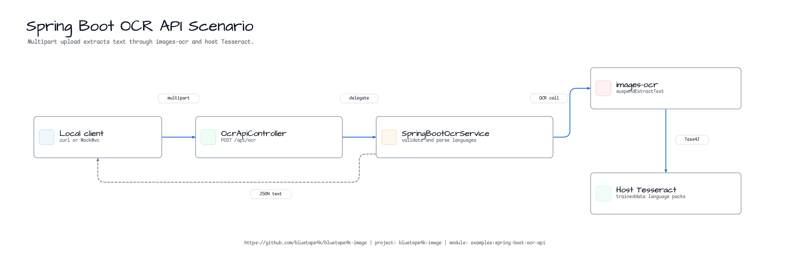
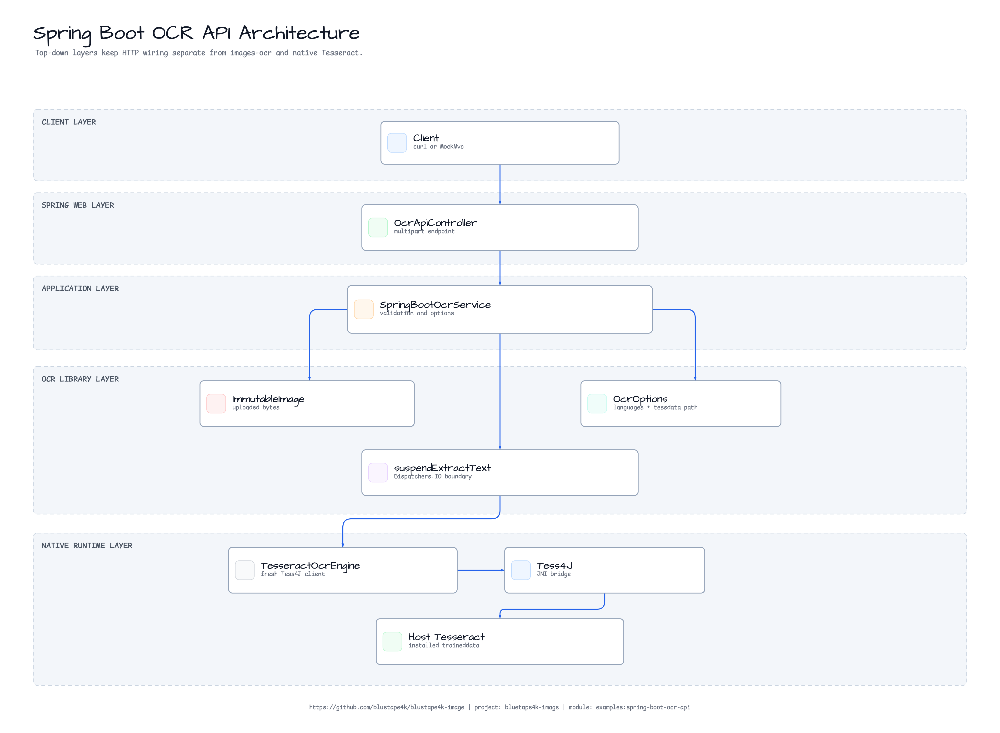
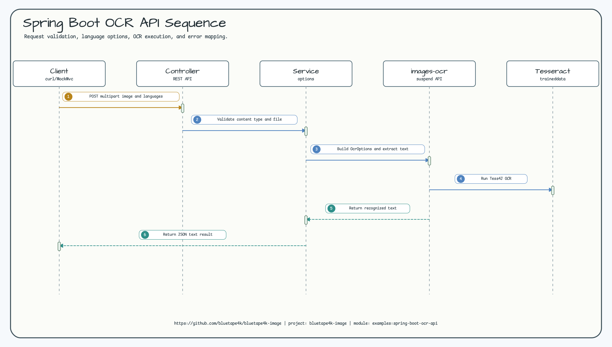

# Spring Boot OCR API Quickstart

[English](./README.md) | 한국어

`bluetape4k-images-ocr`로 multipart image upload에서 OCR text를 추출하는 작은
Spring Boot 4 예제입니다.

## 보여주는 내용

- `POST /api/ocr` multipart upload endpoint
- `languages=eng`, `eng+kor`, `eng,kor` 형식의 Tesseract language parsing
- 주입 가능한 `OcrEngine`을 통한 `ImmutableImage.suspendExtractText` wiring
- host traineddata 위치를 위한 optional `example.ocr.tessdata-path` 설정
- OCR 작업 전 압축 byte 크기와 decoded pixel 수를 분리해서 제한
- request validation과 native OCR runtime unavailable 오류 매핑
- 일반 CI에서 Tesseract 없이 실행되는 fake `OcrEngine` 기반 controller test

이 예제는 저장소 안에 포함된 작은 quickstart입니다. 인증, rate limiting, request
queue, file persistence, batch OCR 같은 production 관심사는 더 큰 application이나
follow-up issue 범위가 더 적합합니다.

## 다이어그램

### 예제 시나리오



### Architecture



### Sequence



## Native OCR 요구사항

이 예제는 `bluetape4k-images-ocr`를 통해 Tess4J를 사용합니다. 실제 OCR 실행에는
host Tesseract와 요청한 language code에 맞는 traineddata package가 필요합니다.

```bash
# macOS
brew install tesseract tesseract-lang

# Ubuntu / Debian
sudo apt-get install tesseract-ocr tesseract-ocr-eng tesseract-ocr-kor tesseract-ocr-jpn fonts-noto-cjk

tesseract --list-langs
```

Tesseract가 traineddata를 찾지 못하면 application을 시작하는 shell에서
`TESSDATA_PREFIX`를 설정하거나 아래처럼 지정하세요.

```yaml
example:
  ocr:
    max-input-bytes: 10485760
    max-input-pixels: 16777216
    max-input-side: 8192
    tessdata-path: /opt/homebrew/share/tessdata
```

Endpoint는 request-level tessdata path를 받지 않습니다.
`ImmutableImage` 생성이나 OCR 호출 전에 `example.ocr.max-input-pixels` 또는
`example.ocr.max-input-side`를 넘는 decoded image header를 거부합니다.

## 실행

```bash
./gradlew :spring-boot-ocr-api:bootRun
```

업로드한 이미지에서 text 추출:

```bash
curl -F "file=@images/src/test/resources/images/cafe.jpg;type=image/jpeg" \
  "http://localhost:8080/api/ocr?languages=eng"
```

응답 예:

```json
{
  "text": "recognized text",
  "languages": ["eng"],
  "characterCount": 15
}
```

여러 language pack을 설치한 경우:

```bash
curl -F "file=@sample-ko.png;type=image/png" \
  "http://localhost:8080/api/ocr?languages=eng+kor"
```

## 테스트

```bash
./gradlew :spring-boot-ocr-api:test
```

테스트는 MockMvc와 fake `OcrEngine`을 사용합니다. Host Tesseract 없이 multipart
OCR success, language parsing, unsupported content type rejection, decoded-pixel
rejection, native OCR failure mapping을 검증합니다.
