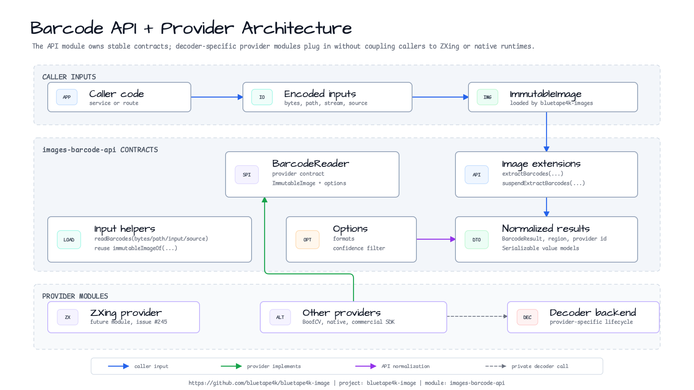

# bluetape4k-images-barcode-api

[English](./README.md) | 한국어

`ImmutableImage`용 provider-neutral barcode/QR 추출 contract 모듈입니다.

## 기능

- Blocking barcode extraction을 위한 `BarcodeReader` provider contract
- Sync/coroutine 호출자를 위한 `ImmutableImage.extractBarcodes(...)`와
  `suspendExtractBarcodes(...)` 확장 함수
- `ByteArray`, `Path`, `InputStream`, Okio `Source` 입력 helper
- Serializable result model: `BarcodeResult`, `BarcodeRegion`,
  `BarcodeBoundingBox`, `BarcodePoint`, `BarcodeProviderIdentity`
- 구체적인 decoder dependency 없음. ZXing, BoofCV, native, commercial SDK
  adapter는 별도 provider 모듈에 둡니다.

## 아키텍처



파란 실선은 caller input 흐름, 초록 실선은 provider module이
`BarcodeReader` contract를 구현하는 관계, 보라 실선은 API 쪽
filtering/normalization, 회색 점선은 provider-private decoder 호출을 뜻합니다.

`images-barcode-api`는 `bluetape4k-images`와 Kotlin coroutines에만 의존합니다.
`ImmutableImage`를 입력으로 받고 provider 출력을 bluetape4k 모델로 정규화하며,
decoder lifecycle, native setup, provider별 설정은 provider 모듈이 책임집니다.

Encoded input helper는 먼저 `ImmutableImage`를 로드한 뒤, 직접 이미지 호출자가
사용하는 것과 같은 `BarcodeReader` contract에 위임합니다.

## 의존성

```kotlin
dependencies {
    implementation("io.github.bluetape4k.image:bluetape4k-images-barcode-api:<version>")
}
```

실제 pixel decoding을 수행하려면 `bluetape4k-images-barcode-zxing` 같은 provider
모듈을 하나 추가하세요.

## 사용 예시

```kotlin
import com.sksamuel.scrimage.ImmutableImage
import io.bluetape4k.images.barcode.BarcodeFormat
import io.bluetape4k.images.barcode.BarcodeOptions
import io.bluetape4k.images.barcode.BarcodeReader
import io.bluetape4k.images.barcode.extractBarcodes
import io.bluetape4k.images.barcode.suspendExtractBarcodes

fun extractCodes(image: ImmutableImage, reader: BarcodeReader) = image.extractBarcodes(
    reader = reader,
    options = BarcodeOptions(
        formats = setOf(BarcodeFormat.QR_CODE, BarcodeFormat.CODE_128),
        tryHarder = true,
        minimumConfidence = 0.80,
    ),
)

suspend fun extractCodesAsync(image: ImmutableImage, reader: BarcodeReader) =
    image.suspendExtractBarcodes(reader)
```

Coroutine dispatcher boundary가 필요하면 `suspendExtractBarcodes`를 사용하세요.

Provider 모듈은 backend-specific format label을 `BarcodeFormat`으로 매핑하고,
진단에 필요하면 원래 provider label을 `BarcodeResult.rawBackendFormat`에 보관합니다.

## 입력 Helper

```kotlin
reader.readBarcodes(bytes)
reader.readBarcodes(path)
inputStream.use { reader.readBarcodes(it) }
source.use { reader.readBarcodes(it) }
```

Helper는 `bluetape4k-images`의 `immutableImageOf(...)`를 재사용합니다.

## 테스트 Fixture

API 모듈은 `testFixtures(project(":bluetape4k-images-barcode-api"))`를 통해
provider-neutral test fixture를 제공합니다.

```kotlin
import io.bluetape4k.images.barcode.testfixtures.BarcodeTestFixtures

val blank = BarcodeTestFixtures.blankImage()
val rotated = BarcodeTestFixtures.rotateClockwise(blank)
val malformed = BarcodeTestFixtures.malformedImageBytes
```

이 fixture들은 결정적인 코드로 테스트 실행 시 생성됩니다. 외부 barcode 이미지
asset은 번들하지 않으며, `BarcodeTestFixtures.GENERATED_SOURCE_NOTE`에 provider
capability 문서용 source/license note를 기록합니다.

## 테스트

```bash
./gradlew :bluetape4k-images-barcode-api:test
```

테스트는 순수 JVM에서 항상 실행됩니다. Model validation, serialization,
sync/suspend delegation, cancellation, input helper decoding과 공유 fixture helper
동작을 검증합니다.
