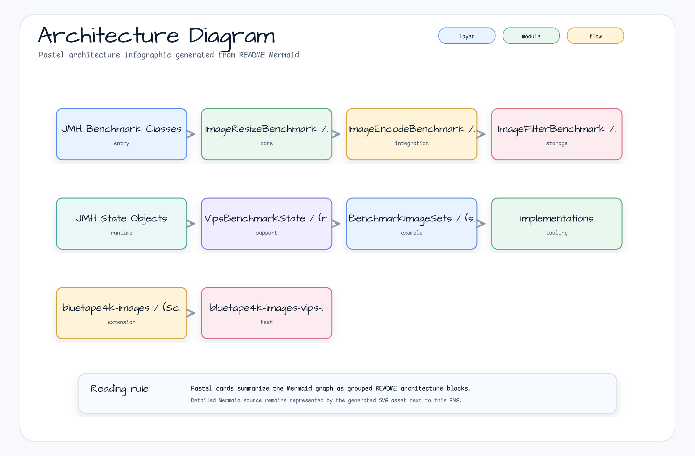
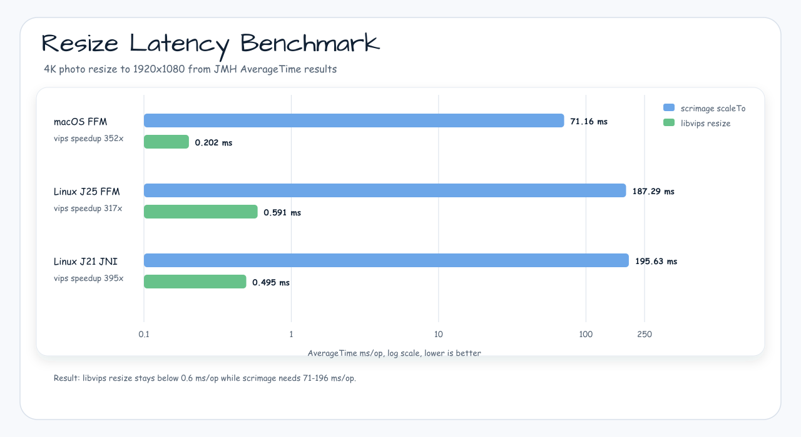
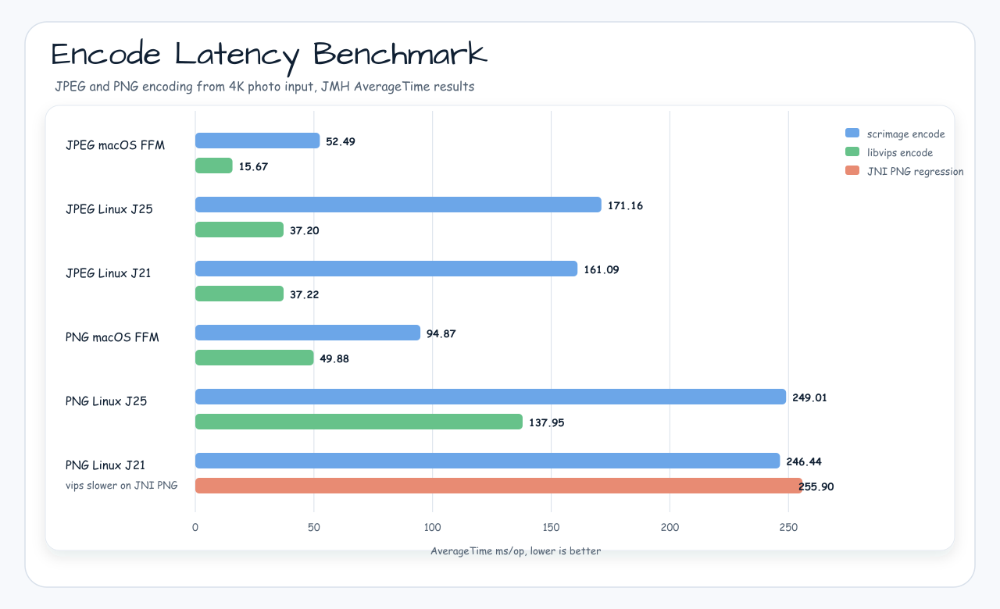
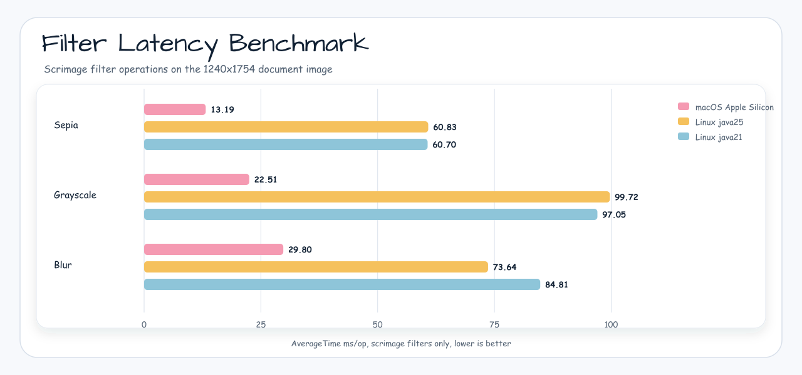

[한국어](./README.ko.md) | English

# Module bluetape4k-images-benchmark

JMH benchmarks comparing [scrimage](https://sksamuel.github.io/scrimage/) and [libvips](https://www.libvips.org/) image processing performance.

## Architecture



## Benchmark Results

> AverageTime ms/op. Full raw data: [`docs/benchmark-results-2026-04-29.md`](docs/benchmark-results-2026-04-29.md)

### Resize (4K 3840×2160 → 1920×1080)



| Environment | scrimage (ms/op) | vips (ms/op) | Speedup |
|-------------|-----------------|--------------|---------|
| macOS, vips-ffm  | 71.16 ± 2.02  | 0.202 ± 0.006 | **352×** |
| CI Linux, java25 | 187.29 ± 9.07 | 0.591 ± 0.046 | **317×** |
| CI Linux, java21 | 195.63 ± 7.39 | 0.495 ± 0.062 | **395×** |

### Encode (4K photo image)



| Format | Environment | scrimage (ms/op) | vips (ms/op) | Speedup |
|--------|-------------|-----------------|--------------|---------|
| JPEG | macOS, vips-ffm  | 52.49 ± 0.44   | 15.67 ± 0.27  | **3.3×** |
| JPEG | CI Linux, java25 | 171.16 ± 121.3 | 37.20 ± 0.99  | **4.6×** |
| JPEG | CI Linux, java21 | 161.09 ± 38.9  | 37.22 ± 1.50  | **4.3×** |
| PNG  | macOS, vips-ffm  | 94.87 ± 4.65   | 49.88 ± 1.02  | **1.9×** |
| PNG  | CI Linux, java25 | 249.01 ± 2.14  | 137.95 ± 2.93 | **1.8×** |
| PNG  | CI Linux, java21 | 246.44 ± 2.14  | 255.90 ± 10.2 | −1.04× ⚠️ |

> ⚠️ **java21 (JNI) PNG**: JNI boundary overhead exceeds compression gain vs scrimage. Use java25 (FFM) for PNG encoding on Linux.

### Filter (scrimage only, 1240×1754 document image)



| Filter    | macOS (ms/op) | CI Linux java25 (ms/op) | CI Linux java21 (ms/op) |
|-----------|--------------|------------------------|------------------------|
| Sepia     | 13.19 ± 0.49 | 60.83 ± 0.42 | 60.70 ± 0.59 |
| Grayscale | 22.51 ± 9.19 | 99.72 ± 23.9 | 97.05 ± 12.6 |
| Blur      | 29.80 ± 1.23 | 73.64 ± 1.28 | 84.81 ± 6.31 |

---

## Running Benchmarks

```bash
# Java 25 — scrimage + vips-ffm (Panama FFM, macOS/Linux)
./gradlew :bluetape4k-images-benchmark:benchmarkBenchmark -Pvips.impl=java25

# Java 21 — scrimage + JVips JNI (Linux only)
./gradlew :bluetape4k-images-benchmark:benchmarkBenchmark -Pvips.impl=java21
```

**macOS prerequisites**: `brew install vips`

`VipsBenchmarkState` auto-detects macOS and sets Homebrew library paths
(`vipsffm.libpath.*.override`) so libvips is found even with SIP stripping `DYLD_LIBRARY_PATH`.

---

## Benchmark Classes

### `ImageResizeBenchmark`

Resizes a synthetic 4K (3840×2160) photo to multiple target resolutions.

| Parameter    | Values |
|--------------|--------|
| `resolution` | `1920x1080`, `1280x720` |

```kotlin
@Benchmark
fun scrimage_scaleTo(bh: Blackhole) {
    val resized = BenchmarkImageSets.photo4k.scaleTo(targetWidth, targetHeight)
    bh.consume(resized)
}

@Benchmark
fun vips_resize(state: VipsBenchmarkState, bh: Blackhole) {
    if (!state.vipsAvailable) { bh.consume(null); return }
    state.createVipsImage(state.photo4kJpegBytes).use { img ->
        bh.consume(img.resize(targetWidth, targetHeight))
    }
}
```

### `ImageEncodeBenchmark`

Encodes a synthetic 4K photo image to JPEG and PNG.

```kotlin
@Benchmark
fun scrimage_encodeJpeg(bh: Blackhole) {
    bh.consume(BenchmarkImageSets.document.bytes(JpegWriter(85, false)))
}

@Benchmark
fun vips_encodeJpeg(state: VipsBenchmarkState, bh: Blackhole) {
    if (!state.vipsAvailable) { bh.consume(null); return }
    state.createVipsImage(state.photo4kJpegBytes).use { img ->
        bh.consume(img.toJpegBytes(85))
    }
}
```

### `ImageFilterBenchmark`

Applies scrimage filters to a 1240×1754 document image.

| Benchmark          | Filter          |
|--------------------|-----------------|
| `scrimage_blur`    | `BlurFilter`    |
| `scrimage_grayscale` | `GrayscaleFilter` |
| `scrimage_sepia`   | `SepiaFilter`   |

### `VipsBenchmarkState`

JMH `@State(Scope.Thread)` — initializes the vips runtime once per trial via reflection
(supports both `FfmVipsRuntime` Java 25 and `JVipsRuntime` Java 21).

```kotlin
@Setup(Level.Trial)
fun setup() {
    photo4kJpegBytes = BenchmarkImageSets.photo4k.bytes(JpegWriter(80, false))
    applyMacOsVipsLibraryPaths()   // sets vipsffm.libpath.*.override on macOS
    vipsAvailable = tryInitVipsRuntime()
}
```
