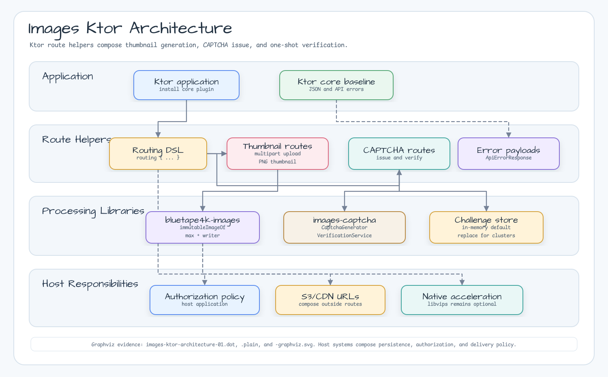

# bluetape4k-images-ktor

English | [한국어](./README.ko.md)

Ktor server helpers for bluetape4k image workflows.

## Architecture



## Features

- `Route.bluetape4kImageThumbnailRoutes()` for multipart image upload and thumbnail bytes
- `Route.bluetape4kCaptchaRoutes()` for issuing base64 PNG CAPTCHA challenges
- One-shot CAPTCHA answer verification backed by `CaptchaVerificationService`
- Stable JSON response models for issue and verify responses
- Shared `bluetape4k-ktor-core` request-parameter and `ApiErrorResponse`
  helpers for bad-request responses

## Dependency

```kotlin
dependencies {
    implementation("io.github.bluetape4k.image:bluetape4k-images-ktor:<version>")
    implementation("io.github.bluetape4k:bluetape4k-ktor-core")
}
```

Install the shared bluetape4k Ktor core baseline, or install compatible Ktor
JSON support yourself:

```kotlin
dependencies {
    implementation("io.ktor:ktor-server-content-negotiation:<ktor-version>")
    implementation("io.ktor:ktor-serialization-kotlinx-json:<ktor-version>")
}
```

## Usage

```kotlin
import io.bluetape4k.images.ktor.bluetape4kCaptchaRoutes
import io.bluetape4k.images.ktor.bluetape4kImageThumbnailRoutes
import io.bluetape4k.ktor.core.Bluetape4kKtorCoreConfig
import io.bluetape4k.ktor.core.installBluetape4kKtorCore
import io.ktor.server.application.Application
import io.ktor.server.routing.routing

fun Application.module() {
    installBluetape4kKtorCore(
        Bluetape4kKtorCoreConfig(installHealthRoutes = false)
    )

    routing {
        bluetape4kImageThumbnailRoutes()
        bluetape4kCaptchaRoutes()
    }
}
```

Routes:

| Method | Path | Description |
| --- | --- | --- |
| `POST` | `/images/thumbnail?maxSide=320` | Reads multipart field `file` and returns PNG thumbnail bytes |
| `GET` | `/captcha?length=6` | Issues a challenge and returns base64 PNG bytes |
| `POST` | `/captcha/{id}/verify` | Consumes the challenge and verifies the submitted answer |

Thumbnail upload example:

```bash
curl -F "file=@photo.jpg;type=image/jpeg" \
  "http://localhost:8080/images/thumbnail?maxSide=320" \
  --output thumbnail.png
```

Verification returns `SUCCESS`, `WRONG_ANSWER`, `EXPIRED`, or `NOT_FOUND`.
`CaptchaVerificationService` remains the storage boundary. Use a distributed
`CaptchaChallengeStore` when multiple application instances must share issued
challenges.

## Custom Configuration

```kotlin
import io.bluetape4k.images.captcha.CaptchaChallengeId
import io.bluetape4k.images.captcha.CaptchaVerificationService
import io.bluetape4k.images.captcha.captchaGenerator
import io.bluetape4k.images.ktor.CaptchaKtorRoutesConfig
import io.bluetape4k.images.ktor.ImageThumbnailKtorRoutesConfig
import io.bluetape4k.images.ktor.bluetape4kCaptchaRoutes
import io.bluetape4k.images.ktor.bluetape4kImageThumbnailRoutes
import io.bluetape4k.codec.Base58

val verifier = CaptchaVerificationService()

routing {
    bluetape4kImageThumbnailRoutes(
        ImageThumbnailKtorRoutesConfig(
            routePath = "/media",
            multipartFieldName = "upload",
            maxInputBytes = 5 * 1024 * 1024,
            defaultMaxSide = 256,
            maxAllowedSide = 1024,
        )
    )

    bluetape4kCaptchaRoutes(
        CaptchaKtorRoutesConfig(
            routePath = "/security/captcha",
            generator = captchaGenerator { length(6) },
            verificationService = verifier,
            idFactory = { CaptchaChallengeId("login-${Base58.randomString(12)}") },
        )
    )
}
```

The thumbnail helper is pure JVM and local-only. Compose persistence, S3/CDN
URLs, authorization, and native libvips acceleration outside this route when an
application needs them. Generic JSON defaults, error payloads, path/query
parameter parsing, and test-client helpers come from the shared
`bluetape4k-ktor-*` modules.
