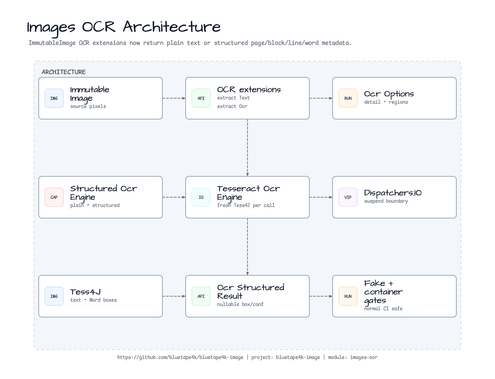
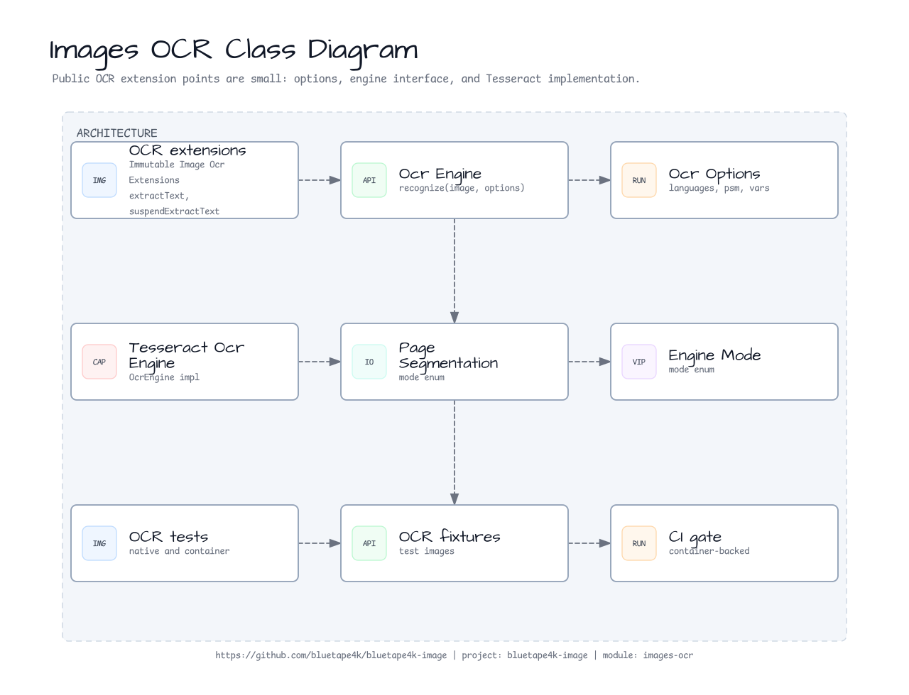
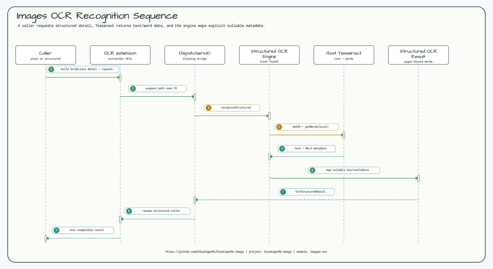

# bluetape4k-images-ocr

[English](./README.md) | 한국어

`ImmutableImage`용 Tess4J/Tesseract OCR 확장 모듈입니다.

## 기능

- Blocking OCR용 `ImmutableImage.extractText(...)`
- 코루틴 호출자를 위한 `ImmutableImage.suspendExtractText(...)`; blocking OCR은 기본적으로
  `Dispatchers.IO`에서 실행합니다.
- 엔진이 제공할 수 있는 page, block, line, word 메타데이터를 반환하는
  `ImmutableImage.extractOcr(...)`와 `suspendExtractOcr(...)`
- 언어, `tessdataPath`, engine mode, page segmentation mode, variables, configs를
  비롯해 structured detail과 source region을 설정하는 `OcrOptions`
- `TesseractOcrEngine`은 호출마다 새 Tess4J 인스턴스를 만들어 mutable OCR 상태를
  호출자끼리 공유하지 않습니다.

## Architecture



## Class Diagram



## Sequence Diagram



## 실행 요구사항

요청할 언어에 맞는 Tesseract와 traineddata 패키지를 설치하세요.

```bash
# macOS / Homebrew
brew install tesseract tesseract-lang

# Ubuntu / Debian
sudo apt-get install tesseract-ocr tesseract-ocr-eng tesseract-ocr-kor tesseract-ocr-jpn fonts-noto-cjk

tesseract --list-langs
```

런타임이 traineddata 파일을 찾지 못하면 `TESSDATA_PREFIX`를 설정하거나
`OcrOptions(tessdataPath = "...")`를 전달하세요.

Host-native OCR은 Tess4J/Lept4J를 JNA로 사용하므로 JVM이 호스트의 Leptonica와
Tesseract shared library를 로드합니다. 현재 런타임은 Homebrew Tesseract 5.5 /
Leptonica 1.87 조합에서 로컬 검증했습니다. Ubuntu 24.04 패키지는 Leptonica 1.82를
제공하며, 현재 Lept4J/Tess4J 라인이 기대하는 native symbol set을 만족하지 못합니다.
따라서 GitHub CI와 Nightly는 portable container-backed OCR gate를 실행하고,
`-Docr.enabled=true`는 local/manual host-native check로 둡니다.

## 의존성

```kotlin
dependencies {
    implementation("io.github.bluetape4k.image:bluetape4k-images-ocr:<version>")
}
```

## 사용 예시

```kotlin
import io.bluetape4k.images.immutableImageOf
import io.bluetape4k.images.ocr.OcrBoundingBox
import io.bluetape4k.images.ocr.OcrOptions
import io.bluetape4k.images.ocr.OcrRegion
import io.bluetape4k.images.ocr.OcrStructuredDetail
import io.bluetape4k.images.ocr.TesseractPageSegmentationMode
import io.bluetape4k.images.ocr.extractOcr
import io.bluetape4k.images.ocr.extractText
import io.bluetape4k.images.ocr.suspendExtractText
import java.io.File

val image = immutableImageOf(File("receipt.png"))

val text = image.extractText(
    OcrOptions(languages = listOf("eng", "kor")),
)

val suspendText = image.suspendExtractText(
    OcrOptions(
        languages = listOf("eng"),
        pageSegmentationMode = TesseractPageSegmentationMode.SINGLE_LINE,
    ),
)

val structured = image.extractOcr(
    OcrOptions(
        languages = listOf("eng"),
        structuredDetail = OcrStructuredDetail.WORD,
        regions = listOf(
            OcrRegion(
                boundingBox = OcrBoundingBox(x = 0, y = 0, width = 640, height = 180),
                id = "header",
            ),
        ),
    ),
)

val words = structured.words.map { word ->
    "${word.text}:${word.confidence ?: "unknown"}"
}
```

Tesseract 튜닝이 필요하면 `variables`를 사용하세요.

```kotlin
val digits = image.extractText(
    OcrOptions(
        languages = listOf("eng"),
        variables = mapOf("tessedit_char_whitelist" to "0123456789"),
    ),
)
```

## Structured Results

`OcrStructuredResult`는 plain extraction과 같은 `text`를 유지하면서 `pages`,
`blocks`, `lines`, `words` 목록을 추가로 제공합니다. Detail level은 명시적으로
선택합니다.

- `OcrStructuredDetail.PLAIN_TEXT`: plain text와 page metadata만 반환합니다.
- `OcrStructuredDetail.LINE`: 가능한 경우 block과 line entry를 반환합니다.
- `OcrStructuredDetail.WORD`: 가능한 경우 block, line, word entry를 반환합니다.

Bounding box와 confidence는 nullable입니다. Tesseract가 유효한 geometry나
confidence를 반환하지 않으면 해당 필드는 `null`로 남기고 placeholder 값을 만들지
않습니다. Region-limited extraction은 `OcrRegion` metadata를 사용하며, bounding
box가 해당 region과 교차하는 structured entry에 matching region을 복사합니다.

PaddleOCR/GPU/model download pipeline 같은 advanced document OCR backend는 이
모듈의 범위에 넣지 않고 issue #169에서 별도 research/adoption lane으로 추적합니다.

## Bounded 다중 페이지 TIFF OCR

`TiffMultiPageOcr`는 인코딩된 TIFF `ByteArray`를 받아 첫 decode나 engine 호출
전에 모든 page를 검증하고, 하나의 ImageIO reader로 page를 순서대로 처리합니다.
기본 한도는 의도적으로 제한되어 있습니다.

```kotlin
val result = TiffMultiPageOcr()
    .recognize(
        tiffBytes,
        options = OcrOptions(languages = listOf("eng")),
        limits = TiffMultiPageOcrLimits(
            maxPages = 16,
            maxTotalPixels = 64_000_000L,
            maxResultTextChars = 1_000_000,
            maxResultEntries = 100_000,
        ),
    )
```

aggregate text는 입력 page 순서를 유지하고 page 사이에 `\n\n`을 넣습니다. 모든
page, block, line, word entry의 `pageIndex`는 TIFF index로 다시 매핑되며, 실패
시 partial aggregate를 반환하지 않습니다. `maxEncodedBytes`,
`maxMetadataBytes`, page/side/pixel 한도는 decode 전에 fail-closed 방식으로
확인하고, 누적 text/entry 한도는 각 page를 public aggregate에 추가하기 전에
확인합니다.

입력과 metadata 거부는 `TiffMultiPageOcrValidationException`, decode·provider·
engine 실패는 `TiffMultiPageOcrException`으로 전달됩니다. 예외 문장을 비교하지
말고 안정적인 `TiffMultiPageOcrFailureReason` 값을 처리하세요. 외부 예외에는
payload, 파일 경로, tessdata 경로, native cause가 포함되지 않습니다.
`suspendRecognize`는 전달한 dispatcher에서 blocking 작업을 수행하고
`CancellationException`을 그대로 재전파합니다. native 취소는 best-effort이므로
신뢰하지 않는 입력에는 caller가 timeout을 함께 설정해야 합니다.

이 API는 다중 페이지 TIFF만 대상으로 합니다. GIF animation frame, page 병렬 OCR,
`Path`/`InputStream` overload는 포함하지 않습니다. 기존 single-image
`extractText`와 `extractOcr` 호출자는 변경 없이 사용할 수 있습니다. 파일이나
stream을 사용하는 caller는 동일한 encoded-byte 한도로 먼저 bounded read를 수행한
뒤 이 `ByteArray` entry point를 호출하고, 안정적인 reason을 retry 또는 HTTP 정책에
매핑해야 합니다.

## 실행 가능한 Quickstart

이 모듈에는 파일 기반 quickstart 테스트가 포함됩니다. 테스트는 작은 이미지를
생성하고, `immutableImageOf(File)`로 읽은 뒤, 명시적인 언어와 page segmentation
옵션으로 OCR을 실행합니다. Tess4J가 traineddata 파일을 자동으로 찾지 못하면
`TESSDATA_PREFIX`를 설정하세요.

```bash
export TESSDATA_PREFIX="$(brew --prefix)/share/tessdata"  # macOS / Homebrew
./gradlew :bluetape4k-images-ocr:test \
  --tests 'io.bluetape4k.images.ocr.OcrQuickstartExampleTest' \
  -Docr.enabled=true
```

예상 출력 형태:

```text
BLUETAPE OCR 123
```

Quickstart는 `eng`를 사용합니다. macOS에서는 `brew install tesseract
tesseract-lang`으로 Tesseract 엔진과 bundled language pack set을 함께 설치합니다.
Ubuntu에서는 `tesseract-ocr-eng`, `tesseract-ocr-kor`, `tesseract-ocr-jpn`처럼
요청할 traineddata 패키지를 명시적으로 설치하세요. 테스트는 `TESSDATA_PREFIX`가
없을 때도 일반적인 Homebrew와 Ubuntu tessdata 경로를 확인합니다.

## 테스트

항상 실행되는 테스트는 options, enum mapping, serialization, structured result
modeling, engine delegation, 호출별 Tess4J 설정, region filtering, sanitized
exception, coroutine cancellation을 검증합니다.

```bash
./gradlew :bluetape4k-images-ocr:test
```

Native OCR 테스트는 호스트 Tesseract, 언어팩, 그리고 classpath의 Tess4J/Lept4J
버전과 호환되는 Leptonica 런타임이 필요하므로 gate로 분리합니다.

```bash
./gradlew :bluetape4k-images-ocr:test -Docr.enabled=true
```

Container smoke 테스트는 Docker가 필요하므로 gate로 분리합니다. GitHub CI와
Nightly가 사용하는 OCR gate입니다.

```bash
./gradlew :bluetape4k-images-ocr:test -Docr.container.enabled=true
```

gate가 켜진 `TiffMultiPageTesseractContainerOcrTest`는 각 decode page를 임시 PNG로
기록해 container의 `tesseract` CLI로 전달하고, page 순서와 aggregate separator를
확인합니다. Host-native release check는 명시적으로 실행합니다.

```bash
./gradlew :bluetape4k-images-ocr:test -Docr.enabled=true --no-daemon
```

테스트 launcher는 module test JVM마다 재사용하지 않는 Tesseract container 하나를
시작합니다. 개발자가 로컬에서 container reuse를 명시적으로 사용하려면
`~/.testcontainers.properties`에서 reusable container를 활성화하고
`-Docr.container.reuse=true`를 전달해야 합니다. `CI=true`에서는 이 opt-in을
무시하며, 테스트와 예제는 reuse를 암묵적으로 활성화하지 않습니다.
