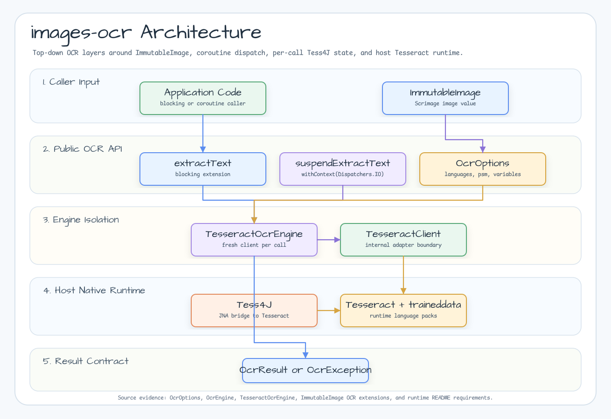
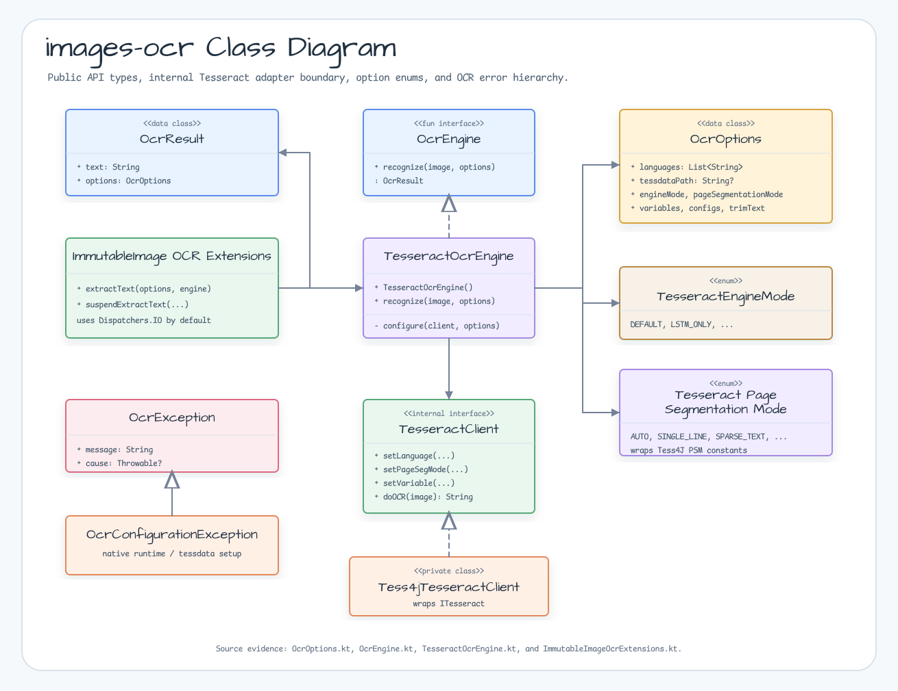
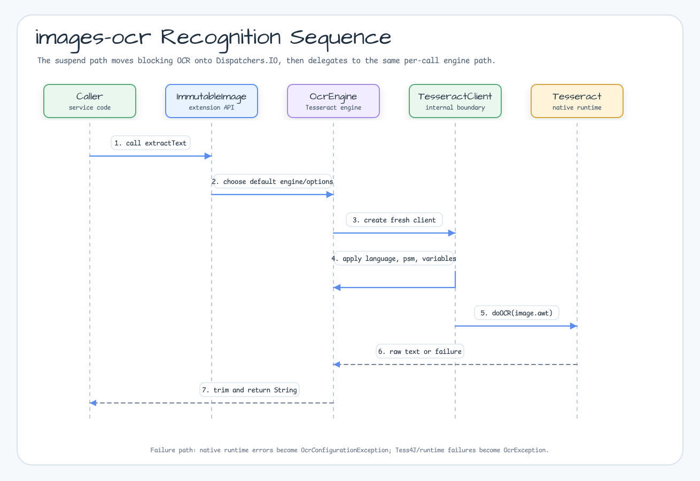

# bluetape4k-images-ocr

English | [한국어](./README.ko.md)

Tess4J/Tesseract OCR extensions for `ImmutableImage`.

## Features

- `ImmutableImage.extractText(...)` for blocking OCR.
- `ImmutableImage.suspendExtractText(...)` for coroutine callers; blocking OCR
  runs on `Dispatchers.IO` by default.
- `OcrOptions` for languages, `tessdataPath`, engine mode, page segmentation
  mode, variables, and configs.
- `TesseractOcrEngine` creates a fresh Tess4J instance per call so mutable OCR
  state is not shared across callers.

## Architecture



## Class Diagram



## Sequence Diagram



## Runtime Requirements

Install Tesseract and the traineddata packages you request.

```bash
# macOS
brew install tesseract tesseract-lang

# Ubuntu / Debian
sudo apt-get install tesseract-ocr tesseract-ocr-eng tesseract-ocr-kor tesseract-ocr-jpn fonts-noto-cjk

tesseract --list-langs
```

Set `TESSDATA_PREFIX` or pass `OcrOptions(tessdataPath = "...")` when the
runtime cannot find traineddata files.

## Installation

```kotlin
dependencies {
    implementation("io.github.bluetape4k.image:bluetape4k-images-ocr:<version>")
}
```

## Usage

```kotlin
import io.bluetape4k.images.immutableImageOf
import io.bluetape4k.images.ocr.OcrOptions
import io.bluetape4k.images.ocr.TesseractPageSegmentationMode
import io.bluetape4k.images.ocr.extractText
import io.bluetape4k.images.ocr.suspendExtractText
import java.io.File

val image = immutableImageOf(File("receipt.png"))

val text = image.extractText(
    OcrOptions(languages = listOf("eng", "kor")),
)

val suspendText = image.suspendExtractText(
    OcrOptions(
        languages = listOf("eng"),
        pageSegmentationMode = TesseractPageSegmentationMode.SINGLE_LINE,
    ),
)
```

Use `variables` for Tesseract tuning:

```kotlin
val digits = image.extractText(
    OcrOptions(
        languages = listOf("eng"),
        variables = mapOf("tessedit_char_whitelist" to "0123456789"),
    ),
)
```

## Tests

Always-on tests validate options, enum mappings, serialization, engine
delegation, per-call Tess4J configuration, sanitized exceptions, and coroutine
cancellation:

```bash
./gradlew :bluetape4k-images-ocr:test
```

Native OCR tests are gated because they need host Tesseract and language packs:

```bash
./gradlew :bluetape4k-images-ocr:test -Docr.enabled=true
```

Container smoke tests are gated because they need Docker:

```bash
./gradlew :bluetape4k-images-ocr:test -Docr.container.enabled=true
```
