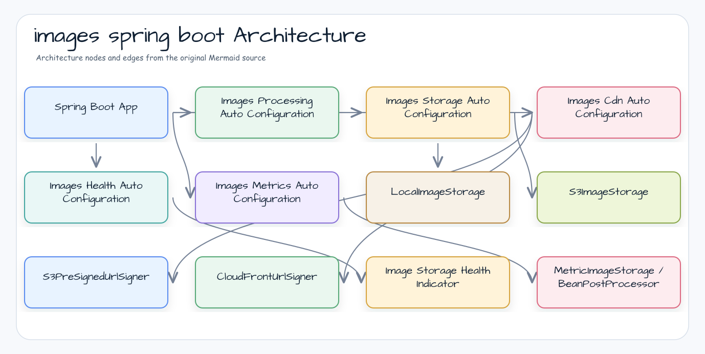

# images-spring-boot

`images` 모듈을 위한 Spring Boot 4 자동 구성 — S3/CDN 스토리지, 리액티브 헬스 인디케이터, Micrometer 메트릭.

## 아키텍처



## 주요 기능

- 이미지 스토리지, CDN 서명, 헬스 체크, 메트릭 **자동 구성**
- **두 가지 스토리지 백엔드**: 로컬 파일시스템 및 `bluetape4k-aws-spring-boot` 기반 AWS S3
- **CDN URL 서명**: S3 사전 서명 URL 또는 CloudFront 서명 URL
- **리액티브 헬스 인디케이터**: 스토리지 접근성을 확인하는 `ReactiveHealthIndicator`
- **Micrometer 메트릭**: `BeanPostProcessor`를 통한 업로드/다운로드 타이머 및 오류 카운터
- **선택적 객체 메타데이터**: body를 다운로드하지 않고 크기, ETag, content type, last-modified 조회
- **Actuator 보호**: `/actuator/configprops`에서 `privateKeyPem` 값을 마스킹하는 `SanitizingFunction`

## 사용법

### 의존성

```kotlin
dependencies {
    implementation(platform("io.github.bluetape4k.image:bluetape4k-image-bom:<version>"))
    implementation("io.github.bluetape4k.image:bluetape4k-images-spring-boot")
}
```

BOM을 import하지 않는다면 모듈 버전을 직접 선언하세요:

```kotlin
dependencies {
    implementation("io.github.bluetape4k.image:bluetape4k-images-spring-boot:<version>")
}
```

### 설정

```yaml
bluetape4k:
  images:
    processing:
      enabled: true
      default-format: jpeg
      default-quality: 85

    storage:
      enabled: true
      backend: local            # 또는: s3
      max-size-bytes: 52428800  # 50 MB
      health-probe-key: .health-probe
      local:
        root-dir: /tmp/images
        # 업로드 중 parent는 만들지 않으며 startup에서 고정 prefix를 준비합니다.
        bootstrap-prefixes: [originals, thumbnails]
      # S3 백엔드 (bluetape4k-aws-spring-boot 필요):
      bucket: my-image-bucket
      key-prefix: images/

    cdn:
      enabled: false            # 기본값: 비활성
      provider: s3_presign      # 또는: cloudfront
      cloudfront:
        distribution-domain: d1234abcd.cloudfront.net
        key-pair-id: APKABC123
        private-key-path: /etc/secrets/cloudfront.pem
        default-expiry: PT10M
        max-expiry: PT1H

    health:
      enabled: true

    metrics:
      enabled: true
```

### 스토리지 백엔드

#### 로컬 (기본값)

추가 의존성 없음. `local.root-dir` 아래에 파일 저장.
`ImageObjectKey`가 `..` 경로 세그먼트를 거부하여 경로 탐색 공격 방지.
업로드 중에는 로컬 parent directory를 생성하지 않습니다. 고정된 상대 경로를
`local.bootstrap-prefixes`에 설정하거나 `LocalImageStorage` 생성 전에 직접 준비하세요.
준비되지 않은 parent는 파일·directory를 만들지 않고 `ValidationException`으로 종료합니다.

runtime write는 `SecureDirectoryStream`을 제공하고 descriptor-relative `move`로
기존 target을 atomic replace할 수 있는 filesystem provider에서만 지원합니다. 업로드는
bytes를 staging한 뒤 가능한 경우 channel을 force하고, staging이 완료된 후에만 target을
교체합니다. 쓰기나 취소가 실패하면 partial stage를 삭제하며 안전하지 않은 path 기반
move로 fallback하지 않습니다. 이 capability가 없는 provider(예: JDK ZipFS)는 storage
계약을 조용히 약화하지 않고 `ImageStorageException`으로 fail closed합니다.
`LocalFileSystemContractTest` matrix는 provider probe, root/nested replace, symbolic link,
permission, missing parent, cancellation 결과를 기록하며, provider나 process가 POSIX
권한을 강제할 수 없으면 해당 검사를 N/A로 보고합니다.

#### S3

`bluetape4k-aws-spring-boot` 의존성과 해당 모듈이 제공하는 `S3Operations`
빈이 필요합니다. `backend=s3`로 설정했는데 `S3Operations` 빈이 없으면 로컬
파일시스템으로 조용히 대체하지 않고 시작 단계에서 실패합니다. 애플리케이션이
S3 저장소 구현을 의도적으로 대체하려면 별도의 `ImageStorage` 빈을 제공하세요.

`Path` 업로드는 먼저 bounded streaming snapshot을 만든 뒤 선택적인
`S3TransferOperations` 파일 전송 capability가 있을 때 이를 사용합니다. capability가
없으면 source 전체를 `ByteArray`로 적재하지 않고 fail closed합니다. `Path` 다운로드는
S3 resource를 통해 스트리밍한 뒤 destination 파일을 atomic replace합니다.

### 객체 메타데이터 capability

기존 `ImageStorage` 메서드 집합은 그대로 유지합니다. 메타데이터를 지원하는
provider는 선택적인 `ImageObjectMetadataReader` capability를 추가로 구현합니다.

```kotlin
val metadata = (storage as? ImageObjectMetadataReader)?.readMetadata(key)
```

`ImageObjectMetadata`는 provider-neutral 모델이며 `sizeBytes`, nullable한
`contentType`/`lastModified`, opaque한 nullable `etag`를 담습니다. ETag의 따옴표와
backend token은 그대로 보존하므로 MD5나 content hash로 해석하거나 정규화하지
마세요. `lastModified` 정밀도는 backend/filesystem이 제공하는 값에 따르며 sub-second
정밀도를 보장하지 않습니다. 로컬 저장소는 파일 attribute만 읽으므로 ETag과 content
type은 `null`입니다.
Micrometer decorator는 capability를 지원하는 provider에서만 이를 보존하고,
지원하지 않는 custom storage에는 capability를 광고하지 않습니다.

S3 메타데이터는 body를 열지 않고 단일 `S3Operations.headObject` snapshot으로
조회합니다. byte-array와 `Path` 다운로드 모두 같은 HEAD size를 먼저 확인한 뒤
실제 스트림 byte 수를 snapshot과 비교하고 결과를 노출합니다. HEAD 실패나 object
교체로 인한 크기 불일치는 fail closed하며 `listPage` 또는 resource size fallback은
사용하지 않습니다. 정렬된 `bluetape4k-aws-spring-boot` artifact에는 upstream
PR [#516](https://github.com/bluetape4k/bluetape4k-aws/pull/516)의 `headObject`
계약(`24c8039006220de654c732f722f3c7beb9b5b74f`)이 포함되어야 하며, consumer는
개별 artifact 버전을 따로 맞추지 말고 `bluetape4k-dependencies` catalog을
사용해야 합니다.

```yaml
bluetape4k.images.storage:
  backend: s3
  bucket: my-bucket
  key-prefix: uploads/
```

### CDN URL 서명

#### S3 사전 서명 URL

```yaml
bluetape4k.images.cdn:
  enabled: true
  provider: s3_presign
```

#### CloudFront 서명 URL

```yaml
bluetape4k.images.cdn:
  enabled: true
  provider: cloudfront
  cloudfront:
    distribution-domain: d1234abcd.cloudfront.net
    key-pair-id: APKABC123
    private-key-path: /etc/secrets/cloudfront.pem
```

`privateKeyPem`은 인라인 설정 가능하지만 파일 경로 사용을 권장합니다. 힙 메모리의 PEM 값은 초기화할 수 없어 힙 덤프에 노출될 수 있습니다.

### 0.5.0 직렬화 경계

`LocalImageStorage`, `S3ImageStorage`, URL signer, `CdnProperties`는 runtime 설정과
collaborator를 보유하는 객체이므로 Java 직렬화 상태가 아닙니다. `ObjectOutputStream`
graph에 넣지 말고 Spring 설정으로 startup 시 다시 생성하세요. CloudFront private-key
PEM과 path property는 Jackson wire view에서 제외하고 `toString()`과 Actuator 진단에서도
마스킹합니다. 기존 runtime 직렬화 사용은 애플리케이션 snapshot으로 migration해야 하며,
남아 있는 직렬화 시도는 `NotSerializableException`으로 실패합니다.

### 헬스 체크

`ImageStorageHealthIndicator`가 `storage.exists()` 호출로 접근성을 확인합니다.
Spring Boot 4 `spring-boot-health` 모듈의 `ReactiveHealthIndicator`로 통합됩니다.

```
GET /actuator/health
{
  "status": "UP",
  "components": {
    "imageStorage": { "status": "UP" }
  }
}
```

### 메트릭

`MeterRegistry` 빈이 있으면 `BeanPostProcessor`가 모든 `ImageStorage` 빈을
`MetricImageStorage`(또는 capability를 보존하는 metadata 변형)로 래핑합니다.

| 메트릭 | 타입 | 설명 |
|--------|------|------|
| `images.storage.upload.duration` | Timer | 업로드 지연 시간 |
| `images.storage.upload.errors` | Counter | 업로드 오류 횟수 |
| `images.storage.download.duration` | Timer | 다운로드 지연 시간 |
| `images.storage.download.errors` | Counter | 다운로드 오류 횟수 |

## 자동 구성 순서

| 클래스 | 이후에 실행 |
|--------|-------------|
| `ImagesProcessingAutoConfiguration` | — |
| `ImagesStorageAutoConfiguration` | `S3AutoConfiguration`, `ImagesProcessingAutoConfiguration` |
| `ImagesCdnAutoConfiguration` | `ImagesStorageAutoConfiguration` |
| `ImagesHealthAutoConfiguration` | `ImagesStorageAutoConfiguration` |
| `ImagesMetricsAutoConfiguration` | `ImagesStorageAutoConfiguration` |

## 예외 계층

```
ImageStorageException (sealed)
├── NotFoundException       — 객체 없음
├── AccessDeniedException   — 권한 없음
├── ConflictException       — 이미 존재
├── TransientException      — 재시도 가능한 오류
└── ValidationException     — 입력 검증 실패
```

## 키 모델

`ImageObjectKey.of(prefix, name)` — 두 세그먼트 모두 `[A-Za-z0-9._/-]+` 패턴을 만족해야 하며 `..`를 포함할 수 없습니다.

```kotlin
val key = ImageObjectKey.of("thumbnails", "photo-001.webp")
// key.fullKey == "thumbnails/photo-001.webp"
```
