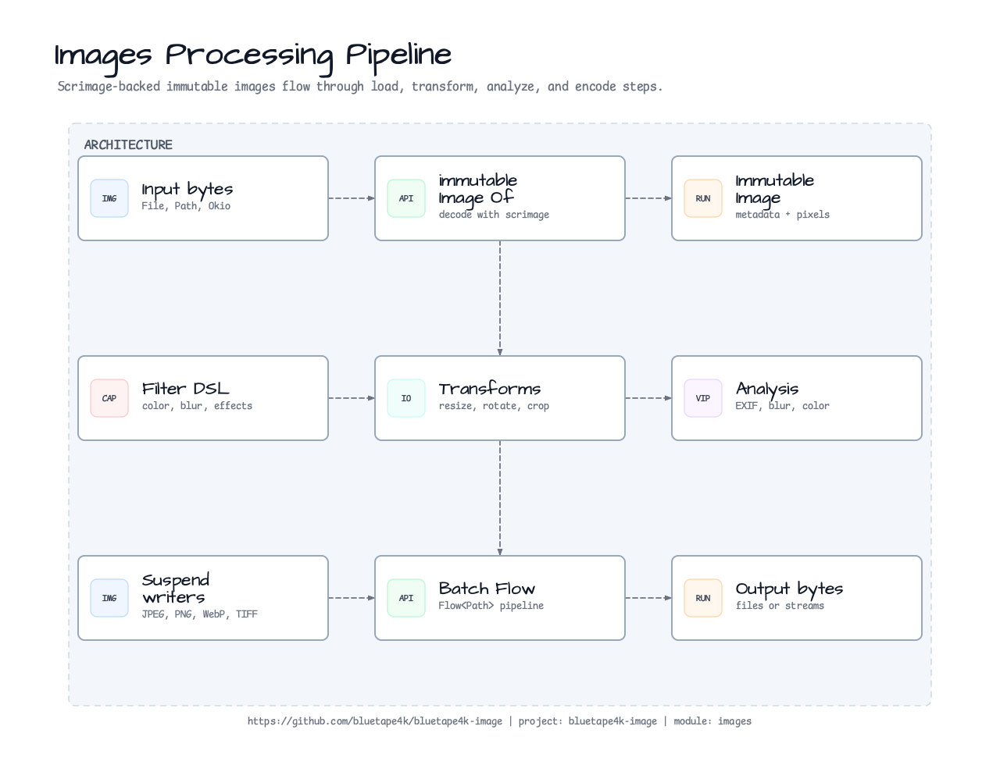
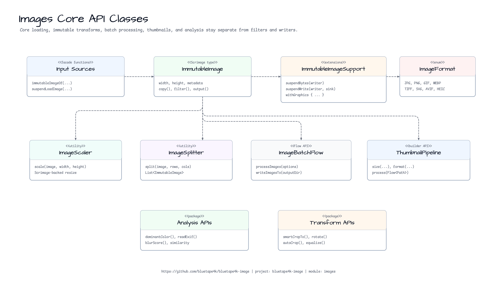
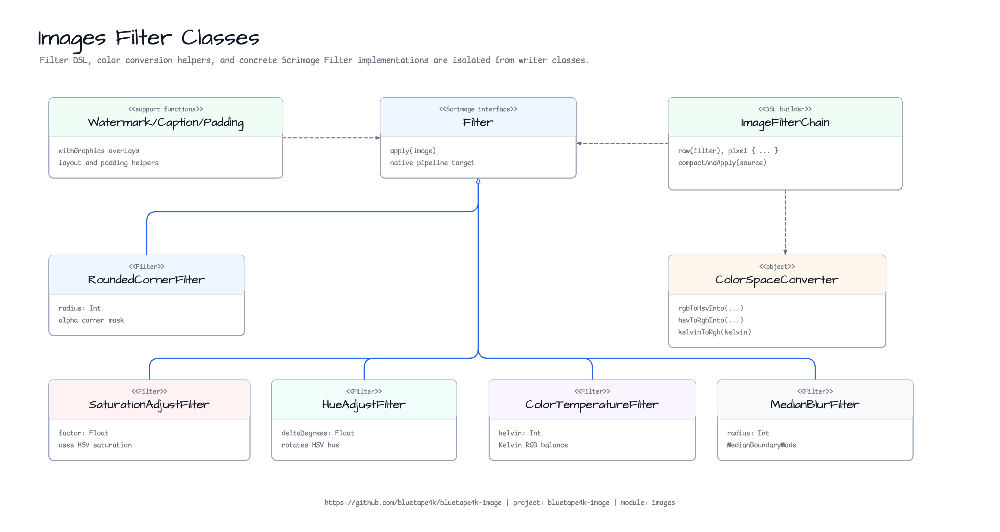
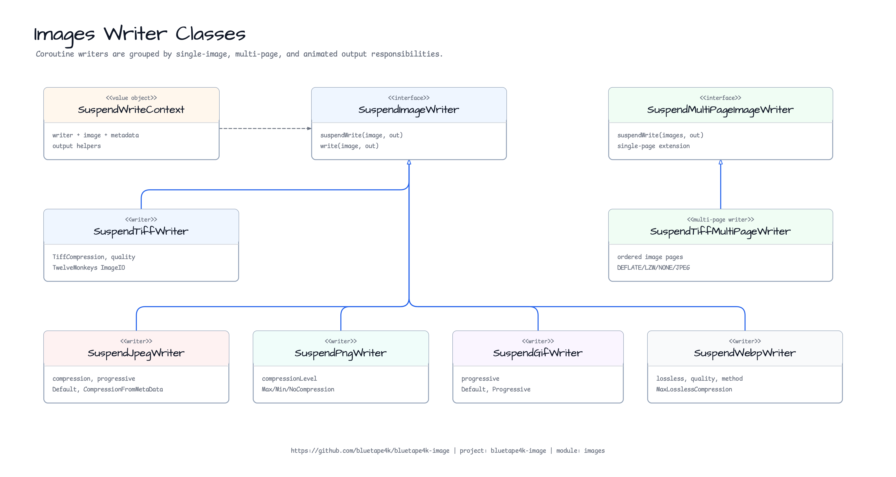
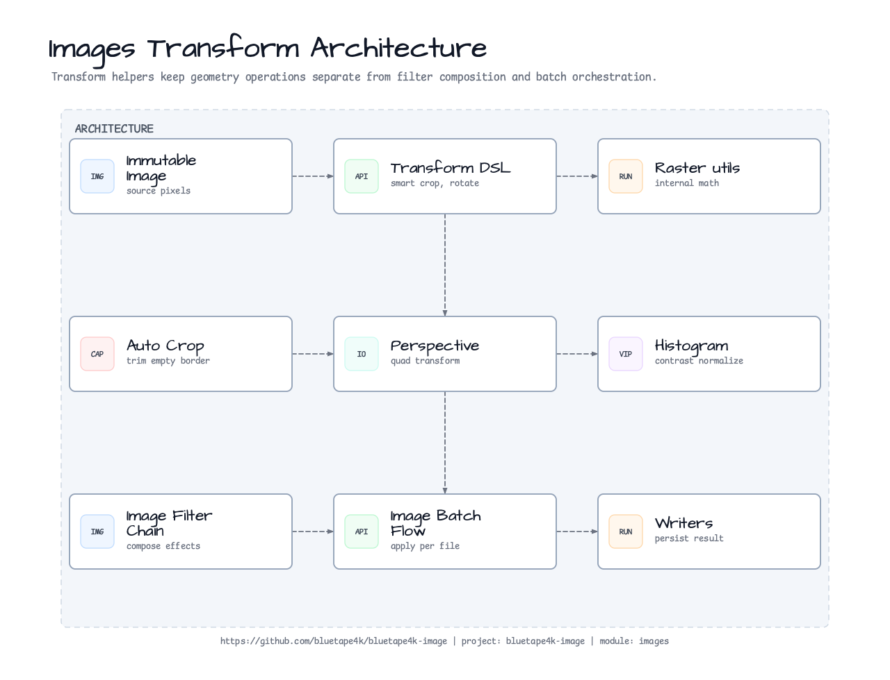
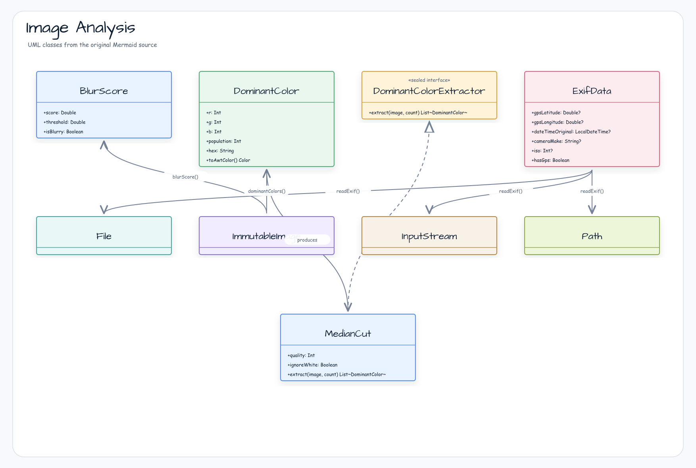

# Module bluetape4k-images

English | [한국어](./README.ko.md)

A library for loading, converting, resizing, splitting, and applying filters to images in formats such as JPG, PNG, GIF, WebP, and **TIFF/SVG** (Issue #134). Built on the [Scrimage](https://github.com/sksamuel/scrimage) library with asynchronous image processing via Coroutines. AVIF and HEIC are incubating interfaces; libvips support is exposed by `images-vips-api` and backed at runtime by the JDK 25 JVips JNI backend (published under the legacy `images-vips-java21` name) or the JDK 25 FFM backend (`images-vips-java25`).

## Architecture

### Processing Pipeline



### Class Diagrams

#### Core API



#### Filters



#### Writers



## Key Features

### Supported Image Formats

| Format | Writer/Reader                    | Notes                                                         |
|--------|----------------------------------|---------------------------------------------------------------|
| PNG    | `SuspendPngWriter`               | Lossless, transparency                                        |
| GIF    | `SuspendGifWriter`               | Animation support                                             |
| JPG    | `SuspendJpegWriter`              | Fast, lossy                                                   |
| WEBP   | `SuspendWebpWriter`              | Best compression, modern                                      |
| TIFF   | `SuspendTiffWriter` / `SuspendTiffMultiPageWriter` | Multi-page, multiple compression modes (DEFLATE/LZW/NONE/JPEG) |
| SVG    | `BatikSvgRasterizer`             | Rasterize to PNG/JPEG; XXE/SSRF-safe by default               |
| AVIF   | `AvifWriter` *(incubating)*      | Interface only; use a libvips runtime backend when native support is available |
| HEIC   | `HeicReader` *(incubating)*      | Interface only; use a libvips runtime backend when native support is available |

- **Dynamic generation**: JPG is fastest (for real-time processing)
- **Static files**: WebP is most efficient (saves storage)
- **Document imaging**: TIFF multi-page support for archival workflows
- **Vector graphics**: SVG rasterization via Batik (opt-in dependency)

### Key Files

| File                                           | Description                              |
|------------------------------------------------|------------------------------------------|
| `ImmutableImageSupport.kt`                     | Create, save, and draw on ImmutableImage |
| `BufferedImageSupport.kt`                      | Create, save, and draw on BufferedImage  |
| `ImageFormat.kt`                               | Supported image format enum              |
| `WriteContextExtensions.kt`                    | Write context extensions                 |
| `IIORegistryUtils.kt`                          | ImageIO registry utilities               |
| `batch/ImageBatchFlow.kt`                      | Coroutine Flow batch image processing    |
| `batch/ImageProcessingDsl.kt`                  | Batch transform DSL with named defaults  |
| `thumbnail/ThumbnailPipeline.kt`               | Multi-size thumbnail pipeline            |
| `tiles/TileProcessor.kt`                       | Tile split/merge and parallel tile processing |
| `scaler/ImageScaler.kt`                        | Image resizing                           |
| `splitter/ImageSplitter.kt`                    | Image splitting                          |
| `filters/WatermarkFilterSupport.kt`            | Watermark filter                         |
| `filters/CaptionFilterSupport.kt`              | Caption filter                           |
| `filters/PaddingSupport.kt`                    | Padding filter                           |
| `filters/WatermarkFilterType.kt`               | Watermark type (COVER/STAMP)             |
| `analysis/DominantColor.kt`                    | Dominant color extraction (MedianCut) — `dominantColor()`, `dominantColors()` |
| `analysis/BlurDetector.kt`                     | Blur detection via Laplacian variance — `blurScore()`, `isBlurry()` |
| `analysis/ExifData.kt`                         | EXIF metadata parsing — `readExif()`, GPS PII removal |
| `analysis/ImageMetadataReport.kt`              | Privacy-aware metadata report — EXIF/XMP/IPTC/ICC/dimensions/HDR hints |
| `moderation/SensitiveContentModels.kt`         | Backend-neutral sensitive-content detection result models |
| `moderation/SensitiveContentPolicy.kt`         | Renderer-neutral moderation policy and treatment decisions |
| `privacy/PrivacyDerivativePipeline.kt`         | Public-safe derivative images with metadata stripping, sizing, and redaction |
| `similarity/ImageSimilarity.kt`                | Core similarity: pixel Δ, MSE, PSNR, global SSIM, pHash |
| `similarity/MssimSimilarity.kt`                | MSSIM — sliding-window Gaussian SSIM                    |
| `similarity/HashSimilarity.kt`                 | aHash/dHash/wHash/phashOf (64/256/1024bit), HashDistance |
| `similarity/HistogramSimilarity.kt`            | Color histogram: ChiSquare, Bhattacharyya, EarthMover   |
| `similarity/KeypointSimilarity.kt`             | Block-Mean descriptor, bestRotationSimilarityTo         |
| `similarity/SimilarityScaleUtils.kt`           | prepareForSimilarity — downscale before MSSIM           |
| `fonts/FontSupport.kt`                         | Font utilities                           |
| `filters/dsl/ImageFilterChain.kt`              | Filter/color correction DSL (`applyFilters`, `suspendApplyFilters`) |
| `filters/dsl/ImageFilterChainDsl.kt`           | DSL member functions (40+ filters)       |
| `filters/SaturationAdjustFilter.kt`            | HSV saturation adjustment filter        |
| `filters/HueAdjustFilter.kt`                   | HSV hue rotation filter                  |
| `filters/ColorTemperatureFilter.kt`            | Kelvin color temperature filter          |
| `filters/MedianBlurFilter.kt`                  | Median blur noise reduction filter       |
| `filters/RoundedCornerFilter.kt`               | Rounded corner alpha mask filter         |
| `filters/ColorSpaceConverter.kt`               | RGB/HSV/YCbCr/Kelvin color space conversion |
| `coroutines/SuspendImageWriter.kt`             | Async image writer interface             |
| `coroutines/SuspendMultiPageImageWriter.kt`    | Async multi-page writer interface        |
| `coroutines/SuspendJpegWriter.kt`              | Async JPEG writer                        |
| `coroutines/SuspendPngWriter.kt`               | Async PNG writer                         |
| `coroutines/SuspendGifWriter.kt`               | Async GIF writer                         |
| `coroutines/SuspendWebpWriter.kt`              | Async WebP writer                        |
| `coroutines/SuspendTiffWriter.kt`              | Async TIFF writer (single-page, TwelveMonkeys) |
| `coroutines/SuspendTiffMultiPageWriter.kt`     | Async TIFF multi-page writer             |
| `coroutines/TiffCompression.kt`                | TIFF compression modes (DEFLATE/LZW/NONE/PACKBITS/JPEG) |
| `coroutines/animated/SuspendGif2WebpWriter.kt` | GIF → WebP conversion writer             |
| `coroutines/animated/AnimatedGifExtensions.kt` | AnimatedGif extensions                   |
| `svg/SuspendSvgRasterizer.kt`                  | SVG rasterizer interface                 |
| `svg/BatikSvgRasterizer.kt`                    | SVG rasterizer (Apache Batik, XXE-safe)  |
| `svg/SvgRasterizeOptions.kt`                   | SVG rasterization options                |
| `avif/AvifWriter.kt`                           | AVIF writer interface *(incubating)*     |
| `heic/HeicReader.kt`                           | HEIC reader interface *(incubating)*     |
| `IncubatingImageApi.kt`                        | `@RequiresOptIn` marker for incubating APIs |

## Usage Examples

### Loading ImmutableImage

```kotlin
import io.bluetape4k.images.*
import io.bluetape4k.okio.asSource
import io.bluetape4k.okio.buffered
import io.bluetape4k.okio.coroutines.asSuspendedSource
import java.nio.channels.AsynchronousFileChannel
import java.nio.file.StandardOpenOption.READ

// Load from ByteArray
val image = immutableImageOf(byteArray)

// Load from InputStream
val image = immutableImageOf(inputStream)

// Load from File
val image = immutableImageOf(File("image.jpg"))

// Load from Path
val image = immutableImageOf(Paths.get("image.jpg"))

// Async load in a coroutine context
val image = suspendImmutableImageOf(File("image.jpg"))
val image = suspendLoadImage(Paths.get("image.jpg"))

// Load from an Okio source
val image = File("image.jpg").inputStream().asSource().buffered().use { source ->
    immutableImageOf(source)
}

// Load from a bluetape4k-okio suspended file source
val channel = AsynchronousFileChannel.open(Paths.get("image.jpg"), READ)
val image = suspendLoadImage(channel.asSuspendedSource())
```

`BufferedSource` inputs are caller-owned and are not closed by load helpers.
Pass a raw `Source` when the helper should buffer and close the source. Scrimage
still decodes into JVM image memory; Okio improves stream ownership and
integration rather than removing the decoded pixel allocation.

### Loading and Saving BufferedImage

```kotlin
import io.bluetape4k.images.*

// Load from various sources
val image = bufferedImageOf(inputStream)
val image = bufferedImageOf(File("image.jpg"))
val image = bufferedImageOf(byteArray)

// Create a new blank image
val image = bufferedImageOf(200, 100)

// Save
image.write(ImageFormat.JPG, File("output.jpg"))
image.write(ImageFormat.PNG, outputStream)

// Convert to ByteArray
val bytes = image.toByteArray("png")
```

### Saving Images (Coroutines)

```kotlin
import io.bluetape4k.images.*
import io.bluetape4k.images.coroutines.*
import io.bluetape4k.okio.coroutines.asSuspendedSink
import okio.Buffer
import java.nio.channels.AsynchronousFileChannel
import java.nio.file.StandardOpenOption.CREATE
import java.nio.file.StandardOpenOption.TRUNCATE_EXISTING
import java.nio.file.StandardOpenOption.WRITE

val image = immutableImageOf(File("input.png"))

// Save as JPEG (80% quality)
image.suspendWrite(SuspendJpegWriter(compression = 80), Paths.get("output.jpg"))

// Save as PNG (maximum compression)
image.suspendWrite(SuspendPngWriter.MaxCompression, Paths.get("output.png"))

// Save as WebP
image.suspendWrite(SuspendWebpWriter.Default, Paths.get("output.webp"))

// Save to an Okio sink without creating an intermediate ByteArray
val buffer = Buffer()
image.suspendWrite(SuspendJpegWriter.Default, buffer)

// Save to a bluetape4k-okio suspended file sink
val channel = AsynchronousFileChannel.open(Paths.get("output.jpg"), WRITE, CREATE, TRUNCATE_EXISTING)
image.suspendWrite(SuspendJpegWriter.Default, channel.asSuspendedSink())

// Convert to ByteArray
val jpegBytes = image.suspendBytes(SuspendJpegWriter.Default)
val webpBytes = image.suspendBytes(SuspendWebpWriter.Default)
```

`BufferedSink` outputs are caller-owned and are flushed, not closed. Pass a raw
`Sink` or `SuspendedSink` when the helper should own and close the output
boundary. Prefer `SuspendedSource`/`SuspendedSink` from `bluetape4k-okio` for
asynchronous file channels and service pipelines that already run in coroutines.

### Batch Image Processing (Issue #135)

`ImageBatchFlow` provides a Coroutine Flow pipeline for applying uniform transforms to a large set of
images with concurrency control and per-pixel memory limits.

```kotlin
import io.bluetape4k.images.batch.*
import kotlinx.coroutines.flow.asFlow
import kotlinx.coroutines.flow.toList
import java.nio.file.Path

// Configure batch options
val options = ImageProcessingOptions(
    parallelism = defaultImageBatchParallelism(),
    maxPixels = DEFAULT_MAX_PIXELS,
    maxInFlightPixels = DEFAULT_MAX_IN_FLIGHT_PIXELS,
    skipFailures = true,                        // skip failing images, don't abort
)

// Process and write results
val writtenPaths: List<Path> = listOf(Path.of("a.jpg"), Path.of("b.jpg"))
    .asFlow()
    .processImages(options) {
        resize(width = 1280, height = 720)      // resize first
        watermark("© bluetape4k")               // overlay watermark
        toJpeg(quality = 85)                    // encode as JPEG
    }
    .writeImagesTo(Path.of("output"), options)  // write to output directory
    .toList()
```

`ImageProcessingDsl` runs transforms on `transformDispatcher` and writes through the caller-provided
`ioDispatcher`. The batch defaults are named constants such as `DEFAULT_MAX_PIXELS`,
`DEFAULT_MAX_IN_FLIGHT_PIXELS`, `JPEG_QUALITY_MIN`, `JPEG_QUALITY_MAX`, and
`PERFORMANCE_SAMPLE_IMAGE_COUNT`.

For larger image sets, use `ImageProcessingOptions.largeJobs()` or pass explicit
`maxPixels` / `maxInFlightPixels` values:

```kotlin
val largeOptions = ImageProcessingOptions.largeJobs(
    parallelism = defaultImageBatchParallelism(),
    maxPixels = LARGE_JOB_MAX_PIXELS,
    maxInFlightPixels = LARGE_JOB_MAX_IN_FLIGHT_PIXELS,
)
```

### Thumbnail Pipeline

`ThumbnailPipeline` generates multiple thumbnail sizes for each source image in a single pass.
Use `ThumbnailPipeline.builder()` to configure sizes, crop strategy, format, and error handling, then
call `process(Flow<Path>)` to start streaming results.

```kotlin
import io.bluetape4k.images.batch.ImageProcessingOptions
import io.bluetape4k.images.coroutines.SuspendJpegWriter
import io.bluetape4k.images.thumbnail.*
import kotlinx.coroutines.flow.asFlow
import kotlinx.coroutines.flow.collect
import java.nio.file.Path

// Build a pipeline that produces three thumbnail sizes per image
val pipeline = ThumbnailPipeline.builder()
    .outputDirectory(Path.of("output/thumbs"))
    .size(width = 1280, height = 720, suffix = "hd")
    .size(width = 640,  height = 360, suffix = "md")
    .size(width = 320,  height = 180, suffix = "sm")
    .format(ThumbnailFormat(SuspendJpegWriter.Default.withCompression(85), "jpg"))
    .crop(ThumbnailCrop.Smart())                // saliency-based crop
    .options(ImageProcessingOptions(parallelism = 4, skipFailures = true))
    .onFailure { result ->
        // result.status contains the failed stage and cause
        println("Thumbnail failed: ${result.source} → ${result.status}")
    }
    .build()

// Stream source images and collect results
pipeline
    .process(listOf(Path.of("photos/photo.jpg"), Path.of("photos/banner.png")).asFlow())
    .collect { result ->
        when (val status = result.status) {
            is ThumbnailStatus.Success ->
                println("OK  ${result.output.fileName} — ${status.bytes} bytes")
            is ThumbnailStatus.Failure ->
                println("ERR ${result.source.fileName} at ${status.stage}")
        }
    }
```

`ThumbnailCrop` variants:
- `ThumbnailCrop.Fit` — scale to fit within the bounding box (default)
- `ThumbnailCrop.Smart()` — saliency-based crop then resize to exact dimensions

### Tile Processing

`TileProcessor` splits large images into a grid of tiles, applies parallel transforms to each tile,
and reassembles them into a single output image. Useful for applying localised filters to images that
are too large to process as a whole.

```kotlin
import com.sksamuel.scrimage.ImmutableImage
import com.sksamuel.scrimage.filter.GrayscaleFilter
import io.bluetape4k.images.tiles.*
import kotlinx.coroutines.flow.asFlow
import kotlinx.coroutines.flow.toList

val image: ImmutableImage = ImmutableImage.loader().fromFile(File("large.jpg"))
val processor = TileProcessor(maxTileCount = 256, parallelism = 4)

// 1. Split into 512×512 tiles
val tiles: List<ImageTile> = processor.split(image, TileSize(width = 512, height = 512))

// 2. Apply a per-tile transform in parallel
val processedTiles: List<ImageTile> = processor
    .processTiles(tiles.asFlow()) { tile ->
        tile.copy(image = tile.image.filter(GrayscaleFilter()))
    }
    .toList()

// 3. Reassemble into the original dimensions
val result: ImmutableImage = processor.merge(processedTiles, image.width, image.height)
result.output(JpegWriter.Default, File("output.jpg"))
```

Simple split-and-merge (no per-tile transform):

```kotlin
val processor = TileProcessor()
val tiles = processor.split(image, TileSize(width = 512, height = 512))
val merged = processor.merge(tiles, image.width, image.height)
```

### TIFF Support (Issue #134)

```kotlin
import io.bluetape4k.images.coroutines.*
import java.io.ByteArrayOutputStream

val image = immutableImageOf(File("photo.jpg"))

// Single-page TIFF (DEFLATE compression by default)
val writer = SuspendTiffWriter.Default
val bos = ByteArrayOutputStream()
writer.suspendWrite(image, bos)

// LZW compression
val lzwWriter = SuspendTiffWriter.Lzw
val bos2 = ByteArrayOutputStream()
lzwWriter.suspendWrite(image, bos2)

// Multi-page TIFF
val pages = listOf(page1, page2, page3)
val multiWriter = SuspendTiffMultiPageWriter.Default
val bos3 = ByteArrayOutputStream()
multiWriter.suspendWrite(pages, bos3)
```

### SVG Rasterization (Issue #134)

```kotlin
import io.bluetape4k.images.svg.*
import com.sksamuel.scrimage.nio.PngWriter

val rasterizer = BatikSvgRasterizer()

// Basic rasterization (external resources blocked by default)
File("diagram.svg").inputStream().use { svg ->
    val image: ImmutableImage = rasterizer.rasterize(svg)
    image.output(PngWriter.MaxCompression, File("diagram.png"))
}

// With custom options
val opts = SvgRasterizeOptions(
    width = 800,
    height = 600,
    dpi = 144,
    allowExternalResources = false,  // SSRF/XXE guard (default)
)
File("diagram.svg").inputStream().use { svg ->
    val image = rasterizer.rasterize(svg, opts)
}
```

### Resizing Images

```kotlin
import io.bluetape4k.images.scaler.*
import java.awt.image.BufferedImage

// Scale by ratio
val scaled = bufferedImage.scale(0.5)  // 50%

// Scale to absolute dimensions (maintain aspect ratio)
val scaled = bufferedImage.scale(width = 200, height = 200, proportional = true)

// Scale to absolute dimensions (ignore aspect ratio)
val scaled = bufferedImage.scale(width = 200, height = 200, proportional = false)

// Scale by X/Y ratio
val scaled = bufferedImage.scale(xScale = 0.5, yScale = 0.5)
```

### Splitting Images

Splits a tall image (e.g., product detail pages) into chunks of the specified height.

```kotlin
import io.bluetape4k.images.splitter.ImageSplitter
import io.bluetape4k.images.ImageFormat

val splitter = ImageSplitter(maxHeight = 2048)

// Basic split
val splitImages: Flow<ByteArray> = splitter.split(
    input = inputStream,
    format = ImageFormat.JPG,
    splitHeight = 1024
)

// Split and compress
val compressedImages: Flow<ByteArray> = splitter.splitAndCompress(
    input = inputStream,
    format = ImageFormat.JPG,
    splitHeight = 1024,
    writer = SuspendJpegWriter(compression = 80)
)

splitImages.collect { bytes ->
    // handle each chunk
}
```

### Adding a Watermark

```kotlin
import io.bluetape4k.images.filters.*
import com.sksamuel.scrimage.ImmutableImage

val image = ImmutableImage.loader().fromFile(File("photo.jpg"))

// Full-cover watermark
val watermarked = image.filter(
    watermarkFilterOf(
        text = "© bluetape4k",
        type = WatermarkFilterType.COVER,
        alpha = 0.2,
        color = Color.WHITE
    )
)

// Stamp watermark
val stamped = image.filter(
    watermarkFilterOf(
        text = "© bluetape4k",
        type = WatermarkFilterType.STAMP,
        alpha = 0.3
    )
)

// Watermark at a specific position
val positioned = image.filter(
    watermarkFilterOf(
        text = "© bluetape4k",
        x = 100,
        y = 100,
        alpha = 0.5
    )
)
```

### Adding a Caption

```kotlin
import io.bluetape4k.images.filters.*
import com.sksamuel.scrimage.Position

val image = ImmutableImage.loader().fromFile(File("photo.jpg"))

val captioned = image.filter(
    captionFilterOf(
        text = "Powered by bluetape4k",
        position = Position.BottomLeft,
        textAlpha = 0.8,
        color = Color.WHITE
    )
)
```

### Adding Padding

```kotlin
import io.bluetape4k.images.filters.*

// Uniform padding on all sides
val padding = paddingOf(20)

// Individual padding per side
val padding = paddingOf(top = 10, right = 20, bottom = 10, left = 20)
```

### Graphics Operations

```kotlin
import io.bluetape4k.images.*
import java.awt.Color

val image = bufferedImageOf(200, 100)

image.useGraphics { graphics ->
    graphics.color = Color.RED
    graphics.fillRect(0, 0, 100, 100)
    graphics.color = Color.BLACK
    graphics.drawString("Hello, World!", 10, 50)
}

val immutableImage = immutableImageOf(File("input.jpg"))
val annotated = immutableImage.withGraphics { graphics ->
    graphics.color = Color.BLUE
    graphics.drawRect(10, 10, 100, 100)
}
```

### Image Similarity Comparison

Environment-independent image regression testing, duplicate detection, and compression-quality metrics.

```kotlin
import io.bluetape4k.images.*
import io.bluetape4k.images.similarity.*

val a = immutableImageOf(File("a.jpg"))
val b = immutableImageOf(File("b.jpg"))

// Pixel-level comparison
a.pixelAvgDeltaTo(b)   // Avg per-channel RGB delta (0.0 ~ 255.0, 0 = identical)
a.pixelMaxDeltaTo(b)   // Max per-channel RGB delta (0 ~ 255)

// Statistical metrics
a.mseTo(b)             // Mean Squared Error
a.psnrTo(b)            // Peak SNR dB (≥ 30 good, ≥ 40 near-identical, +∞ if identical)
a.ssimTo(b)            // Global SSIM (-1.0 ~ 1.0, ≥ 0.95 visually indistinguishable)

// Perceptual hash — legacy 64-bit API (robust to resize / JPEG recompression)
a.phash()                      // 64-bit Long
a.phashDistanceTo(b)           // Hamming distance 0 ~ 64 (≤ 5 near-identical, ≤ 10 similar)
```

| Metric               | Use case                                  | Identical |
|----------------------|-------------------------------------------|-----------|
| `pixelAvgDeltaTo`    | Byte-level regression testing (tolerance) | 0.0       |
| `pixelMaxDeltaTo`    | Single-pixel outlier detection            | 0         |
| `psnrTo`             | JPEG/WebP compression quality             | +∞        |
| `ssimTo`             | Global perceptual similarity              | 1.0       |
| `phashDistanceTo`    | Duplicate / crop / resize detection       | 0         |

### MSSIM (Multi-Scale SSIM)

Sliding-window SSIM that captures local spatial structure. More sensitive than global SSIM.

```kotlin
import io.bluetape4k.images.similarity.*

val a = immutableImageOf(File("a.jpg"))
val b = immutableImageOf(File("b.jpg"))

// 11×11 Gaussian window (default), averaged over all valid positions
val mssim = a.mssimTo(b)                    // 0.0 ~ 1.0
val mssim = a.mssimTo(b, windowSize = 7)    // smaller window
val mssim = a.mssimTo(b, sigma = 2.0)       // wider Gaussian

// For large images, downscale first to save time
val prepared = a.prepareForSimilarity(maxSide = 512)
val score = prepared.mssimTo(b.prepareForSimilarity(512))
```

> Both images must have the same dimensions. Use `prepareForSimilarity` for consistent large-image handling.

### Extended Perceptual Hash (aHash / dHash / wHash / pHash)

Variable bit-width perceptual hashes (64 / 256 / 1024 bit).

```kotlin
import io.bluetape4k.images.similarity.*

val a = immutableImageOf(File("a.jpg"))
val b = immutableImageOf(File("b.jpg"))

// 64-bit convenience shortcuts
val da = HashDistance.hamming(a.ahash(), b.ahash())   // average hash
val dd = HashDistance.hamming(a.dhash(), b.dhash())   // difference hash
val dw = HashDistance.hamming(a.whash(), b.whash())   // wavelet hash
// Note: a.phash() == a.phashOf(PHashSize.BITS_64)[0]

// Variable bit-width — LongArray
val p256 = a.phashOf(PHashSize.BITS_256)              // LongArray(4)
val p1024 = b.phashOf(PHashSize.BITS_1024)            // LongArray(16)
val dist = HashDistance.hamming(a.phashOf(PHashSize.BITS_256), b.phashOf(PHashSize.BITS_256))
```

| Hash  | Algorithm              | Strength                        |
|-------|------------------------|---------------------------------|
| aHash | Average intensity      | Fast, simple                    |
| dHash | Adjacent gradient      | Robust to mild brightness shift |
| wHash | Haar DWT LL subband    | Faster than pHash, similar accuracy |
| pHash | DCT low-frequency      | Most robust to JPEG / resize    |

### Color Histogram Similarity

Compares images via per-channel color distribution.

```kotlin
import io.bluetape4k.images.similarity.*

val a = immutableImageOf(File("a.jpg"))
val b = immutableImageOf(File("b.jpg"))

// Chi-Square (most discriminating, [0, 1])
val sim = a.histogramSimilarityTo(b)                                   // ChiSquare, RGB, 32 bins
val sim = a.histogramSimilarityTo(b, HistogramSimilarity.chiSquare())

// Bhattacharyya coefficient ([0, 1])
val sim = a.histogramSimilarityTo(b, HistogramSimilarity.bhattacharyya())

// Earth Mover's Distance normalized ([0, 1])
val sim = a.histogramSimilarityTo(b, HistogramSimilarity.earthMover())

// HSV color space, 64 bins per channel
val measure = HistogramSimilarity.ChiSquare(colorSpace = ColorSpace.HSV, binsPerChannel = 64)
val sim = a.histogramSimilarityTo(b, measure)
```

### Block-Mean Descriptor (Keypoint-free Matching)

Grid-based luminance descriptor for rotation-aware similarity.

```kotlin
import io.bluetape4k.images.similarity.*

val a = immutableImageOf(File("a.jpg"))
val b = immutableImageOf(File("b.jpg"))

// Grid similarity (L2-normalized, [0, 1])
val sim = a.blockMeanSimilarityTo(b)                        // 8×8 grid
val sim = a.blockMeanSimilarityTo(b, gridRows = 16, gridCols = 16)

// Rotation-aware: checks 0°/90°/180°/270°, returns best match
val sim = a.bestRotationSimilarityTo(b)

// Raw descriptor
val desc = a.blockMeanDescriptor()   // DoubleArray(64) normalized luminance per cell
```

### Converting Animated GIF to WebP

```kotlin
import io.bluetape4k.images.coroutines.animated.*
import com.sksamuel.scrimage.nio.AnimatedGif

val gif = AnimatedGif.fromFile(File("animation.gif"))

// Convert to WebP
gif.suspendWrite(SuspendGif2WebpWriter.Default, Paths.get("animation.webp"))

// Convert to ByteArray
val webpBytes = gif.suspendBytes(SuspendGif2WebpWriter.Default)
```

## Image Writer Options

### SuspendJpegWriter

```kotlin
SuspendJpegWriter.Default                              // 80% quality
SuspendJpegWriter(compression = 90)                    // Custom quality
SuspendJpegWriter(compression = 80, progressive = true) // Progressive JPEG
SuspendJpegWriter.CompressionFromMetaData              // Use compression from metadata
```

### SuspendPngWriter

```kotlin
SuspendPngWriter.MaxCompression  // level 9 (slowest)
SuspendPngWriter.MinCompression  // level 1 (fastest)
SuspendPngWriter.NoCompression   // level 0 (no compression)
```

### SuspendWebpWriter

```kotlin
SuspendWebpWriter.Default
SuspendWebpWriter.MaxLosslessCompression

SuspendWebpWriter(
    z = 9,           // compression level (0-9)
    q = 75,          // quality (0-100)
    m = 4,           // compression method (0-6)
    lossless = false,
    noAlpha = false
)
```

## Filter / Color Correction DSL (Issue #131)

Package: `io.bluetape4k.images.filters.dsl`

### `ImageFilterChain` DSL

The `applyFilters { ... }` and `suspendApplyFilters { ... }` extension functions provide a fluent DSL for chaining image filters. Key design points:

- `source.copy()` defensive copy ensures the original image is never mutated
- Adjacent scrimage native filters are automatically batched into a `PipelineFilter` for performance
- 40+ DSL member functions covering color/tone, style, blur, effects, and text

```kotlin
import io.bluetape4k.images.filters.dsl.*

// Synchronous filter chain
val result = image.applyFilters {
    brightness(1.2f)
    contrast(1.1)
    saturation(1.15f)
    sepia()
}

// Suspending (coroutine) filter chain
val result2 = image.suspendApplyFilters {
    gaussianBlur(3)
    colorTemperature(3000)
    vignette()
}

// Escape hatch: inject any custom filter
val result3 = image.applyFilters {
    raw(MyCustomFilter())
    pixel { img -> img.flipX() }
}
```

### New Filters (5 types)

| Filter | DSL Function | Description |
|--------|-------------|-------------|
| `SaturationAdjustFilter` | `saturation(factor)` | HSV saturation multiplier (1.0=original, 0=grayscale) |
| `HueAdjustFilter` | `hue(deltaDegrees)` | HSV hue rotation in degrees |
| `ColorTemperatureFilter` | `colorTemperature(kelvin)` | Kelvin color temperature adjustment (1000–40000 K) |
| `RoundedCornerFilter` | `roundedCorners(radius)` | Rounded corners with alpha mask |
| `MedianBlurFilter` | `medianBlur(radius, boundary)` | Median blur noise reduction (`MedianBoundaryMode`: REPLICATE/REFLECT) |

### `ColorSpaceConverter`

Utility object for color space conversions used internally by the new filters.

```kotlin
import io.bluetape4k.images.filters.ColorSpaceConverter

// RGB ↔ HSV
val (h, s, v) = ColorSpaceConverter.rgbToHsv(255, 128, 0)
val (r, g, b) = ColorSpaceConverter.hsvToRgb(30f, 1f, 1f)

// Kelvin → RGB
val (r, g, b) = ColorSpaceConverter.kelvinToRgb(6500)

// Pixel array conversions (per-pixel bulk)
val hsvArray = image.toHsvArray()     // FloatArray [h0,s0,v0, h1,s1,v1, ...]
val ycbcrArray = image.toYCbCrArray() // FloatArray [y0,cb0,cr0, ...]
```

## Image Transforms

Advanced image transformation operations backed by pure JVM (Java2D) with suspend variants.

### Transform Architecture



### AutoCrop

Remove background margins automatically.

```kotlin
// Auto-detect background from 4 corners
val cropped = image.autoCrop(tolerance = 10, padding = 2)

// Explicit background color
val cropped2 = image.autoCrop(tolerance = 5, backgroundColor = Color.WHITE)

// Suspend variant
val cropped3 = image.suspendAutoCrop()
```

### SmartCrop

Saliency-based crop (Sobel edge energy — not ML).

```kotlin
// Crop to 16:9 widescreen, keeping the most "interesting" region
val wide = image.smartCrop(AspectRatio.WIDESCREEN)

// Crop and resize to exact output dimensions
val thumb = image.smartCropTo(400, 300)

// Suspend variant
val wide2 = image.suspendSmartCrop(AspectRatio.SQUARE)
```

`AspectRatio` presets: `SQUARE (1:1)`, `WIDESCREEN (16:9)`, `PORTRAIT (9:16)`, `STANDARD (4:3)`.

### Rotation & Flip

```kotlin
// Arbitrary angle (transparent background, canvas auto-expanded)
val rotated = image.rotateDegrees(45.0)
val rotatedRed = image.rotateDegrees(30.0, background = Color.RED)

// 90-degree multiples (native scrimage, lossless)
val cw90  = image.rotateRight()
val ccw90 = image.rotateLeft()

// Flip
val hFlip = image.flipHorizontal()
val vFlip = image.flipVertical()

// Suspend
val async = image.suspendRotateDegrees(45.0)
```

### Perspective Transform

4-point homography for document de-skewing and perspective correction.

```kotlin
val src = listOf(
    ImagePoint(10.0, 10.0), ImagePoint(490.0, 0.0),
    ImagePoint(500.0, 490.0), ImagePoint(0.0, 500.0),
)
val dst = listOf(
    ImagePoint(0.0, 0.0), ImagePoint(499.0, 0.0),
    ImagePoint(499.0, 499.0), ImagePoint(0.0, 499.0),
)
val corrected = image.perspectiveTransform(src, dst, outputWidth = 500, outputHeight = 500)

// Suspend variant
val async = image.suspendPerspectiveTransform(src, dst, 500, 500)
```

### CLAHE (Histogram Equalization)

Contrast Limited Adaptive Histogram Equalization via YCbCr colour space.

```kotlin
// CLAHE with default tile/clip settings
val enhanced = image.clahe()

// Custom tile size and clip limit
val enhanced2 = image.clahe(tileSize = 16, clipLimit = 3.0)

// Global (single-tile) equalization
val global = image.globalEqualize()

// Suspend variant
val async = image.suspendClahe(tileSize = 8, clipLimit = 2.0)
```

### DSL Integration

All transforms are available inside `applyFilters { }` / `suspendApplyFilters { }` DSL.

```kotlin
val result = image.applyFilters {
    autoCrop(tolerance = 10, backgroundColor = Color.WHITE)
    rotateDegrees(15.0)
    clahe()
}

// Suspend DSL
val asyncResult = image.suspendApplyFilters {
    smartCrop(AspectRatio.WIDESCREEN)
    flipHorizontal()
}
```

### Image Analysis

Dominant color extraction, blur detection, and privacy-aware metadata reports — all pure JVM, no native dependencies.



#### Dominant Color Extraction (Median Cut)

```kotlin
import io.bluetape4k.images.analysis.*

val image = ImmutableImage.loader().fromFile(File("photo.jpg"))

// Extract top 5 dominant colors
val colors: List<DominantColor> = image.dominantColors(5)
colors.forEach { c ->
    println("${c.hex} (population=${c.population})")
}

// Extract single dominant color (null if image is fully transparent)
val primary: DominantColor? = image.dominantColor()

// Custom extractor — exclude near-white pixels
val extractor = DominantColorExtractor.medianCut(quality = 5, ignoreWhite = true)
val filtered = image.dominantColors(3, extractor)

// Suspend (CPU-bound → Dispatchers.Default)
val asyncColors = image.suspendDominantColors(5)
```

#### Blur Detection (Laplacian Variance)

```kotlin
import io.bluetape4k.images.analysis.*

val image = ImmutableImage.loader().fromFile(File("photo.jpg"))

// Blur score — higher = sharper
val result: BlurScore = image.blurScore(threshold = 100.0)
println("score=${result.score}, isBlurry=${result.isBlurry}")

// Boolean shorthand
if (image.isBlurry()) {
    println("Image is blurry — skip processing")
}

// Suspend
val asyncScore: BlurScore = image.suspendBlurScore(threshold = 150.0)
```

#### Metadata Reports

```kotlin
import io.bluetape4k.images.analysis.*

// EXIF-only view
val exif: ExifData = File("photo.jpg").readExif()
println("make=${exif.cameraMake}, model=${exif.cameraModel}")
println("iso=${exif.iso}, aperture=f/${exif.aperture}")
println("taken=${exif.dateTimeOriginal}")

// GPS — with PII-removal helper
if (exif.hasGps) {
    val safe = exif.withoutGps()  // removes lat/lon/altitude
    println("${safe.cameraMake}")
}

// From ByteArray (max 50 MB)
val exifFromBytes: ExifData = readExif(bytes)

// From Path (jar/zip-safe)
val exifFromPath: ExifData = Paths.get("photo.jpg").readExif()

// Suspend
val asyncExif: ExifData = File("photo.jpg").suspendReadExif()

// Public-safe extended report (GPS stripped, raw tags omitted)
val publicReport: ImageMetadataReport = readImageMetadataReport(uploadBytes)
println("dimensions=${publicReport.dimensions}")
println("xmp=${publicReport.containsXmp}, iptc=${publicReport.containsIptc}")
println("icc=${publicReport.iccProfile?.colorSpace}, hdr=${publicReport.hdrHints.hasHdrHint}")

// Internal diagnostics are opt-in and bounded. Use them for operator tooling,
// not for public API responses.
val diagnosticReport = File("photo.jpg").readImageMetadataReport(
    ImageMetadataReadOptions(
        stripSensitiveMetadata = false,
        includeDiagnosticTags = true,
        maxDiagnosticValueLength = 128,
    ),
).withoutSensitiveMetadata()

// Optional backend adapters can enrich the report with sanitized header facts.
val vipsAwareReport = publicReport.withBackendHeaderFields(
    sourceBackend = "vips",
    headerFields = mapOf("interpretation" to "scRGB HDR", "gainmap" to "present"),
)
```

Use `readImageMetadataReportStrict` when metadata absence is part of an enforcement decision. It returns `ImageMetadataReadResult.Success` or a bounded `Failure` classification (`SIZE_LIMIT`, `IO`, or `PARSE`) instead of collapsing an unreadable output to `ImageMetadataReport.EMPTY`. `ImageMetadataReport.containsExif` and `containsGps` are directory-presence flags, so unknown EXIF tags and partial GPS directories are still visible to policy code without exposing raw values.

#### Key Files

| File                                     | Description                                      |
|------------------------------------------|--------------------------------------------------|
| `analysis/DominantColor.kt`             | `DominantColor` data class + `DominantColorExtractor` sealed interface |
| `analysis/MedianCutQuantizer.kt`        | Median Cut quantization engine (5-bit/channel)  |
| `analysis/BlurDetector.kt`              | `BlurScore` + Laplacian variance computation     |
| `analysis/ExifData.kt`                  | `ExifData` model + `readExif()` entry points     |
| `analysis/ImageMetadataReport.kt`       | Public-safe metadata report + bounded internal diagnostics |

### Sensitive Content Moderation Policy

`bluetape4k-images` defines backend-neutral sensitive-content detection and policy contracts. It does not bundle a detector runtime, model weights, or a redaction renderer.

```kotlin
import io.bluetape4k.images.moderation.*

val detection = SensitiveContentDetection(
    label = "explicit-nudity",
    category = SensitiveContentCategory.EXPLICIT_NUDITY,
    severity = SensitiveContentSeverity.HIGH,
    confidence = 0.94,
    sourceBackend = "custom-detector",
    rawBackendLabel = "nsfw_explicit",
    policyReason = "adult-content",
    region = SensitiveRegion(
        geometry = SensitiveRegionGeometry.Rectangle(
            x = 0.12,
            y = 0.18,
            width = 0.44,
            height = 0.52,
            coordinateSpace = SensitiveCoordinateSpace.NORMALIZED,
        ),
    ),
)

val policy = SensitiveModerationPolicy.failClosed(
    rules = listOf(
        SensitiveModerationRule(
            id = "explicit-high-blur",
            categories = setOf(SensitiveContentCategory.EXPLICIT_NUDITY),
            minimumSeverity = SensitiveContentSeverity.HIGH,
            minimumConfidence = 0.85,
            action = SensitiveTreatmentAction.BLUR,
            level = SensitiveTreatmentLevel.HIGH,
            parameters = SensitiveTreatmentParameters(blurRadius = 12.0, blurSigma = 3.0),
            reason = "High-confidence explicit content must be blurred",
        ),
    ),
)

val report = policy.evaluate(listOf(detection))
```

Geometry variants:

| Geometry | Use case |
|---|---|
| `Rectangle` | Axis-aligned boxes in pixel or normalized coordinates |
| `Polygon` | Closed areas; the first point must be repeated as the last point |
| `Polyline` | Open paths or contours |
| `RasterMask` | External mask references or raster mask metadata |

Validation rules:

- `confidence` is always `0.0..1.0`.
- Normalized coordinates must fit inside `0.0..1.0`.
- Pixel coordinates are non-negative and can be checked against `ImageDimensions` with `requireWithin(...)`.
- Detector adapters should map raw backend labels to stable `SensitiveContentCategory` values while preserving `rawBackendLabel`.
- Policy rules select actions such as `ALLOW`, `MOSAIC`, `BLUR`, `SOLID_MASK`, `DROP`, `REJECT`, `QUARANTINE`, and `MANUAL_REVIEW` without rendering pixels.
- The default policy factory fails closed for unmatched or unknown categories by selecting `QUARANTINE`.
- False negatives, false positives, confidence thresholds, and route-specific risk levels remain application policy concerns.

### Privacy-Safe Derivative Images

Use `suspendPrivacyDerivative` when a Ktor route, Spring controller, or batch job must publish a public preview instead of the original upload. The pipeline re-encodes fresh bytes, strips EXIF/GPS metadata by policy, checks decoded pixel budgets, can resize through the thumbnail model, and can apply rectangle redactions from the moderation/detection region model.

```kotlin
import io.bluetape4k.images.*
import io.bluetape4k.images.analysis.*
import io.bluetape4k.images.moderation.*
import io.bluetape4k.images.privacy.*
import io.bluetape4k.images.thumbnail.ThumbnailSize
import java.awt.Color

// In a Ktor route or Spring controller: read the upload body as bytes first.
val image = immutableImageOf(uploadBytes)
val exif = readExif(uploadBytes)

val derivative = image.suspendPrivacyDerivative(
    sourceExif = exif,
    options = PrivacyDerivativeOptions(
        stripMetadata = true,
        removeGps = true,
        maxPixels = 16_777_216L,
        thumbnailSize = ThumbnailSize(width = 640, height = 480, suffix = "public"),
        redactions = listOf(
            PrivacyRedaction(
                region = SensitiveRegion(
                    geometry = SensitiveRegionGeometry.Rectangle(
                        x = 0.10,
                        y = 0.18,
                        width = 0.35,
                        height = 0.28,
                        coordinateSpace = SensitiveCoordinateSpace.NORMALIZED,
                    ),
                    id = "face-1",
                ),
                maskColorArgb = Color.BLACK.rgb,
            ),
        ),
    ),
)

// Return derivative.bytes as image/jpeg and persist derivative.report for audit.
```

Every derivative output is re-read with the strict metadata reader. If the writer emits malformed bytes, or a requested category remains, `PrivacyDerivativeVerificationException` is thrown and the derivative is not reported as successful. The `PrivacyDerivativeReport.metadataVerification` field records requested, source-present, remaining categories, and `verified`; `verified=true` means the output was readable and no requested category remained. It contains no raw metadata or parser exception. Even when all metadata-removal options are disabled, the output is still parsed so an unreadable writer cannot be treated as verified.

For file batches, keep the same privacy policy and let `ImageProcessingOptions` control parallelism, failure handling, and in-flight pixel pressure:

```kotlin
val results = sourcePaths.processPrivacyDerivatives(
    privacyOptions = PrivacyDerivativeOptions(removeGps = true, stripMetadata = true),
    processingOptions = ImageProcessingOptions(parallelism = 2, skipFailures = true),
)
```

### Privacy Snapshot Serialization (0.5.0)

Privacy runtime objects are intentionally not Java-serializable. Persist or transfer only
the concrete snapshot DTOs, and use the Jackson 3 codec explicitly:

```kotlin
val snapshot = derivative.toPayload(sourceId = "upload-42")
val json = PrivacyDerivativeJackson.encodePayload(snapshot)
val restored = PrivacyDerivativeJackson.decodePayload(json)
check(restored.bytes.contentEquals(snapshot.bytes))
```

The JSON contract is a typed `schemaVersion=1` envelope. The fixed codec rejects unknown
fields, unsupported versions, trailing documents, unsafe source identifiers, and inputs above
`PrivacyDerivativeJsonLimits`; streaming decode does not close the caller's `InputStream`.
`PrivacyDerivativeFormat`, `PrivacyDerivativeResult`, batch results, and Spring storage/CDN
runtime collaborators no longer advertise `Serializable` in 0.5.0. Existing Java serialization
of those runtime objects must be migrated to snapshots; it fails with `NotSerializableException`
instead of producing a partial object graph.

## Testing & Quality

### Golden Image Testing

Pixel-level regression testing via [`GoldenImageAssert`](src/test/kotlin/io/bluetape4k/images/golden/GoldenImageAssert.kt).

- **Comparison mode** (default): compares against stored golden PNGs with configurable tolerance
- **Update mode**: run with `-Dbluetape4k.images.golden.update=true` to regenerate goldens
- **CI guard**: update mode is blocked in CI environments

### Property-Based Testing (PBT)

[`ImagePropertyTest`](src/test/kotlin/io/bluetape4k/images/property/ImagePropertyTest.kt) verifies 10 invariants across 6 deterministic image inputs (320×240, 640×480, 1280×720, 3840×2160 solid/gradient/noise).

| # | Invariant | Description |
|---|-----------|-------------|
| 1 | scaleTo dimensions | `scaleTo(w, h)` output is exactly `w×h` |
| 2 | fit bounds | `fit(w, h)` output is within `w×h` |
| 3 | grayscale R==G==B | Every pixel has R, G, B equal after grayscale |
| 4 | resize round-trip | decode→encode→decode yields same dimensions |
| 5 | PNG bytes > 0 | PNG encoding always produces non-empty bytes |
| 6 | sepia ≠ grayscale | sepia and grayscale produce distinct results |
| 7 | scaleTo idempotent | `scaleTo` twice with same target is identical |
| 8 | resize shrinks bytes | Downscaled JPEG ≤ original JPEG in bytes |
| 9 | solid JPEG round-trip | Solid-color JPEG survives encode→decode |
| 10 | filter preserves size | `filter()` keeps original width and height |

```bash
# Run PBT + golden tests
./gradlew :bluetape4k-images:test

# Regenerate golden images
./gradlew :bluetape4k-images:test -Dbluetape4k.images.golden.update=true
```

## Dependency

```kotlin
dependencies {
    implementation("io.github.bluetape4k.image:bluetape4k-images:${version}")
}
```
